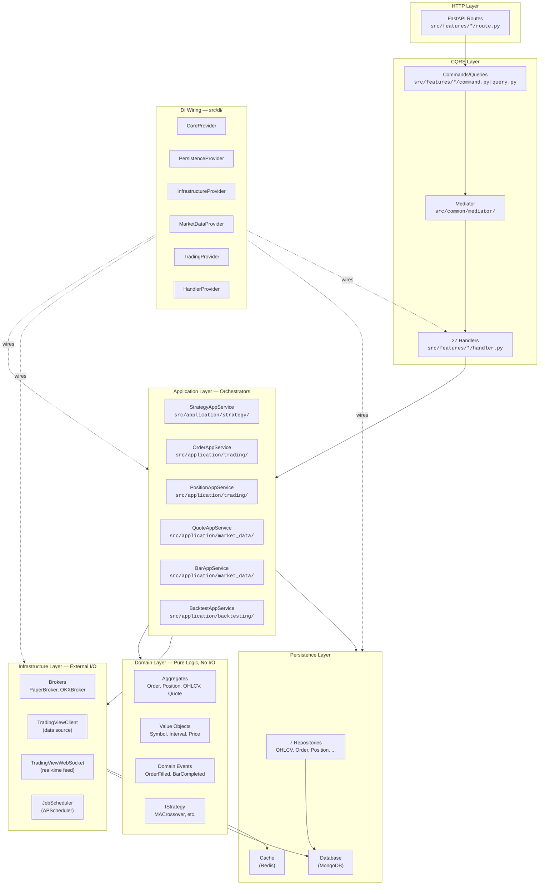
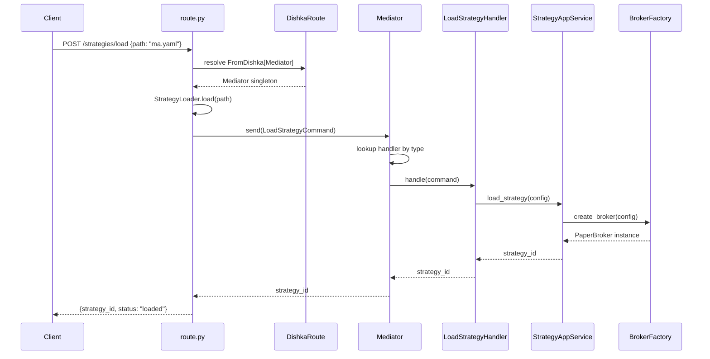
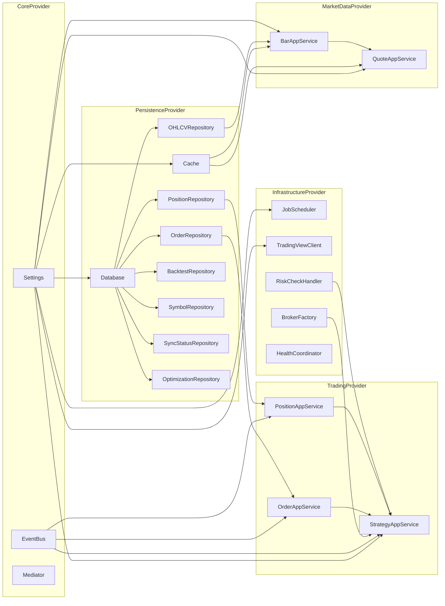
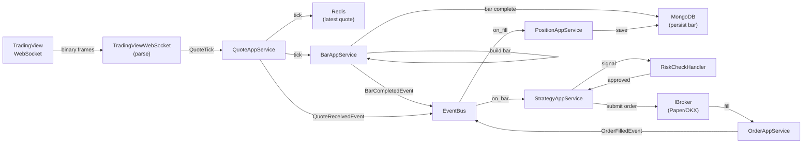

# Architecture Visual Map

**Last Updated:** 2026-03-14 | **Purpose:** Living visual reference for codebase navigation

## 1. Layer Map — What Lives Where

## 2. Request Flow — POST /strategies/load

## 3. DI Resolution Graph — What Depends on What

## 4. Real-Time Data Flow — WebSocket → Strategy

## 5. Naming Glossary

| Suffix | Layer | Purpose | Count |
|--------|-------|---------|-------|
| `AppService` | Application | Stateful orchestrator | 8 |
| `Client` | Infrastructure | External service caller | 2 |
| `Handler` | Features | CQRS command/query handler | 27 |
| `Repository` | Persistence | Data access | 7 |
| `Factory` | Infrastructure | Object creation | 1 |
| `Provider` | DI | Dishka dependency provider | 6 |

## 6. File Navigation Cheat Sheet

**"I need to..."**

| Task | Go to |
|------|-------|
| Add a new API endpoint | `src/features/{domain}/{operation}/route.py` |
| Add business logic for that endpoint | `src/features/{domain}/{operation}/handler.py` |
| Define the request shape | `src/features/{domain}/{operation}/command.py` or `query.py` |
| Wire the handler into DI | `src/di/handlers.py` |
| Add a new application service | `src/application/{domain}/` |
| Wire that service into DI | `src/di/{domain}_provider.py` |
| Add a new repository | `src/persistence/repositories/` + wire in `src/di/persistence.py` |
| Add a domain model | `src/domain/{domain}/` |
| Add a domain event | `src/domain/{domain}/{domain}_event.py` |
| Change startup/shutdown | `src/main.py` (lifespan) |
| Change DI container | `src/container.py` |
| Add middleware | `src/common/middleware/` + `src/main_extensions.py` |
