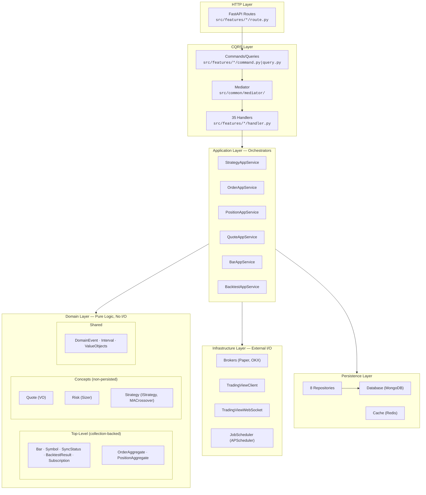
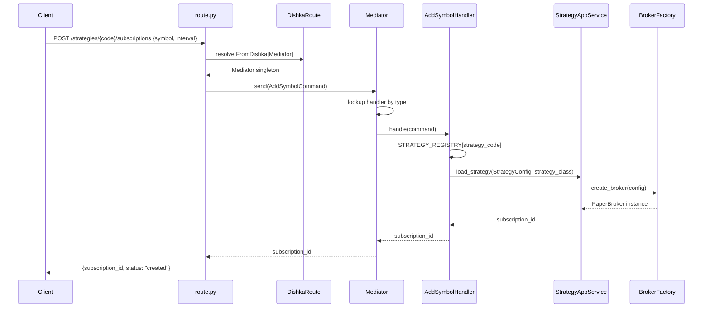
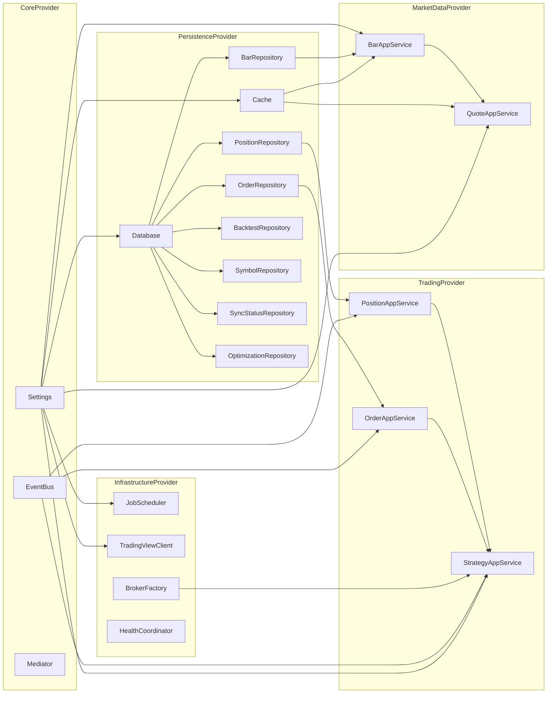
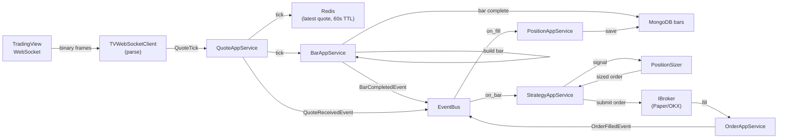

# Architecture Visual Map

**Last Updated:** 2026-05-05 | **Purpose:** Living visual reference for codebase navigation | **DDD Structure:** Three-tier (top-level, concepts, shared) | **Structure:** 4 backend packages + 1 frontend package

Current note: `pocketquant-web` is now part of the repo and sits alongside the backend package graph shown below.

## 1. ASCII Layer Relation Map

```
  ┌──────────────────────────┐
  │     External Clients     │
  │   (REST API / WebSocket) │
  └────────────┬─────────────┘
               │
  ┌────────────┴─────────────────────────────────┐
  │         FastAPI + Middleware Stack            │
  │  CorrelationId → RateLimit → Idempotency     │
  └────────────┬─────────────────────────────────┘
               │
  ╔════════════╧═════════════════════════════════════════════╗
  ║  FEATURES  (src/features/)  35 CQRS Handlers            ║
  ║  market_data(13) backtesting(5) strategy(11) trading(4) ║
  ║  risk(1) + subscriptions(2)                             ║
  ║  Route → Command/Query → Mediator.send() → Handler      ║
  ╚════════════╤═════════════════════════════════════════════╝
               │
  ┌────────────┴────────────┐
  │   Mediator (CQRS Hub)   │
  │  @handles → dispatch    │
  └────────────┬────────────┘
               │
    ┌──────────┼──────────────────────┐
    │          │                      │
    ▼          ▼                      ▼
  ╔═══════════════╗  ╔═══════════════╗  ╔═══════════════════╗
  ║  APPLICATION  ║  ║    DOMAIN     ║  ║  INFRASTRUCTURE   ║
  ║ (Orchestrate) ║  ║ (Pure Logic)  ║  ║  (External I/O)   ║
  ║               ║  ║               ║  ║                   ║
  ║ BacktestApp   ║  ║ TOP-LEVEL:    ║  ║ Brokers           ║
  ║ GridOptimize  ║  ║  Bar  Symbol  ║  ║  PaperBroker      ║
  ║ HistReplay    ║  ║  OrderAgg     ║  ║  OKXBroker        ║
  ║ BarApp        ║  ║  PositionAgg  ║  ║ Data Providers    ║
  ║ QuoteApp      ║  ║  SyncStatus   ║  ║  TVClient(REST)   ║
  ║ StrategyApp   ║  ║  BacktestRes  ║  ║  TVWebSocket      ║
  ║ OrderApp      ║  ║               ║  ║ Scheduling        ║
  ║ PositionApp   ║  ║ CONCEPTS:     ║  ║  APScheduler      ║
  ║ YamlLoader    ║  ║  Quote (VO)   ║  ║ Webhooks          ║
  ╚═══════╤═══════╝  ║  Risk (Sizer) ║  ║  Dispatcher       ║
          │          ║  Strategy     ║  ╚═════════╤═════════╝
          │          ║   IStrategy   ║            │
          │          ║   MACrossover ║            │
          │          ║               ║            │
          │          ║ SHARED:       ║            │
          │          ║  DomainEvent  ║            │
          │          ║  Interval     ║            │
          │          ║  ValueObjects ║            │
          │          ╚═══════╤═══════╝            │
          │                  │                    │
          └──────────────────┼────────────────────┘
                             │
  ╔══════════════════════════╧════════════════════════════╗
  ║  PERSISTENCE  (src/persistence/)                      ║
  ║  Database(MongoDB)  Cache(Redis)  8 Repositories     ║
  ║  Bar · Order · Position · Backtest · Optimization    ║
  ║  Symbol · SyncStatus · Subscription                   ║
  ╚══════════╤══════════════════╤═════════════════════════╝
             │                  │
             ▼                  ▼
       MongoDB:$MONGO_PORT   Redis:$REDIS_PORT

  ╔══════════════════════════════════════════════════════╗
  ║  COMMON  (src/common/)  Cross-Cutting, ALL layers   ║
  ║  Mediator · EventBus · Middleware(3) · Health(3)    ║
  ║  Logging(structlog) · UUID7 · Constants · Tracing   ║
  ╚══════════════════════════════════════════════════════╝

  DEPENDENCY DIRECTION (strict, unidirectional):
    Features ──► Application ──► Domain ◄── Infrastructure
                                   ▲
                              Persistence
  Domain has ZERO I/O imports (enforced by AST test)
```

## 2. Domain Three-Tier Structure

```
  packages/pocketquant-core/src/pocketquant/core/domain/
  │
  ├── TOP-LEVEL (collection-backed, to_mongo/from_mongo)
  │   ├── bar/            Bar entity, BarCompletedEvent✅, OHLCV VO, BarBuilder
  │   ├── order/          OrderAggregate, OrderStatus/Type/Side enums, 5 events
  │   ├── position/       PositionAggregate, PositionSide enum, PnL VO, 3 events
  │   ├── symbol/         Symbol entity (flattened from SymbolAggregate)
  │   │   (Note: Subscription entity actually lives in pocketquant-trading/domain/subscription.py)
  │   ├── sync_status/    SyncStatus entity
  │   └── backtest/       BacktestResult, OptimizationResult entities
  │
  ├── concepts/ (non-persisted logic, no MongoDB collection)
  │   ├── quote/          QuoteTick VO, QuoteReceivedEvent✅
  │   ├── risk/           RiskConfig VO, RiskModel enum, PositionSizer service
  │   └── strategy/       IStrategy interface, Signal VO, Direction enum
  │                        MACrossover impl, SignalGeneratedEvent
  │
  └── shared/ (cross-cutting, used by all domain folders)
      ├── events.py       DomainEvent base class
      ├── enums.py        Interval enum (1m..1M)
      └── value_objects.py  Shared VOs (Price, Signal, etc)
```

## 3. Layer Map (Mermaid)



## 4. Request Flow — POST /strategies/{strategy_code}/subscriptions



## 5. DI Resolution Graph



## 6. Real-Time Data Flow — WebSocket to Strategy



## 7. C4 System Context (Level 1)

```
    ┌──────────┐          ┌──────────────────────────────┐
    │  Trader  │─────────>│       PocketQuant            │
    │  (User)  │  REST    │  Algorithmic Trading Platform │
    │          │<─────────│  DDD + CQRS + Clean Arch     │
    └──────────┘  JSON    └──────┬───────┬───────┬───────┘
                                 │       │       │
                    ┌────────────┘       │       └────────────┐
                    v                    v                    v
           ┌──────────────┐    ┌──────────────┐    ┌──────────────┐
           │ TradingView  │    │     OKX      │    │  Webhook     │
           │ Data Provider│    │   Exchange   │    │  Consumers   │
           │ REST + WS    │    │  REST + WS   │    │  HTTP POST   │
           └──────────────┘    └──────────────┘    └──────────────┘
```

## 8. C4 Container (Level 2)

```
    ┌──────────┐
    │  Trader  │
    └────┬─────┘
         │ HTTP/JSON
         v
┌────────────────────────────────────────────────────────────┐
│                 PocketQuant Platform                        │
│                                                            │
│  ┌──────────────────────────────────────────────────────┐  │
│  │          FastAPI Web Server (Uvicorn)                 │  │
│  │  Port 8765 · /api/v1/* · Middleware · Dishka DI      │  │
│  └──────────────────────┬───────────────────────────────┘  │
│                          │                                  │
│     ┌────────────────────┼────────────────────┐             │
│     v                    v                    v             │
│  ┌─────────┐      ┌──────────┐      ┌────────────────┐    │
│  │  CQRS   │      │ Domain   │      │ Background     │    │
│  │ Handlers│─────>│ Engine   │      │ Jobs           │    │
│  │ (27)    │      │ (Pure)   │      │ (APScheduler)  │    │
│  └─────────┘      └──────────┘      └────────────────┘    │
│       │                                     │              │
│       v                                     v              │
│  ┌─────────┐ ┌─────────┐ ┌────────┐ ┌──────────┐         │
│  │ App     │ │ Broker  │ │ Event  │ │ Data     │         │
│  │Services │ │ Layer   │ │ Bus    │ │ Sync     │         │
│  │ (8 svc) │ │Paper/OKX│ │(in-mem)│ │ Jobs     │         │
│  └─────────┘ └─────────┘ └────────┘ └──────────┘         │
└──────────┬──────────────────────┬─────────────────────────┘
           │                      │
           v                      v
    ┌──────────────┐       ┌──────────────┐
    │   MongoDB    │       │    Redis     │
    │  $MONGO_PORT │       │ $REDIS_PORT  │
    │ 7 collections│       │  TTL cache   │
    │ bars,orders  │       │ quote,bar    │
    │ positions,...│       │ idempot,rate │
    └──────────────┘       └──────────────┘
```

## 9. DI Container Wiring Order

```
  CoreProvider ──> PersistenceProvider ──> InfrastructureProvider
       │                                         │
       v                                         v
  MarketDataProvider ──> TradingProvider ──> HandlerProvider

  Container creates all 27 handlers + registers with Mediator
```

## 10. Event Flow

```
  Handler ──publish──> EventBus ──notify──> Subscribers
                         │
       ┌─────────────────┼─────────────────┐
       v                 v                 v
  BarCompleted      QuoteReceived     OrderFilled
  │                 │                 │
  v                 v                 v
  StrategyApp       BarApp            PositionApp
  .on_bar()         .process_tick()   ._on_fill()
```

## 11. Naming Glossary

| Suffix | Layer | Purpose | Count |
|--------|-------|---------|-------|
| `AppService` | Application | Stateful orchestrator | 8 |
| `Client` | Infrastructure | External service caller | 2 |
| `Handler` | Features | CQRS command/query handler | 27 |
| `Repository` | Persistence | Data access | 7 |
| `Factory` | Infrastructure | Object creation | 1 |
| `Provider` | DI | Dishka dependency provider | 6 |

## 12. File Navigation Cheat Sheet

**Standard DDD File Names (per folder):**
- `entities.py` — Pydantic BaseModel with to_mongo/from_mongo
- `events.py` — Frozen dataclass domain events
- `value_objects.py` — Frozen dataclass immutable values
- `enums.py` — String enums
- `interfaces.py` — ABC base classes
- `services/` — Pure domain services

**"I need to..."**

| Task | Go to |
|------|-------|
| Add API endpoint | `src/features/{domain}/{operation}/route.py` |
| Implement business logic | `src/features/{domain}/{operation}/handler.py` |
| Define request/response | `src/features/{domain}/{operation}/command.py\|query.py` |
| Add application service | `src/application/{domain}/` |
| Add domain entity (persisted) | `src/domain/{name}/entities.py` |
| Add domain concept (non-persisted) | `src/domain/concepts/{name}/` |
| Add domain event | `src/domain/{name}/events.py` |
| Add shared enum/VO | `src/domain/shared/enums.py\|value_objects.py` |
| Add repository | `src/persistence/repositories/` |
| Change startup | `src/main.py` (lifespan function) |
| Configure DI | `src/container.py` + `src/di/` (6 provider files) |
| Add middleware | `src/common/middleware/` + `src/main_extensions.py` |

## 13. Bounded Contexts (Strategic Map)

| Context | Responsibility | Owns | Package |
|---|---|---|---|
| **Market Data** | Bar/quote ingestion, storage, real-time streaming | `Bar`, `SyncStatus`, market-data DTOs | `pocketquant-core` (domain) + `pocketquant-api` (sync jobs) |
| **Trading** | Order execution + position lifecycle | `OrderAggregate`, `PositionAggregate` | `pocketquant-core` (domain) + `pocketquant-trading` (orchestration) |
| **Strategy** | Trading logic interfaces + signal generation | `IStrategy`, `Signal`, strategy implementations | `pocketquant-core` (interfaces) + `pocketquant-trading` (registry, services) |
| **Risk** | Position sizing + risk validation | `RiskModel`, `PositionSizer` | `pocketquant-core` (pure calculations) |
| **Symbol** | Tradeable-asset metadata | `Symbol` (flat entity since 2026-03-15) | `pocketquant-core` |
| **Backtest** | Historical replay + performance analysis | `BacktestResult`, `TradeRecord`, `PerformanceCalculator` | `pocketquant-backtest` (engine, persistence) |

> A 7th container — `pocketquant-web` (Node/Vite SPA) — is a **UI surface**, not a bounded context. It consumes the API HTTP boundary; no domain logic lives there.

### Context Map (Relationships)

```
                                    ┌──────────────┐
                                    │  Backtest    │
                                    │ (replays MD) │
                                    └──────┬───────┘
                                           │ consumes Bar
                                           ▼
┌──────────────┐   BarCompletedEvent ┌──────────────┐    SignalGeneratedEvent  ┌──────────────┐
│ Market Data  │────────────────────▶│  Strategy    │─────────────────────────▶│   Trading    │
│   (Bar)      │                     │  (IStrategy) │                          │ (OrderAgg,   │
└──────┬───────┘                     └──────┬───────┘                          │  PositionAgg)│
       │ Quote (DTO/Redis)                  │ Symbol lookup                    └──────┬───────┘
       │                                    ▼                                          │
       │                            ┌──────────────┐         RiskConfig                │
       │                            │   Symbol     │◀─────────────────────────────────┤
       │                            │   (entity)   │                                   │
       │                            └──────────────┘         ┌──────────────┐          │
       │                                                     │     Risk     │◀─────────┘
       │                                                     │ (PositionSizer)         (pre-trade check)
       │                                                     └──────────────┘
       ▼
   (no upstream)
```

**Relationship types:**
- **Market Data → Strategy** — *Customer/Supplier* via published events (`BarCompletedEvent`, `QuoteReceivedEvent`)
- **Strategy → Trading** — *Customer/Supplier* via `SignalGeneratedEvent`
- **Trading → Position lifecycle** — internal aggregate-to-aggregate event chain (`OrderFilledEvent` → `PositionAggregate`)
- **Risk → Trading** — *Shared Kernel* (risk calculations consumed pre-trade)
- **Symbol → all** — *Conformist* (everyone reads `Symbol`; no one mutates without ownership)
- **Backtest → Market Data** — *Customer* (replays historical Bars)

## 14. Ubiquitous Language

| Term | Meaning in this codebase | Common false synonyms to avoid |
|---|---|---|
| **Symbol** | Composite identifier `BTCUSDT:BINANCE` — code + exchange in one string | "Ticker", "pair", "instrument" |
| **Bar** | Time-bucketed OHLCV record. **Not** "candle", "kline", "ohlcv-row" | "Candle" (UI term only); use "Bar" in domain code |
| **Quote** | Latest tick (price + size + timestamp), cached in Redis. Not persisted long-term | "Tick" (used only inside `BarBuilder` aggregation) |
| **Subscription** | Strategy's registration for `(symbol, exchange, interval)` → drives feed routing | "Watch", "follow" |
| **Sync** | Bringing local Bar storage up-to-date from an external source (TradingView, Binance) | "Backfill" (specific to one-off historical loads), "refresh" |
| **Strategy** | A pluggable trading-logic class implementing `IStrategy`. Loaded by id, not file path | "Algorithm" (too broad), "bot" (UI term) |
| **Aggregate** | DDD construct: entity with invariants + lifecycle + event emission. Earn this name. | Don't apply to data records (e.g. Bar isn't an aggregate) |
| **Composite symbol** | The `CODE:EXCHANGE` format. Replaced earlier `(exchange, code)` 2-tuple API | "Exchange-prefixed symbol" |
| **In-progress bar** | Bar currently being built from live ticks; `is_complete=False` | "Open bar", "partial bar" |
