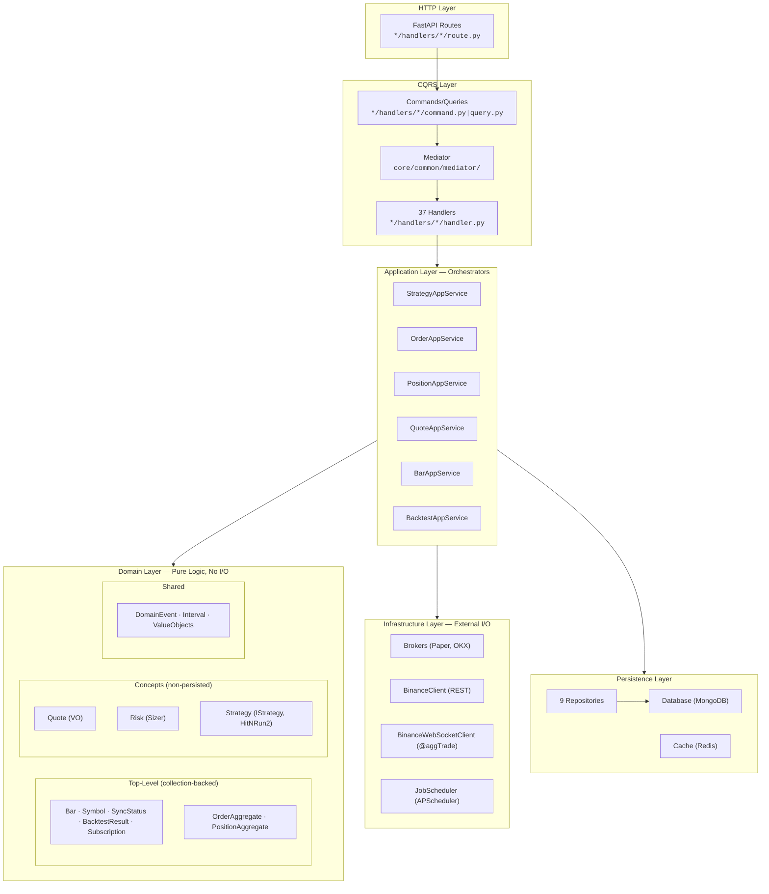
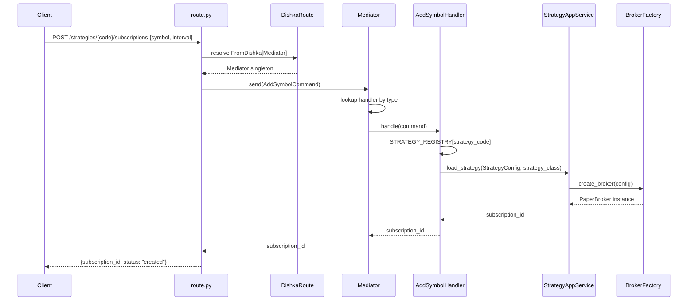
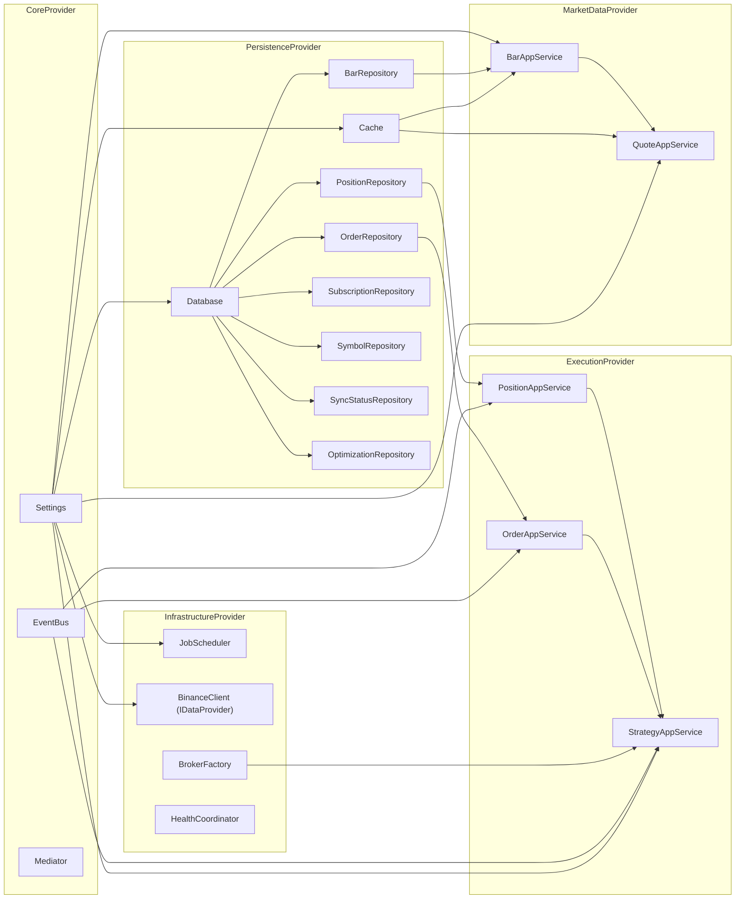

# Architecture Visual Map

Visual reference for codebase navigation. DDD three-tier structure (top-level, concepts, shared); 6-package layered monorepo (5 Python + `pocketquant-web`); 37 CQRS handlers + route modules + 2 SSE streams.

## 1. ASCII Layer Relation Map

```
  ┌──────────────────────────┐
  │     External Clients     │
  │   (REST API / WebSocket) │
  └────────────┬─────────────┘
               │
  ┌────────────┴─────────────────────────────────┐
  │         FastAPI + Middleware Stack            │
  │  CorrelationId → RateLimit → Idempotency     │
  └────────────┬─────────────────────────────────┘
               │
  ╔════════════╧═════════════════════════════════════════════╗
  ║  HANDLERS  (api + trading packages)  37 CQRS Handlers   ║
  ║  market_data(17) strategy/trading(14) backtest(6)       ║
  ║  Route → Command/Query → Mediator.send() → Handler      ║
  ║  + 2 SSE streams: /bars/stream/{symbol}, /quotes/stream ║
  ╚════════════╤═════════════════════════════════════════════╝
               │
  ┌────────────┴────────────┐
  │   Mediator (CQRS Hub)   │
  │  @handles → dispatch    │
  └────────────┬────────────┘
               │
    ┌──────────┼──────────────────────┐
    │          │                      │
    ▼          ▼                      ▼
  ╔═══════════════╗  ╔═══════════════╗  ╔═══════════════════╗
  ║  APPLICATION  ║  ║    DOMAIN     ║  ║  INFRASTRUCTURE   ║
  ║ (Orchestrate) ║  ║ (Pure Logic)  ║  ║  (External I/O)   ║
  ║               ║  ║               ║  ║                   ║
  ║ BacktestApp   ║  ║ TOP-LEVEL:    ║  ║ Brokers           ║
  ║ GridOptimize  ║  ║  Bar  Symbol  ║  ║  PaperBroker      ║
  ║ HistReplay    ║  ║  OrderAgg     ║  ║  OKXBroker        ║
  ║ BarApp        ║  ║  PositionAgg  ║  ║ Data Providers    ║
  ║ QuoteApp      ║  ║  SyncStatus   ║  ║ BinanceClient(REST)║
  ║ StrategyApp   ║  ║  BacktestRes  ║  ║ BinanceWebSocket  ║
  ║ OrderApp      ║  ║               ║  ║ Scheduling        ║
  ║ PositionApp   ║  ║ CONCEPTS:     ║  ║  APScheduler      ║
  ║ YamlLoader    ║  ║  Quote (VO)   ║  ║ Webhooks          ║
  ╚═══════╤═══════╝  ║  Risk (Sizer) ║  ║  Dispatcher       ║
          │          ║  Strategy     ║  ╚═════════╤═════════╝
          │          ║   IStrategy   ║            │
          │          ║   HitNRun2    ║            │
          │          ║               ║            │
          │          ║ SHARED:       ║            │
          │          ║  DomainEvent  ║            │
          │          ║  Interval     ║            │
          │          ║  ValueObjects ║            │
          │          ╚═══════╤═══════╝            │
          │                  │                    │
          └──────────────────┼────────────────────┘
                             │
  ╔══════════════════════════╧════════════════════════════╗
  ║  PERSISTENCE  (infrastructure/persistence/)           ║
  ║  Database(MongoDB)  Cache(Redis)  9 Repositories     ║
  ║  Bar · Order · Position · Optimization · Symbol      ║
  ║  SyncStatus · Subscription · TrackedSymbol · JobHist ║
  ╚══════════╤══════════════════╤═════════════════════════╝
             │                  │
             ▼                  ▼
       MongoDB:$MONGO_PORT   Redis:$REDIS_PORT

  ╔══════════════════════════════════════════════════════╗
  ║  COMMON  (core/common/)  Cross-Cutting, ALL layers  ║
  ║  Mediator · EventBus · Middleware(3) · Health(3)    ║
  ║  Logging(structlog) · UUID7 · Constants · Tracing   ║
  ╚══════════════════════════════════════════════════════╝

  DEPENDENCY DIRECTION (strict, unidirectional):
    Features ──► Application ──► Domain ◄── Infrastructure
                                   ▲
                              Persistence
  Domain has ZERO I/O imports (enforced by AST test)
```

## 2. Domain Three-Tier Structure

```
  packages/pocketquant-core/src/pocketquant/core/domain/
  │
  ├── TOP-LEVEL (collection-backed, to_mongo/from_mongo)
  │   ├── bar/            Bar entity, BarCompletedEvent✅, OHLCV VO, BarBuilder
  │   ├── order/          OrderAggregate, OrderStatus/Type/Side enums, 5 events
  │   ├── position/       PositionAggregate, PositionSide enum, PnL VO, 3 events
  │   ├── symbol/         Symbol entity (flattened from SymbolAggregate)
  │   │   (Note: Subscription entity actually lives in pocketquant-trading/domain/subscription.py)
  │   ├── sync_status/    SyncStatus entity
  │   └── backtest/       BacktestResult, OptimizationResult entities
  │
  ├── concepts/ (non-persisted logic, no MongoDB collection)
  │   ├── quote/          QuoteTick VO, QuoteReceivedEvent✅
  │   ├── risk/           RiskConfig VO, RiskModel enum, PositionSizer service
  │   └── strategy/       IStrategy interface, Signal VO, Direction enum
  │                        HitNRun2 impl, SignalGeneratedEvent
  │
  └── shared/ (cross-cutting, used by all domain folders)
      ├── events.py       DomainEvent base class
      ├── enums.py        Interval enum (1m..1M)
      └── value_objects.py  Shared VOs (Price, Signal, etc)
```

## 3. Layer Map (Mermaid)



## 4. Request Flow — POST /strategies/{strategy_code}/subscriptions



## 5. DI Resolution Graph



## 6. Real-Time Data Flow — WebSocket to Strategy


## 7. C4 System Context (Level 1)

```
    ┌──────────┐          ┌──────────────────────────────┐
    │  Trader  │─────────>│       PocketQuant            │
    │  (User)  │  REST    │  Algorithmic Trading Platform │
    │          │<─────────│  DDD + CQRS + Clean Arch     │
    └──────────┘  JSON    └──────┬───────┬───────┬───────┘
                                 │       │       │
                    ┌────────────┘       │       └────────────┐
                    v                    v                    v
           ┌──────────────┐    ┌──────────────┐    ┌──────────────┐
           │   Binance    │    │     OKX      │    │  Webhook     │
           │ Data Provider│    │   Exchange   │    │  Consumers   │
           │ REST + WS    │    │  REST + WS   │    │  HTTP POST   │
           └──────────────┘    └──────────────┘    └──────────────┘
```

## 8. C4 Container (Level 2)

```
    ┌──────────┐
    │  Trader  │
    └────┬─────┘
         │ HTTP/JSON
         v
┌────────────────────────────────────────────────────────────┐
│                 PocketQuant Platform                        │
│                                                            │
│  ┌──────────────────────────────────────────────────────┐  │
│  │          FastAPI Web Server (Uvicorn)                 │  │
│  │  Port 8765 · /api/v1/* · Middleware · Dishka DI      │  │
│  └──────────────────────┬───────────────────────────────┘  │
│                          │                                  │
│     ┌────────────────────┼────────────────────┐             │
│     v                    v                    v             │
│  ┌─────────┐      ┌──────────┐      ┌────────────────┐    │
│  │  CQRS   │      │ Domain   │      │ Background     │    │
│  │ Handlers│─────>│ Engine   │      │ Jobs           │    │
│  │ (37)    │      │ (Pure)   │      │ (APScheduler)  │    │
│  └─────────┘      └──────────┘      └────────────────┘    │
│       │                                     │              │
│       v                                     v              │
│  ┌─────────┐ ┌─────────┐ ┌────────┐ ┌──────────┐         │
│  │ App     │ │ Broker  │ │ Event  │ │ Data     │         │
│  │Services │ │ Layer   │ │ Bus    │ │ Sync     │         │
│  │ (8 svc) │ │Paper/OKX│ │(in-mem)│ │ Jobs     │         │
│  └─────────┘ └─────────┘ └────────┘ └──────────┘         │
└──────────┬──────────────────────┬─────────────────────────┘
           │                      │
           v                      v
    ┌──────────────┐       ┌──────────────┐
    │   MongoDB    │       │    Redis     │
    │  $MONGO_PORT │       │ $REDIS_PORT  │
    │ 7 collections│       │  TTL cache   │
    │ bars,orders  │       │ quote,bar    │
    │ positions,...│       │ idempot,rate │
    └──────────────┘       └──────────────┘
```

## 9. DI Container Wiring Order

```
  CoreProvider ──> PersistenceProvider ──> InfrastructureProvider
       │                                         │
       v                                         v
  MarketDataProvider ──> ExecutionProvider ──> HandlerProvider

  Container creates all 37 handlers + registers with Mediator
```

## 10. Event Flow

```
  Handler ──publish──> EventBus ──notify──> Subscribers
                         │
       ┌─────────────────┼─────────────────┐
       v                 v                 v
  BarCompleted      QuoteReceived     OrderFilled
  │                 │                 │
  v                 v                 v
  StrategyApp       BarApp            PositionApp
  .on_bar()         .process_tick()   ._on_fill()
```

> **Naming glossary, file-navigation ("I need to…"), bounded-context table, ubiquitous-language** moved to text homes:
> - Class-naming by layer → [code-standards.md](./code-standards.md) → "Class Naming by Layer"
> - File navigation ("where does X live") → [system-architecture.md](./system-architecture.md) → "Where Does X Live?"
> - Bounded contexts + ubiquitous language → [system-architecture.md](./system-architecture.md)

## 11. Context Map (Bounded-Context Relationships)

```
                                    ┌──────────────┐
                                    │  Backtest    │
                                    │ (replays MD) │
                                    └──────┬───────┘
                                           │ consumes Bar
                                           ▼
┌──────────────┐   BarCompletedEvent ┌──────────────┐    SignalGeneratedEvent  ┌──────────────┐
│ Market Data  │────────────────────▶│  Strategy    │─────────────────────────▶│   Trading    │
│   (Bar)      │                     │  (IStrategy) │                          │ (OrderAgg,   │
└──────┬───────┘                     └──────┬───────┘                          │  PositionAgg)│
       │ Quote (DTO/Redis)                  │ Symbol lookup                    └──────┬───────┘
       │                                    ▼                                          │
       │                            ┌──────────────┐         RiskConfig                │
       │                            │   Symbol     │◀─────────────────────────────────┤
       │                            │   (entity)   │                                   │
       │                            └──────────────┘         ┌──────────────┐          │
       │                                                     │     Risk     │◀─────────┘
       │                                                     │ (PositionSizer)         (pre-trade check)
       │                                                     └──────────────┘
       ▼
   (no upstream)
```

Relationship types (Customer/Supplier, Shared Kernel, Conformist) and the ubiquitous-language glossary live in [system-architecture.md](./system-architecture.md) → "Bounded Contexts" + "Ubiquitous Language".
