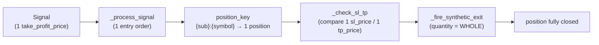

# The engine does not support scale-out / multi-TP / partial close

The current engine settles **one entry → one take-profit → closes the whole position in a single fill**. No scale-out (partial profit-taking), no multi-TP (multiple TP levels), no partial close. This is a known limitation, described with the `EngulfingStrategyService` 1-TP baseline.

The limitation lives across **four layers**, each of which must change to support scale-out:

| Layer | Specific limitation | Symbol |
|---|---|---|
| Signal | exactly **one** `take_profit_price: float \| None` — not a list of TP levels | `Signal.take_profit_price` (`core/domain/strategy/value_objects.py`) |
| Strategy hook | `on_bar_completed` returns **one** `Signal \| None` per bar — no list, no per-part exit fraction | `IStrategyService.on_bar_completed` (`core/domain/strategy/strategy_service_interface.py`) |
| Broker exit | SL/TP auto-fill fires **one** synthetic exit with `quantity=pos.quantity` (the whole position), no partial exit | `PaperBrokerAdapter._check_sl_tp`, `PaperBrokerAdapter._fire_synthetic_exit` (`core/infra/brokers/paper/paper_broker_adapter.py`) |
| Position store | one `position_key = f"{subscription_id}:{symbol}"` → **one** position; a second order with the same key merges into that position, it does not create a separate lot | `PaperBrokerAdapter._execute_fill` (position_key) |

## Why a single Signal cannot create two TPs

Each arrow carries **one** TP value and closes the **whole** quantity. Nowhere in the chain can it hold "took 50% at TP1, let the other 50% run to TP2": `Signal` has only one TP field, the position has only one `tp_price`, and the synthetic exit always uses the full `pos.quantity`.

## Scale-out requires cross-cutting changes

To support real scale-out, the following must all change together:

- `Signal` — carry a list of `(tp_price, fraction)` instead of a single TP.
- `IStrategyService` contract — the hook must be able to express multiple exit levels.
- `PaperBrokerAdapter` — `_check_sl_tp` compares multiple levels, `_fire_synthetic_exit` exits part of the quantity and keeps the rest open.
- Lot/position tracking — one position must track multiple lots with their own TPs (currently one `position_key` → one position aggregate).
- Position-box render in `web/` — draw multiple TP levels and the remaining quantity.

Because the scope spans `Signal → strategy → broker → position store → UI`, scale-out is a separate roadmap item, not a local tweak within a single strategy.
