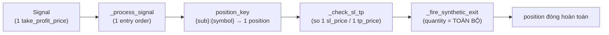

# Engine không hỗ trợ scale-out / multi-TP / partial close

Engine hiện tại chốt **một entry → một take-profit → đóng toàn bộ position trong một lần fill**. Không có scale-out (chốt lời từng phần), không multi-TP (nhiều mức TP), không partial close. Đây là known limitation, mô tả bằng `EngulfingStrategyService` baseline 1-TP.

Giới hạn nằm ở **bốn tầng**, mỗi tầng đều phải đổi nếu muốn scale-out:

| Tầng | Giới hạn cụ thể | Symbol |
|---|---|---|
| Signal | đúng **một** `take_profit_price: float \| None` — không phải list các mức TP | `Signal.take_profit_price` (`core/domain/strategy/value_objects.py`) |
| Strategy hook | `on_bar_completed` trả **một** `Signal \| None` mỗi bar — không trả list, không kèm tỷ lệ chốt từng phần | `IStrategyService.on_bar_completed` (`core/domain/strategy/strategy_service_interface.py`) |
| Broker exit | SL/TP auto-fill bắn **một** synthetic exit với `quantity=pos.quantity` (toàn bộ), không exit một phần | `PaperBrokerAdapter._check_sl_tp`, `PaperBrokerAdapter._fire_synthetic_exit` (`core/infra/brokers/paper/paper_broker_adapter.py`) |
| Position store | một `position_key = f"{subscription_id}:{symbol}"` → **một** position; lệnh thứ 2 cùng key merge vào position đó, không tạo lot tách biệt | `PaperBrokerAdapter._execute_fill` (position_key) |

## Vì sao một Signal không tạo được hai TP

Mỗi mũi tên đều mang theo **một** giá trị TP và đóng **toàn bộ** khối lượng. Không có chỗ nào trong chuỗi giữ được "đã chốt 50% ở TP1, còn 50% chạy tới TP2": `Signal` chỉ có một field TP, position chỉ có một `tp_price`, và synthetic exit luôn dùng `pos.quantity` đầy đủ.

## Scale-out cần thay đổi cross-cutting

Để hỗ trợ scale-out thật sự, phải sửa đồng loạt:

- `Signal` — mang danh sách `(tp_price, fraction)` thay vì một TP đơn.
- `IStrategyService` contract — hook diễn đạt được nhiều mức chốt.
- `PaperBrokerAdapter` — `_check_sl_tp` so nhiều mức, `_fire_synthetic_exit` chốt một phần khối lượng và giữ phần còn lại mở.
- Lot/position tracking — một position phải theo dõi nhiều lot với TP riêng (hiện một `position_key` → một position aggregate).
- Position-box render ở `web/` — vẽ nhiều mức TP và phần khối lượng còn lại.

Vì phạm vi trải khắp `Signal → strategy → broker → position store → UI`, scale-out là một hạng mục roadmap riêng, không phải tinh chỉnh cục bộ trong một strategy.
