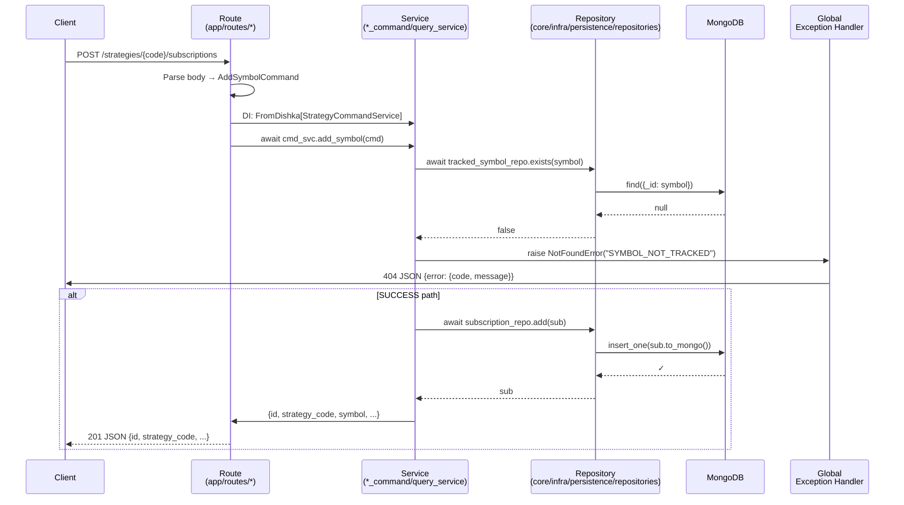

# Service & Route Conventions

Pattern: mỗi route gọi một command/query service; service chứa logic xử lý; exception handlers ở tầng global.

**Từ khóa code giữ tiếng Anh:** `DishkaRoute`, `FromDishka`, `APIRouter`, `BaseModel`, `StrategyCommandService`, `SyncService`, `AddSymbolCommand`, v.v.

---

## Tóm tắt

| Thành phần | Nơi | Trách nhiệm |
|-----------|-----|-----------|
| **Route** | `src/pocketquant/app/routes/{feature}.py` | Parse request → xây Command/Query → gọi service → return DTO |
| **Command Service** | `src/pocketquant/{pkg}/{feature}_command_service.py` | Xử lý write logic: Mongo update, repository calls, cascade |
| **Query Service** | `src/pocketquant/{pkg}/{feature}_query_service.py` | Xử lý read logic: fetch Mongo, enrich, serialize |
| **Command/Query DTO** | Định nghĩa trong service file (Pydantic `BaseModel`) | Request body model (e.g. `AddSymbolCommand`, `GetStrategyQuery`) |
| **Exception handler** | `src/pocketquant/core/common/exceptions.py::register_exception_handlers()` | Global mapping `AppError` → HTTP response |
| **Repository** | `src/pocketquant/core/persistence/repositories/{entity}_repository.py` (e.g. `subscription_repository.py`) | MongoDB CRUD, queries, upserts |

---

## Quy tắc Route

**File structure:** `src/pocketquant/app/routes/{feature}.py`

**Boilerplate:**

```python
from dishka.integrations.fastapi import DishkaRoute, FromDishka
from fastapi import APIRouter, Query, Response
from pydantic import BaseModel

from pocketquant.{pkg}.{feature}_command_service import (
    SomeCommandService,
    SomeCommand,
)
from pocketquant.{pkg}.{feature}_query_service import (
    SomeQueryService,
    SomeQuery,
)

router = APIRouter(prefix="/{prefix}", tags=["tag"], route_class=DishkaRoute)

class RequestBody(BaseModel):
    field: str

@router.post("/path", status_code=201, response_model=dict)
async def endpoint_name(
    body: RequestBody,
    cmd_svc: FromDishka[SomeCommandService],
) -> dict:
    return await cmd_svc.method(SomeCommand(field=body.field))

@router.get("/path/{id}", response_model=dict)
async def endpoint_name(
    id: str,
    query_svc: FromDishka[SomeQueryService],
) -> dict:
    return await query_svc.method(SomeQuery(id=id))
```

**Key điểm:**

- `FromDishka[ServiceType]` → DI injection tự động
- Route không try/catch; exception propagate → global handler
- Pydantic `BaseModel` validate input tự động
- Response type hint quy định OpenAPI schema
- Status code rõ ràng: `201` (created), `204` (no content), `404` (not found)

---

## Quy tắc Command Service

**File structure:** `src/pocketquant/{pkg}/{feature}_command_service.py`

**Template:**

```python
from pydantic import BaseModel
from pocketquant.core.infra.persistence.repositories import Repository

# === Command DTOs ===

class SomeCommand(BaseModel):
    """Tác vụ ghi."""
    field: str

# === Service ===

class SomeCommandService:
    """Xử lý command, không có try/catch."""

    def __init__(
        self,
        repo: SomeRepository,
    ):
        self.repo = repo

    async def method(self, cmd: SomeCommand) -> dict:
        # Validate
        if not await self.repo.exists(cmd.field):
            raise NotFoundError(f"Not found: {cmd.field}")
        
        # Execute
        result = await self.repo.upsert({...})
        
        # Return DTO
        return {"id": result.id, "status": "ok"}
```

**Exception patterns:**

- `NotFoundError` (404) — raise khi entity không tồn tại
- `DomainError` (400) — raise khi logic constraint vi phạm (ví dụ duplicate key)
- `AppError` (500) — base class, không raise trực tiếp
- **Không try/catch trong service.** Exception propagate → global handler

**Response DTO:**

- Trả Pydantic model hoặc `dict`
- Không return raw MongoDB doc; serialize bằng `.to_dto()`
- Datetime → ISO string

---

## Quy tắc Query Service

**File structure:** `src/pocketquant/{pkg}/{feature}_query_service.py`

**Template:**

```python
from pydantic import BaseModel

class SomeQuery(BaseModel):
    """Tác vụ đọc."""
    id: str

class SomeQueryService:
    """Xử lý query, không modify state."""

    def __init__(self, repo: SomeRepository):
        self.repo = repo

    async def get_one(self, query: SomeQuery) -> dict | None:
        doc = await self.repo.find_by_id(query.id)
        if not doc:
            return None
        return doc.to_dto()

    async def list_all(self) -> list[dict]:
        docs = await self.repo.list_all()
        return [d.to_dto() for d in docs]
```

**Key điểm:**

- Không mutate state; chỉ read Mongo + serialize
- Return `dict` (DTO) hoặc `list[dict]`
- Raise `NotFoundError` nếu cần validation (ví dụ template missing), nhưng không catch
- Có thể batch enrich: fetch N subscriptions + backtest status trong 1 call

---

## Quy tắc Exception Handling

**Global handler tại:** `src/pocketquant/core/common/exceptions.py::register_exception_handlers()`

Gọi tại startup:

```python
# src/pocketquant/app/main_extensions.py
from pocketquant.core.common.exceptions import register_exception_handlers
register_exception_handlers(app, validation_error_cls=RequestValidationError)
```

Handler tự động map:
- `NotFoundError` → 404 JSON `{error: {code, message}}`
- `DomainError` → 400 JSON `{error: {code, message}}`
- `AppError` (base) → 500 JSON `{error: {code, message}}`

**Trong code:**

```python
# ✓ GOOD
if not found:
    raise NotFoundError("SYMBOL_NOT_TRACKED")

# ✗ WRONG
if not found:
    return JSONResponse(status_code=404, content=...)

# ✗ WRONG
try:
    result = await repo.upsert(...)
except DuplicateKeyError:
    return JSONResponse(status_code=409, ...)
```

---

## Quy tắc Repository

**File structure:** `src/pocketquant/core/infra/persistence/repositories/{entity}_repository.py`

**Mẫu:**

```python
from pocketquant.core.domain.{entity} import {Entity}

class {Entity}Repository:
    """MongoDB CRUD."""

    def __init__(self, db: Database):
        self._db = db
        self._collection_name = "{entities}"

    async def add(self, entity: {Entity}) -> {Entity}:
        """Insert, raise DuplicateKeyError if _id exists."""
        await self._db[self._collection_name].insert_one(
            entity.to_mongo()
        )
        return entity

    async def find_by_id(self, id: str) -> {Entity} | None:
        """Query by _id; return domain entity or None."""
        doc = await self._db[self._collection_name].find_one({"_id": id})
        if not doc:
            return None
        return {Entity}.from_mongo(doc)

    async def list_all(self) -> list[{Entity}]:
        cursor = self._db[self._collection_name].find({})
        return [{Entity}.from_mongo(doc) async for doc in cursor]

    async def upsert(self, id: str, updates: dict) -> {Entity}:
        """Update or insert."""
        result = await self._db[self._collection_name].find_one_and_update(
            {"_id": id},
            {"$set": updates},
            upsert=True,
            return_document=True,
        )
        return {Entity}.from_mongo(result)
```

**Key điểm:**

- Repository KHÔNG raise `NotFoundError`; trả `None` và để caller handle
- `to_mongo()` / `from_mongo()` serialize/deserialize domain entity
- Tất cả repos ở `core/infra/persistence/repositories/`
- Không có repos ở `trading/`, `backtest/`, etc.

---

## Worked Example: Add Symbol (Strategy Subscription)

**End-to-end: POST `/api/v1/strategies/{strategy_code}/subscriptions`**

**Route** (`app/routes/strategy.py:80–96`):

```python
@strategy_router.post("/{strategy_code}/subscriptions", status_code=201)
async def create_subscription(
    strategy_code: str,
    body: CreateSubscriptionBody,
    cmd_svc: FromDishka[StrategyCommandService],
) -> dict:
    """Create a subscription."""
    return await cmd_svc.add_symbol(
        AddSymbolCommand(
            strategy_id=strategy_code,
            symbol=body.symbol,
            interval=body.interval,
        )
    )
```

**Service** (`engine/strategy_command_service.py`):

```python
class AddSymbolCommand(BaseModel):
    strategy_id: str
    symbol: str
    interval: str

class StrategyCommandService:
    def __init__(
        self,
        tracked_symbol_repo: TrackedSymbolRepository,
        subscription_repo: SubscriptionRepository,
        strategy_app_svc: StrategyAppService,
    ):
        self.tracked_symbol_repo = tracked_symbol_repo
        self.subscription_repo = subscription_repo
        self.strategy_app_svc = strategy_app_svc

    async def add_symbol(self, cmd: AddSymbolCommand) -> dict:
        # Validate symbol tracked
        if not await self.tracked_symbol_repo.exists(cmd.symbol):
            raise NotFoundError("SYMBOL_NOT_TRACKED")

        # Validate template exists
        template = STRATEGY_REGISTRY.get(cmd.strategy_id)
        if not template:
            raise NotFoundError("STRATEGY_NOT_FOUND")

        # Compute deterministic sub_id
        sub_id = Subscription.deterministic_id(
            cmd.strategy_id, cmd.symbol, cmd.interval
        )

        # Load strategy instance if needed
        if not self.strategy_app_svc.get_strategy(sub_id):
            config = StrategyConfig(
                id=sub_id,
                name=cmd.strategy_id,
                symbol=cmd.symbol,
                interval=cmd.interval,
            )
            await self.strategy_app_svc.load_strategy(config, template)

        # Persist subscription (Mongo unique index enforces dedup)
        sub = Subscription(
            id=sub_id,
            strategy_code=cmd.strategy_id,
            symbol=cmd.symbol,
            interval=cmd.interval,
            desired_state="stopped",  # opt-in start
        )
        await self.subscription_repo.add(sub)

        # Return DTO
        return sub.to_dto()
```

**Exception flow:**

```
            ┌─ NotFoundError (SYMBOL_NOT_TRACKED) ──┐
            │                                         │
Route ──→ Service ──────────────────────────────┬──→ Global handler ──→ 404 JSON
            │                                         │
            ├─ DuplicateKeyError (Mongo) ────┐       │
            │   re-raise as DomainError ──────┘       │
            │                                         │
            └────────────────────────────────────────┘
```

**API response on success (201):**

```json
{
  "id": "a1b2c3d4e5f6g7h8",
  "strategy_code": "hitnrun2",
  "symbol": "BTCUSDT:BINANCE",
  "interval": "1h",
  "created_at": "2026-06-11T10:00:00Z",
  "desired_state": "stopped",
  "actual_state": "stopped"
}
```

**API response on error (404):**

```json
{
  "error": {
    "code": "SYMBOL_NOT_TRACKED",
    "message": "Symbol not tracked"
  }
}
```

---

## Sequence diagram (Mermaid v11)



---

## Import contracts

Route → Service imports:

```
app/routes/{feature}.py
    ├→ pocketquant.{pkg}.{feature}_command_service
    ├→ pocketquant.{pkg}.{feature}_query_service
    └→ pocketquant.core.common.exceptions
```

Service → Repository imports:

```
pocketquant.{pkg}.{feature}_*_service
    └→ pocketquant.core.persistence.repositories.*
```

Exception imports:

```
pocketquant.core.common.exceptions
    ├─ NotFoundError (404)
    ├─ DomainError (400)
    └─ AppError (base, 500)
```

---

## OpenAPI / Swagger

- FastAPI tự động generate OpenAPI từ endpoint type hints
- `response_model=` xác định schema trả về
- `FromDishka[ServiceType]` dependency không xuất hiện trong Swagger (ẩn)
- Swagger live tại `/docs` (Swagger UI) hoặc `/openapi.json`

Xem `README.md` → "OpenAPI" hoặc truy cập http://localhost:41921/api/v1/docs khi chạy server.

---

## Mối quan hệ: routes ↔ services ↔ repositories

```
┌─────────────────────────────────────────────────────────────┐
│ app/routes/{feature}.py                                     │
│  ├─ @router.post("/path")                                   │
│  └─ FromDishka[SomeCommandService/SomeQueryService]         │
└─────────────────┬───────────────────────────────────────────┘
                  │
                  ▼
┌─────────────────────────────────────────────────────────────┐
│ {pkg}/{feature}_command/query_service.py                    │
│  ├─ class AddSymbolCommand(BaseModel)                       │
│  ├─ async def add_symbol(cmd: AddSymbolCommand) → dict     │
│  └─ DI: repositories (trackedSymbolRepo, subscriptionRepo) │
└─────────────────┬───────────────────────────────────────────┘
                  │
                  ▼
┌─────────────────────────────────────────────────────────────┐
│ core/infra/persistence/repositories/{entity}_repository.py │
│  ├─ async def add(entity: Entity) → Entity                  │
│  ├─ async def find_by_id(id: str) → Entity | None          │
│  └─ MongoDB collection access                              │
└─────────────────────────────────────────────────────────────┘
```

---

## Xem thêm

- [System Architecture](./system-architecture.md) — layers, DI container
- [Code Standards](./code-standards.md) — async rules, naming, comment policy
- [Strategy Lifecycle](./features/strategy-lifecycle.md) — end-to-end example (add/start/stop/delete)
