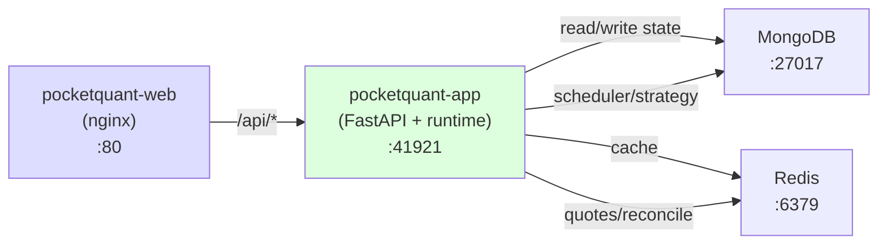

# System Architecture

Pattern: DDD + Clean Architecture + Dishka. Structure: Single Python package at repo-root `src/pocketquant/` with subpackages (core, engine, backtest, app) + Node SPA (`web`). Dependency direction: `core ◁ engine ◁ backtest ◁ app`, `web → app`. Market data: Binance public REST/WS (@aggTrade), no auth required. Streaming: SSE + Redis-backed real-time.

For local run/test steps and canonical route names, use [README](../README.md). This document remains a deeper design reference.

## High-Level Architecture

PocketQuant uses **Clean Architecture + DDD** with strict unidirectional dependency flow: Routes → Services → Domain, Adapters → Domain. Command/Query services orchestrate domain logic. A modern React 19 SPA frontend consumes the REST API.

```
┌─────────────────────────────────────────────────────────────────┐
│                    Client Layer (Browser)                       │
│  pocketquant-web: React 19 + Vite + Lightweight Charts         │
│  Candlestick chart, 5 indicators, symbol/interval selectors     │
└──────────────────────┬──────────────────────────────────────────┘
                       │ HTTP/REST (proxy to :41921 app)
                       ▼
          ┌──────────────────────────────────────────────┐
          │  pocketquant-app (FastAPI + runtime)         │
          │  :41921 (all /api/v1/* routes)               │
          │  Scheduler, WS feed, strategy lifecycle,     │
          │  reconcile loop, backtest worker             │
          └──────┬───────────────────────────────────────┘
                 │
                 ▼
┌─────────────────────────────────────────────────────────────────┐
│   External Services & Infrastructure                             │
│  Binance REST+WS | OKX REST+WS | MongoDB | Redis | APScheduler │
└─────────────────────────────────────────────────────────────────┘
                         │
            ┌────────────┴────────────┐
            │                         │
            ▼                         ▼
┌──────────────────────────┐   ┌──────────────────────────┐
│  Application Layer       │   │   Domain Layer           │
│  (Orchestrators)         │◄──┤   (Pure Logic)           │
│  ├─ StrategyAppService       │   │   ├─ Aggregates         │
│  ├─ BacktestAppService       │   │   ├─ Value Objects      │
│  ├─ BarAppService           │   │   ├─ Domain Events      │
│  ├─ OrderAppService         │   │   ├─ Interfaces         │
│  └─ PositionAppService      │   │   └─ Domain Services    │
└──────────┬───────────────┘   └──────────────────────────┘
           │                            │
           │    ┌───────────────────────┘
           │    │
           ▼    ▼
┌─────────────────────────────────────────────────────────────────┐
│              Infrastructure Layer (External I/O)                 │
│  ┌──────────┐  ┌──────────┐  ┌──────────┐  ┌──────────────┐   │
│  │ Brokers  │  │Providers │  │Persistence│  │ Scheduling  │   │
│  │ (OKX,   │  │(Binance  │  │(MongoDB,  │  │  (APScheduler)  │
│  │ Paper)  │  │ REST/WS) │  │ Redis)    │  │              │   │
│  └──────────┘  └──────────┘  └──────────┘  └──────────────┘   │
└─────────────────────────────────────────────────────────────────┘
        │              │               │            │
        ▼              ▼               ▼            ▼
    ┌────────┐  ┌──────────┐  ┌──────────────┐  ┌──────────┐
    │  OKX   │  │ Binance  │  │  MongoDB     │  │ Redis /  │
    │ Live   │  │  Public  │  │  (Bars,     │  │BackgroundJobs
    │Trading │  │  REST/WS │  │  Orders,    │  │          │
    │        │  │          │  │  Positions) │  │          │
    └────────┘  └──────────┘  └──────────────┘  └──────────┘
```

**Dependency Direction:** Features ← Application ← Domain, Adapters ← Domain (no reverse dependencies)

**Real-Time Streaming:** Frontend receives live market data via Server-Sent Events (SSE) for bars and quotes, backed by Redis as the intermediary between inbound WebSocket sources (Binance, OKX) and outbound HTTP streams. See [WebSocket Architecture](./websocket-architecture.md) for detail on SSE endpoints (`/bars/stream/{symbol}`, `/quotes/stream/{symbol}`), polling intervals, and staleness detection.

## Strategy Declarative Control Plane (SP1)

**Architecture:** Kubernetes-style control-plane/data-plane split.

```
Control plane (desired state)           Data plane (live engine)
 Mongo: subscription.desired_state       RAM: StrategyAppService instances
      ▲                 │                    ▲           │
 API  │                 │ read desired       │ start/stop
      │                 ▼                    │           ▼
 [handlers]  ┌──────────────────┐           │    [market events]
             │  reconcile loop  │───────────┴────────────
             │  5s poll         │ write actual_state → Mongo
             └──────────────────┘
```

**Control-plane sources of truth:** `Subscription` entity persists two state fields:
- `desired_state: "running" | "stopped"` — what a handler (or human) intends → written by HTTP start/stop handlers
- `actual_state: "running" | "stopped"` — live engine's observed state → written by reconcile loop when it detects drift

**Handlers are declarative:** `StartStrategyCommand` and `StopStrategyCommand` write `desired_state` only (no direct engine call) and return before the strategy starts/stops; the reconcile loop converges within ≤1 interval.

**Reconcile loop:** `StrategyReconcileService` (in `engine` subpackage) polls every `Settings.reconcile_interval_seconds` (default 5.0s):
1. Iterates `sub_repo.list_all()` (reads from Mongo)
2. For each subscription, compares `desired_state` to live `StrategyAppService` instance's run-state
3. Calls `start_strategy()` or `stop_strategy()` to converge
4. Mirrors observed `actual_state` back to Mongo only on drift (idempotent, no per-tick churn)
5. Subscription-driven: never enumerates RAM, so injected backtest strategies (synthetic ids) are invisible

**Add new subscription:** `AddSymbolHandler` persists with `desired_state="stopped"` (opt-in to trading; no auto-start on add) and pre-loads the instance without starting it.

**List subscriptions:** `ListSymbolsHandler` sources run-state from Mongo: returns `desired_state`, `actual_state`, and computed `is_running` (derived as `actual_state == "running"`). No RAM read.

**Boot migration:** Idempotent `migrate_subscription_desired_state` backfills legacy docs lacking `desired_state` → `desired_state="running"` (auto-resume), `actual_state="stopped"`. Only docs without `desired_state` are touched; a human's later stop is never re-flipped on redeploy. Runs after rehydrate, before reconcile starts, so first tick auto-resumes all legacy subs within one poll interval.

## Clean Architecture Layer Breakdown

### Layer 1: Domain (Pure Business Logic) — src/pocketquant/core/domain/

**Purpose:** Core business rules with ZERO external dependencies. Reusable domain concepts.

**Rules:**
- No I/O imports (no pymongo, redis, aiohttp, http)
- Immutable value objects (frozen dataclasses, enums)
- Domain events for state changes (HistoricalDataSyncedEvent, OrderFilledEvent, etc.)
- Validation via __post_init__
- Enforced via `test_domain_purity.py` (AST check)

**Structure:**
```
domain/
├── backtest/               # Backtesting domain
│   └── services/performance_calculator.py
├── bar/                    # TOP-LEVEL: Market bars (renamed from ohlcv/)
│   ├── entities.py         # Bar entity with to_mongo/from_mongo
│   ├── events.py           # BarCompletedEvent, HistoricalDataSyncedEvent
│   ├── value_objects.py    # OHLCV, BarRange
│   └── services/bar_builder.py  # BarBuilder service
├── order/                  # TOP-LEVEL: Order lifecycle
│   ├── entities.py         # OrderAggregate with to_mongo/from_mongo
│   ├── enums.py            # OrderType, OrderSide, OrderStatus
│   └── events.py           # Order events
├── position/               # TOP-LEVEL: Position tracking
│   ├── entities.py         # PositionAggregate with to_mongo/from_mongo
│   ├── enums.py            # PositionSide
│   ├── events.py           # Position events
│   └── value_objects.py    # PnL
├── symbol/                 # TOP-LEVEL: Tradeable instruments
│   └── entities.py         # Symbol (flattened from SymbolAggregate)
├── sync_status/            # TOP-LEVEL: Sync tracking
│   └── entities.py         # SyncStatus
├── backtest/               # TOP-LEVEL: Backtest results
│   ├── entities.py         # BacktestResult, OptimizationResult
│   ├── value_objects.py    # TradeRecord, EquityPoint, BacktestMetrics
│   └── services/performance_calculator.py  # NumPy metrics
├── concepts/               # NON-PERSISTED logic
│   ├── quote/
│   │   ├── events.py       # QuoteReceivedEvent, QuoteUpdatedEvent
│   │   └── value_objects.py  # Price, QuoteTick
│   ├── risk/
│   │   ├── enums.py        # RiskModel enum
│   │   ├── value_objects.py  # RiskConfig
│   │   └── services/position_sizer.py  # PositionSizer (pure calc)
│   └── strategy/
│       ├── enums.py        # Direction enum
│       ├── events.py       # SignalGeneratedEvent
│       ├── interfaces.py   # IStrategy ABC
│       ├── value_objects.py  # Signal, StrategyConfig, OrderConfig, StopLossConfig, TakeProfitConfig
│       └── services/hitnrun2.py  # HitNRun2Strategy — 1m breakdown/breakup with capped SL/TP
└── shared/                 # Cross-cutting
    ├── enums.py            # Interval enum
    ├── events.py           # DomainEvent base (was domain_event.py)
    └── value_objects.py    # INTERVAL_SECONDS mapping
```

**Example - Bar Entity with MongoDB Persistence:**
All domain entities use Pydantic BaseModel with built-in `to_mongo()` / `from_mongo()` for persistence.

**Example - Symbol Entity (Flattened from SymbolAggregate):**
Symbol is now a simple flat entity with `code`, `exchange`, `name`, `asset_type`, `is_active` fields and standard `to_mongo()`/`from_mongo()` methods.

**Composite Symbol Format:**
Exchange encapsulation replaces standalone `exchange` field across domain entities (Bar, Order, Position, Symbol, SyncStatus, Subscription, TrackedSymbol). Symbol identifier format is now composite: `{CODE}:{EXCHANGE}` (e.g., `BTCUSDT:BINANCE`). Single immutable `symbol: str` field replaces `(code, exchange)` pairs. Business logic never decomposes—exchange is opaque postfix.

**Example - Domain Service (Pure Logic):**
BarBuilder and PositionSizer are pure domain services with zero I/O, implementing domain business rules.

### Layer 2: Application (Orchestrators) — `engine`, `backtest`, `app` packages

**Purpose:** Orchestrate domain logic + adapter I/O to fulfill business use cases. Stateful services and engines that coordinate between layers. The **shared** strategy/order/position engine lives in `engine` subpackage.

**Structure:**
```
src/pocketquant/engine/                # SHARED engine (used by backtest + app)
├── strategy_command_service.py        # StrategyCommandService (dispatch, signal handling)
├── strategy_query_service.py          # StrategyQueryService (read strategies, subscriptions)
├── order_command_service.py           # OrderCommandService (order state, recovery)
├── orders_positions_service.py        # OrdersPositionsService (combined query service)
└── ... (other orchestrators)

src/pocketquant/backtest/              # Backtest orchestration
├── backtest_command_service.py        # BacktestCommandService (execute backtest)
├── backtest_query_service.py          # BacktestQueryService (fetch results)
├── optimization/                      # GridOptimizationAppService (parameter search)
└── ... (other orchestrators)

src/pocketquant/core/domain/services/  # Pure domain services
├── performance_calculator.py          # PerformanceCalculator (NumPy metrics)
├── bar_builder.py                     # BarBuilder (OHLCV aggregation)
└── position_sizer.py                  # PositionSizer (risk calculations)
```

**Example - Application Service:**
```python
# StrategyAppService - orchestrates domain + adapter I/O
class StrategyAppService:
    def __init__(self, broker: IBroker, event_bus: EventBus):
        self.broker = broker
        self.event_bus = event_bus
        self.strategy: Optional[IStrategy] = None

    async def on_bar(self, bar: Bar) -> None:
        """Called when bar completes."""
        # 1. Domain: Get strategy signal
        signal = await self.strategy.on_bar(bar)

        # 2. Adapter: Check risk
        approved = await risk_check(signal)

        # 3. Adapter: Execute via broker
        if approved:
            order = await self.broker.submit_order(approved.order)

        # 4. Adapter: Publish event
        await self.event_bus.publish(SignalGeneratedEvent(...))
```

### Layer 3: Routes (API Layer) — `app/routes/`

**Purpose:** Thin HTTP routing layer. Routes receive requests, delegate to command/query services, return responses.

**Pattern:** Routes use FastAPI's `APIRouter(route_class=DishkaRoute)` and inject service dependencies via `FromDishka[CommandService]` or `FromDishka[QueryService]`. Each route accepts a Pydantic command/query model and returns a DTO.

**Structure:**
Routes are organized by feature (backtest, strategy, market_data) with APIRouter registering endpoints. Example route calls a command service method directly:

```python
# src/pocketquant/app/routes/strategy.py (example)
router = APIRouter(route_class=DishkaRoute)

@router.post("/strategies/{strategy_code}/subscriptions")
async def add_symbol(
    strategy_code: str,
    cmd: AddSymbolCommand,
    strategy_svc: FromDishka[StrategyCommandService]
) -> SubscriptionDTO:
    return await strategy_svc.add_symbol(cmd.symbol, cmd.interval)
```

**Service 5-Step Pattern** (in command/query services):
1. Receive Command/Query (Pydantic model) → 2. Fetch Adapters → 3. Execute Domain → 4. Persist Adapters → 5. Return DTO

**Example:**
```python
# src/pocketquant/backtest/backtest_command_service.py
class BacktestCommandService:
    async def run_backtest(self, cmd: RunBacktestCommand) -> BacktestResultDTO:
        # 1. Resolve strategy class from registry
        strategy_class = STRATEGY_REGISTRY[cmd.strategy_code]

        # 2. Fetch historical bars from adapters
        bars = await self.bar_repo.find(
            symbol=cmd.symbol, start_date=cmd.start_date, end_date=cmd.end_date
        )

        # 3. Execute domain logic via orchestrator
        results = await self._backtest_app_service.run(strategy_class, bars, self.broker)

        # 4. Persist to MongoDB
        await self.backtest_repo.save(results)

        # 5. Return DTO (not domain entity)
        return BacktestResultDTO(
            run_id=str(results.id),
            sharpe_ratio=results.metrics.sharpe,
            ...
        )
```

### Layer 4: Adapters (External I/O) — src/pocketquant/core/ + other subpackages

**Purpose:** All external integrations: databases, brokers, data providers, scheduling, HTTP. Concrete adapters live in `core/infra/` and `core/common/`. Abstractions (ports/DTOs) live in `core/domain/{brokers,market_data}` so engine/backtest/trading depend on contracts, not implementations (DIP). Domain purity enforced: `core/domain/` imports zero I/O.

**Structure:**
```
core/
├── persistence/                       # Data access (MongoDB, Redis, repositories)
│   ├── mongodb.py           # Database async singleton (PyMongo)
│   ├── redis.py             # Cache async singleton (redis-py)
│   ├── base_repository.py   # BaseRepository mixin (_collection() helper)
│   ├── health_checks.py     # check_database / check_redis
│   └── repositories/        # All 12 repos (instance methods via DI)
│       ├── bar_repository.py
│       ├── order_repository.py
│       ├── position_repository.py
│       ├── subscription_repository.py
│       ├── backtest_repository.py
│       ├── backtest_order_repository.py
│       ├── backtest_trade_repository.py
│       ├── optimization_repository.py
│       ├── symbol_repository.py
│       ├── tracked_symbol_repository.py
│       ├── sync_status_repository.py
│       └── job_history_repository.py
├── brokers/
│   └── paper/               # PaperBroker (in-memory simulation)
│       └── paper_broker.py
├── market_data/
│   └── binance/             # Binance REST + WS integration
│       ├── binance_client.py            # BinanceClient (implements core.domain IDataProvider)
│       ├── binance_websocket_client.py  # BinanceWebSocketClient (@aggTrade stream)
│       └── binance_mappers.py           # Binance-specific mapping
├── scheduling/
│   └── scheduler.py         # JobScheduler (APScheduler + MongoDBJobStore)
├── http_client/
│   └── client.py            # ResilientHttpClient (retry/backoff)
└── domain/                           # Domain (pure business logic, zero I/O)
    ├── brokers/            # Ports: IBroker, IBrokerFactory + DTOs
    └── market_data/        # Ports: IDataProvider, IRealtimeQuoteProvider + DTOs
```

**Notes:**
- OKX live broker (OKXBroker + websocket) lives in `src/pocketquant/core/infra/brokers/okx/` (next to `paper/`).
- Ports + DTOs (IBroker, IBrokerFactory, OrderResult, AccountBalance, OrderEvent, IDataProvider, IRealtimeQuoteProvider) live in `core.domain.{brokers,market_data}`.
- No schemas/ — persistence lives in domain entities via `to_mongo()`/`from_mongo()` methods.

**Key Services:**

| Service | Purpose |
|---------|---------|
| **MongoDBConnection** | Async collection access, pooling (5-50 connections) |
| **RedisConnection** | JSON serialization, pattern deletion, TTL support |
| **PaperBroker** | In-memory simulation, configurable slippage/delay |
| **OKXBroker** | Live trading, HMAC auth, exponential backoff reconnection |
| **BinanceClient** | Implements IDataProvider; public REST API (no auth). Returns bars with delta volume per tick (required by BarBuilder). Rate limit: 1200 weight/min. |
| **BinanceWebSocketClient** | @aggTrade stream for real-time quote ingestion. Implements IRealtimeQuoteProvider. |
| **JobScheduler** | APScheduler wrapper, async job execution, supports `second` param for cron offset (dodge bar-close race) |

### Layer 5: Common (Cross-Cutting) — src/pocketquant/core/common/

**Purpose:** Shared utilities: event bus, middleware, tracing, health checks, logging, UUID generation.

**Structure:**
```
common/
├── messaging/
│   ├── event_bus.py          # EventBus (in-memory, FIFO, 50-event history)
│   ├── event_handler.py      # EventHandler base class
│   ├── event_registry.py     # @event_handler decorator + auto-discovery
│   └── ...
├── middleware/
│   ├── correlation_id.py     # CorrelationIdMiddleware (request tracking)
│   ├── request_logging.py    # RequestLoggingMiddleware
│   ├── idempotency.py        # IdempotencyMiddleware (24h TTL)
│   └── rate_limit.py         # RateLimitMiddleware (200 req/10s per IP)
├── tracing/
│   ├── correlation.py        # CorrelationID context management
│   └── context.py            # ContextVar storage
├── health/
│   ├── coordinator.py        # HealthCoordinator (parallel checks)
│   └── checks.py             # Database, cache, jobs health probes
├── database.py               # Database singleton (MongoDB)
├── cache.py                  # Cache singleton (Redis)
├── jobs.py                   # JobScheduler singleton (APScheduler)
├── uuid.py                   # UUID7 generation (time-ordered IDs)
├── logging.py                # Structured logging (structlog)
├── constants.py              # Cache keys, TTLs, limits, headers
└── __init__.py
```

**Key Components:**

| Component | Purpose |
|-----------|---------|
| **EventBus** | Publish domain events, subscribe handlers via @event_handler |
| **CorrelationIdMiddleware** | Inject request ID for distributed tracing |
| **RateLimitMiddleware** | Token bucket per IP (200 req/10s) |
| **IdempotencyMiddleware** | Cache POST responses by idempotency_key header |
| **Database** | MongoDB async singleton |
| **Cache** | Redis async singleton |
| **JobScheduler** | APScheduler async wrapper |

### Layer 6: Presentation (Web UI) — web (React SPA)

**Purpose:** TradingView-like charting interface for real-time market visualization and indicator analysis.

**Tech Stack:**
- **Vite 8** - Build tool with HMR
- **React 19** - UI framework with Hooks
- **TypeScript 5.9** - Type safety
- **Lightweight Charts 5.1** - High-performance candlestick rendering
- **TanStack Query 5.x** - Server state management, real-time polling

**Structure:**
```
src/
├── api/                  # REST client layer
│   ├── api-client.ts    # HTTP fetch wrapper (proxy to :41921 app)
│   └── market-data-api.ts  # Market data queries
├── components/
│   ├── chart/           # Charting components
│   │   ├── trading-chart.tsx  # Candlestick + volume + indicators
│   │   ├── use-chart.ts       # Lightweight Charts initialization
│   │   └── indicator-series.ts  # SMA, EMA, RSI, MACD, Bollinger
│   ├── controls/        # User controls
│   │   ├── symbol-selector.tsx   # Symbol dropdown
│   │   ├── interval-selector.tsx  # Timeframe picker (1m-1M)
│   │   └── indicator-toggles.tsx  # Show/hide indicators
│   └── layout/
│       └── app-header.tsx  # Navigation + branding
├── hooks/               # React custom hooks
│   ├── use-ohlcv.ts     # Fetch historical bars
│   ├── use-realtime-bar.ts  # Real-time polling (TanStack Query)
│   ├── use-symbols.ts   # Fetch symbol list
│   └── use-indicators.ts  # Indicator calculation
├── lib/
│   └── indicators/      # Pure indicator algorithms
│       ├── moving-average.ts  # SMA, EMA
│       ├── rsi.ts             # Relative Strength Index
│       ├── macd.ts            # MACD + signal line
│       └── bollinger-bands.ts # Upper, middle, lower bands
├── App.tsx              # Root component
└── main.tsx             # Vite entry point
```

**Routes:**
- `/` — Charts: TradingChart + SymbolSelector + IntervalSelector + StrategySelector + IndicatorToggles + AppHeader
- `/strategies` — Operator Dashboard: 3-pane layout (list/start/stop strategies, config+chart embed, positions/metrics)
- `/monitor` — System Monitoring: HealthBanner + DataHealthTable (sync/integrity, expandable rows, check/repair) + BackgroundJobsList (auto-poll 30s)

**Key Features:**
- **Candlestick Chart:** Real-time OHLCV visualization via Lightweight Charts
- **Volume Overlay:** Trading volume as histogram below price
- **5 Indicators:** SMA (20/50), EMA (12/26), RSI (14), MACD (12,26,9), Bollinger Bands (20,2)
- **Symbol/Interval Selectors:** Switch data without page reload
- **Real-time Polling:** TanStack Query refetches bar data every 5-10s (configurable)
- **API Proxy:** Vite dev server proxies `/api/*` to `http://localhost:41921` (app)

**Custom Hooks:**

| Hook | Purpose | Interval |
|------|---------|----------|
| `useOHLCV()` | Fetch historical bars (TanStack Query + cache) | on-demand |
| `useBacktest()` | Execute and track backtest runs | on-demand |
| `useSymbols()` | List available symbols | on-demand |
| `useAvailableIntervals()` | Get compatible timeframes from sync status | on-demand |
| `useRealTimeBar()` | Poll API for latest bar | 5–10s |
| `useIndicators()` | Calculate SMA/EMA/RSI/MACD/BB from bars | derived |
| `useSyncStatus()` | Poll sync status | 30s |
| `useIntegrityCheck()` / `useIntegrityRepair()` | Data integrity mutations | manual |
| `useBackgroundJobs()` | Poll background job list | 30s |
| `useSubscriptions()` | Poll strategy subscription list | polling |

**API Layer:** `apiFetch()` / `apiPost()` wrappers in `src/api/api-client.ts`; modules: `market-data-api.ts`, `backtest-api.ts`, `strategy-subscription-api.ts`.

**Deployment:** Vite `dist/` served as static assets behind FastAPI (no separate server).

## Where Does X Live?

| Topic | Location |
|-------|----------|
| Domain entities (Bar, Order, Position, Symbol) | `core/domain/{bar,order,position,symbol}/entities.py` |
| Value objects (OHLCV, Signal, PnL, QuoteTick) | `core/domain/{bar,concepts}/value_objects.py` |
| Domain events (11 events) | `core/domain/{bar,order,position,concepts}/events.py` |
| Enums (OrderStatus, Interval, Direction, etc.) | `core/domain/{bar,order,position,shared}/enums.py` |
| Event bus + @event_handler decorator | `core/common/messaging/` |
| Middleware (correlation, rate limit, idempotency) | `core/common/middleware/` |
| MongoDB connection | `core/persistence/mongodb.py` |
| Redis connection | `core/persistence/redis.py` |
| All repositories | `core/persistence/repositories/` |
| Binance REST + WS clients | `core/infra/market_data/binance/` |
| OKX broker + WS + reconnection | `core/infra/brokers/okx/` |
| PaperBroker (simulation) | `core/infra/brokers/paper/` |
| APScheduler wrapper | `core/infra/scheduling/scheduler.py` |
| Dishka DI container (6 providers) | `app/di/` |
| FastAPI app + middleware wiring | `app/main.py`, `app/main_extensions.py` |
| Command/Query services | `engine/`, `backtest/`, `app/` (subpackage service classes) |
| Backtest execution engine | `backtest/backtest_command_service.py` |
| Grid optimization engine | `backtest/optimization/grid_optimization_app_service.py` |
| Strategy runtime dispatch | `engine/strategy_command_service.py`, `engine/strategy_query_service.py` |
| Order state machine | `engine/order_command_service.py` |
| Position tracking + P&L | `engine/orders_positions_service.py` |
| HitNRun2 strategy (hitnrun2) | `core/domain/concepts/strategy/services/hitnrun2.py` |
| Background sync job registration | `app/main_extensions.py` → `register_sync_jobs()` |
| Subscription backtest job worker | `backtest/jobs/subscription_backtest_jobs.py` |
| UUID7 generation | `core/common/uuid.py` |
| Cache keys, TTLs, constants | `core/common/constants.py` |
| Frontend API client layer | `web/src/api/` |
| Frontend custom hooks | `web/src/hooks/` |
| Chart + indicator components | `web/src/components/chart/` |
| Domain purity test (AST check) | `tests/core_test/unit/domain/test_domain_purity.py` |

## Clean Architecture Request Flow

### Command Flow (State Mutation)

```
HTTP Request (POST /api/v1/market-data/sync)
  ↓
Middleware Stack
  ├─ CorrelationIdMiddleware → inject correlation_id
  ├─ RateLimitMiddleware → check token bucket (200 req/10s)
  └─ IdempotencyMiddleware → return cached response if duplicate
  ↓
Route (src/pocketquant/app/routes/market_data.py)
  ├─ Parse request body → SyncSymbolCommand
  ├─ Inject FromDishka[MarketDataCommandService]
  └─ Call service.sync_symbol(command)
  ↓
Command Service (src/pocketquant/app/market_data_command_service.py or engine/)
  ├─ [1] Fetch: IDataProvider.fetch_ohlcv() (impl: BinanceClient)  [adapter]
  │       └─ Excludes the in-progress bar: endTime caps at floor(now/duration)*duration - 1
  │          (in-progress quote remains in Redis via WS @aggTrade)
  ├─ [2] Validate: Bar.from_mongo()                               [domain]
  ├─ [3] Persist: BarRepository.upsert_many()                     [adapter]
  ├─ [4] Invalidate: Cache.delete_pattern()                       [adapter]
  └─ [5] Publish: EventBus.publish(HistoricalDataSyncedEvent)
  ↓
Route Response
  └─ Return SyncResultDTO as JSON 200
```

**Service 5-Step Pattern:**
1. **Fetch** from adapters (providers, repositories)
2. **Validate** via domain layer (aggregates, value objects)
3. **Persist** via adapters (database, cache writes)
4. **Invalidate** cache (pattern-based deletion)
5. **Publish** domain events (event subscribers react async)

### Query Flow (Read-Only)

```
HTTP Request (GET /api/v1/market-data/bars/{symbol}/{interval}?limit=100)
  ↓
Middleware Stack
  ├─ CorrelationIdMiddleware → inject correlation_id
  ├─ RateLimitMiddleware → check token bucket
  └─ (No idempotency for GET)
  ↓
Route (src/pocketquant/app/routes/market_data.py)
  ├─ Parse params (symbol as composite: BTCUSDT:BINANCE or URL-encoded %3A)
  ├─ Build GetBarsQuery
  ├─ Inject FromDishka[MarketDataQueryService]
  └─ Call service.get_bars(query)
  ↓
Query Service (src/pocketquant/app/market_data_query_service.py or engine/)
  ├─ [1] Fetch: Cache.get(key) or BarRepository.get_bars()
  ├─ [2] Validate: Bar value objects
  ├─ [3] Cache: Cache.set(key, result, ttl=300)
  └─ [4] Return: BarsDTO (never return entities)
  ↓
Route Response
  └─ Return BarsDTO as JSON 200
```

## Trading Persistence Layer

### MongoDB Collections & Repository Access

14 collections. `_id` is a UUIDv7 everywhere we own the writes; the single exception is `apscheduler_jobs` (= the job name, APScheduler-managed — library-owned, see code-standards §12.6). Subscription dedup lives in the unique compound index `ix_subscriptions_dedup_triple` on `(strategy_code, symbol, interval)`, not in the id. Two join keys carry the model: **`subscription_id`** links live trading records to their subscription; the composite **`symbol`** (`BTCUSDT:BINANCE`) is the shared natural key across market-data + trading. ERD diagram: [system-relationship-map](./system-relationship-map.md) §8.

| Collection | `_id` strategy | Repository | Logical FK → | Context |
|---|---|---|---|---|
| `symbols` | uuid7 | SymbolRepository | — (reference data) | Symbol |
| `bars` | uuid7 | BarRepository | `symbol` → symbols | Market Data |
| `sync_status` | uuid7 | SyncStatusRepository | `(symbol,interval)` ↔ bars | Market Data |
| `tracked_symbols` | uuid7 (unique index on `symbol`) | TrackedSymbolRepository | drives bars + sync_status | Market Data |
| `subscriptions` | uuid7 (unique index on triple) | SubscriptionRepository | `symbol` → symbols; `strategy_code` → in-code registry | Strategy |
| `orders` | uuid7 | OrderRepository | `subscription_id`; `broker_order_id` → OKX | Trading |
| `positions` | uuid7 | PositionRepository | `subscription_id` → subscriptions | Trading |
| `backtest_runs` | uuid7 (`run_id`) | BacktestRepository | `subscription_id` → subscriptions (cache) | Backtest |
| `backtest_orders` | uuid7 | BacktestOrderRepository | `run_id` → backtest_runs | Backtest |
| `backtest_trades` | uuid7 | BacktestTradeRepository | `run_id` → backtest_runs | Backtest |
| `backtest_requests` | uuid7 (partial unique index: ≤1 `pending` per `sub_id`) | BacktestRequestRepository | `sub_id` → subscriptions | Backtest |
| `backtest_optimization_runs` | uuid7 | OptimizationRepository | — | Backtest |
| `job_history` | uuid7 | JobHistoryRepository | — | Scheduling |
| `apscheduler_jobs` | natural: job name | (APScheduler-managed) | — | Scheduling |

**All repositories:**
- Inherit from `BaseRepository` (provides `_collection()` helper)
- Instance-based with `Database` injected via constructor
- Zero direct `Database.get_collection()` calls outside persistence layer
- No physical joins — orphans possible; cleanup is explicit in repo methods (e.g. `delete_by_strategy_code`)

### Recovery on Startup

```
Application Startup
  ↓
OrderRepository.ensure_indexes() - Create MongoDB indexes
PositionRepository.ensure_indexes()
  ↓
OrderAppService.load_pending_orders()
  └─> Load orders with status: pending, submitted, partially_filled
      └─> Restore in-memory state + broker_order_id mapping
  ↓
PositionAppService.start()
  └─> PositionRepository.find_open()
      └─> Load all is_closed=false positions
      └─> Restore in-memory position state
  ↓
Ready to process market events and recover fills
```

### State Transitions

**Order Lifecycle:**
- **Submit:** OrderAggregate created → OrderRepository.save()
- **Fill:** OrderStatus = FILLED → OrderRepository.save() + publish OrderFilledEvent
- **Cancel:** OrderStatus = CANCELLED → OrderRepository.save()
- **Reject:** OrderStatus = REJECTED → OrderRepository.save()

**Position Lifecycle:**
- **Open:** First fill creates position → PositionRepository.save() + publish PositionOpenedEvent
- **Update:** Same-side fills increase quantity → PositionRepository.save()
- **Close:** Opposite-side fills reduce to zero → PositionRepository.save() + mark is_closed=true

## Broker Abstraction Layer

**IBroker Interface:** `submit_order()`, `cancel_order()`, `get_positions()`, `get_orders()`

| Broker | Type | Features |
|--------|------|----------|
| **PaperBroker** | Simulation | Slippage, fill delays, P&L calc, no dependencies |
| **OKXBroker** | Live | HMAC auth, exponential backoff reconnection, circuit breaker (10 failures → 5m pause) |

## Middleware Stack

**Order:** CorrelationId → RateLimit → Idempotency → Route Handler

| Middleware | Purpose |
|------------|---------|
| CorrelationId | Inject request ID for tracing |
| RateLimit | Token bucket: 200 req/10s per IP |
| Idempotency | Cache POST responses (24h TTL) |

## Event Bus Pattern

**Purpose:** Decouple features via domain events (in-memory, FIFO, 50 event max history).

**Characteristics:**
- Handlers publish → EventBus.publish(event) → subscribers notified sequentially
- Bounded history (**50 events max**, hardcoded in CoreProvider)
- Sync + async handlers supported
- No persistence (events lost on restart)

## Data Pipelines (Overview)

**See [service-and-route-conventions.md](./service-and-route-conventions.md) for the route → service → repository recipe; the per-endpoint inventory lives in FastAPI OpenAPI (`/api/v1/docs`).**

Key pipelines at high level:
1. **Historical Sync:** BinanceClient.fetch_ohlcv() → BarRepository.upsert_many() → Cache invalidation → EventBus (requires delta-volume contract)
2. **Real-time Quotes:** Binance @aggTrade WebSocket → QuoteAppService → BarAppService (13 intervals) → MongoDB + EventBus
3. **Data Integrity:** Check alignment + gaps → Delete misaligned → Resync gaps (skip_filter=True) → Verify — Cron jobs @ 04:00 UTC (check) & every 12h (repair)
4. **Strategy Execution:** Market event → Strategy.on_bar() → Risk check → Broker.submit_order() → Position tracking
5. **Backtesting:** BacktestConfig → Historical bars → PaperBroker.simulate_fills() → PerformanceCalculator → MongoDB
6. **Parameter Optimization:** GridOptimizationAppService → Parallel backtests → Best params → MongoDB

## Concurrency Model

- **Event Loop:** All async code on single event loop (FastAPI/Uvicorn)
- **Async I/O:** Binance REST/WS via aiohttp (no thread pool required)
- **Asyncio.Lock:** BarAppService uses lock for thread-safe OHLC atomic updates during real-time bar aggregation

## Dependency Injection (Dishka)

**dishka** library with 6 providers + auto-resolution via type hints. Dependencies resolved automatically by matching `__init__` parameter types.

**Key files:**
| File | Purpose |
|------|---------|
| `src/pocketquant/app/di/` | Providers (Core, Persistence, Infrastructure, etc.) |
| `src/pocketquant/app/main.py` | Lifespan: create container, setup_dishka |

**6 Providers:**
- **CoreProvider** - Settings, EventBus (max_history=**50**)
- **PersistenceProvider** - Database (PyMongo), Cache (Redis), repositories (Bar, Order, Position, Subscription, Symbol, SyncStatus, TrackedSymbol, Optimization, Backtest{Run,Order,Trade}, JobHistory)
- **InfrastructureProvider** - PaperBroker, OKXBroker, BrokerFactory, BinanceClient (IDataProvider), BinanceWebSocketClient (IRealtimeQuoteProvider), OkxWebSocketClient, OkxReconnectionHandler, HTTP client, WebhookDispatcher, JobScheduler
- **MarketDataProvider** - BarAppService, QuoteAppService, 8 sync/integrity background jobs
- **ExecutionProvider** - OrderAppService, PositionAppService, StrategyAppService, RiskCheckHandler
**Service Methods (representative):** Command/Query services in each subpackage. Routes delegate to service methods which accept Pydantic models and return DTOs. Example: `StrategyCommandService.add_symbol()`, `BacktestQueryService.get()`.

**8 Background Jobs** (registered in `register_sync_jobs()`):

| Job ID | Schedule | Purpose | Grace Time |
|--------|----------|---------|-----------|
| `sync_5m` | every 5m (+2s offset) | Sync all symbols at 5m interval | 120s |
| `sync_15m` | every 15m (+2s offset) | Sync all symbols at 15m interval | 120s |
| `sync_hourly` | every 1h (+2s offset) | Sync all symbols at 1h/4h intervals | 300s |
| `sync_swing` | every 4h (+2s offset) | Sync all symbols at swing intervals | 600s |
| `sync_daily` | cron 00:05 UTC | Sync all symbols at 1d/1w/1M intervals | 3600s |
| `sync_backfill` | cron 03:00 UTC | Full backfill (5000 bars) all intervals | 3600s |
| `sync_integrity` | cron 04:00 UTC | Check bar alignment + gaps (7 days back) | 3600s |
| `sync_repair` | every 12h | Delete misaligned bars, resync gaps, verify `still_missing` count | 3600s |

Cron offset (+2s) prevents bar-close race condition. Sub-daily syncs use bounded retry inside handler (backoff 0/3/8s, 15s budget). Catch-up fires immediately on startup if last successful run > grace window.

## Resource Lifecycle

### Startup Sequence

1. FastAPI lifespan async context manager started
2. Load settings from .env via pydantic-settings
3. Setup structured logging (structlog)
4. Create dishka AsyncContainer with providers (initialization order: Core → Persistence → Infrastructure → MarketData → Execution → Services)
5. Register command/query services with container
6. `ensure_all_indexes()` creates MongoDB indexes
7. `register_health_checks()` registers DB/Redis/job health probes
8. `recover_stale_backtests()` marks backtests stuck >10min in `running` state as `failed`
9. `recover_orphan_jobs()` detects and resets scheduler jobs stuck in `running` state (crash recovery)
10. `seed_tracked_symbols()` ensures at least one symbol in registry
11. `start_background_jobs()` registers APScheduler sync jobs (with per-job `misfire_grace_time` tuning)
12. `setup_dishka(container, app)` integrates dishka with FastAPI routes
13. Server ready: app on port 41921 (serves `/api/*` + SPA) — single process only

> ⚠ **Adding new persistent jobs or async workers?** See `code-standards.md` → "Async Suspension Points — Await Is Preemption" before wiring. The rule: wire every dependency (globals, container handles, registrations) BEFORE the call that starts the worker. APScheduler replays `next_run_time` on startup; first tick fires within `misfire_grace_time` seconds of `start()`. Per-job grace time configured in `register_sync_jobs()`; adjust based on job criticality.

### Graceful Shutdown (container.close() in finally)

1. Stop accepting new requests
2. `container.close()` runs all provider cleanups in reverse order:
   - StrategyAppService.stop() — stop strategy engine
   - JobScheduler.shutdown(wait=True) — stop background jobs
   - Cache.disconnect() — close Redis
   - Database.disconnect() — close MongoDB

## SP3: Single-Process Backend Architecture

**Goal:** Unified backend combining all routes, scheduler, WS feed, and strategy lifecycle in one FastAPI process on port 41921.

**Single command:**



**app (Single Process):**
- Container-internal port 41921, serves all `/api/v1/*` routes + SPA fallback
- Owns: scheduler, WS feed (Binance/OKX), strategy lifecycle, reconcile loop, backtest worker, all API routes
- Lifespan runs migrations + `ensure_indexes()` before yielding
- Single-worker-only constraint: scheduler/WS/broker are in-process singletons; `--workers N` duplicates reconcile loop and live broker connection
- Command: `uvicorn pocketquant.app.main:app --host 0.0.0.0 --port 41921`

**Dependency Graph (top tier only):**

```
core ◁ engine ◁ backtest ◁ app
       └─ app imports core + engine + backtest only (verified by import-linter contracts)
```

**Local Dev Ports:**
- app: `http://localhost:41921/api/v1/docs` (Swagger)
- app: `http://localhost:41921/` (SPA root)
- Vite proxy: `/api/*` → `http://localhost:41921` (app)

**Container Network (compose.prod.yml):**
- web + app + mongo + redis + portainer on same bridge network (`pocketquant-prod`)
- No published port for app — nginx in web container reverse-proxies `/api/*` to app service name (`http://app:41921`)
- External clients reach web on `WEB_PORT` (default :80); nginx routes `/api/*` internally to app on :41921

## Integration Points

| System | Type | Details |
|--------|------|---------|
| **Binance** | HTTP + WS | Public REST (no auth), rate limit 1200 weight/min. @aggTrade WebSocket for real-time quotes. Bars must include per-tick delta volume. |
| **OKX** | WS + Auth | HMAC-SHA256, 1s-30s backoff, 10-fail circuit breaker |
| **MongoDB** | Async | PyMongo, pool 5-50 connections, 13 collections |
| **Redis** | Async | redis-py, TTL: 60s quotes, 300s bars, 86400s idempotency |

## Error Handling

| Category | Strategy |
|----------|----------|
| **Transient** | Exponential backoff (0/3/8s, 15s budget in fetch_with_retry), auto-reconnect |
| **Permanent** | HTTP errors (4xx/5xx) |
| **Silent** | Log, continue execution |

**Data Sync Anomalies (Structured Logs):**
- `market_data.sync.fetch_recovered` (INFO) — Retry succeeded after attempt N
- `market_data.sync.no_progress` (WARN) — Zero bars inserted; tracked via no_progress_streak (broadened semantics: empty/misaligned/existing)
- `market_data.sync.stuck_threshold_crossed` (ERROR, once per streak) — Streak reaches 3× cadence threshold with stale last bar

## Performance & Security

**Characteristics:** Sync 1-5s per 5k bars | Quote <100ms | Bar aggregation <1ms/tick | Service dispatch <0.1ms | Quote throughput 1000+/sec

**Security:** Credentials via env vars only | Rate limit 200 req/10s per IP | Idempotency cache 24h TTL | MongoDB/Redis auth via DSN

## Configuration

Environment variables (`.env`):

| Variable | Description | Default |
|----------|-------------|---------|
| `MONGODB_URL` | MongoDB DSN | — |
| `REDIS_URL` | Redis DSN | — |
| `LOG_FORMAT` | `json` (prod) or `console` (dev) | — |
| `LOG_LEVEL` | `debug`, `info`, `warning`, `error` | — |
| `ENVIRONMENT` | `development` or `production` | — |
| `APP_PORT` | Host-mapped port (container always 41921) | `58921` |
| `ENABLE_JOBS` | Enable background sync/integrity jobs | `false` |
| `OKX_API_KEY` | OKX live trading credential (optional) | — |
| `OKX_API_SECRET` | OKX live trading credential (optional) | — |
| `OKX_PASSPHRASE` | OKX live trading credential (optional) | — |
| `OKX_DEMO_MODE` | OKX sandbox mode | `true` |

For deployment-specific env handling (docker-network service names, host-published ports), see [deployment.md](./deployment.md).

## Dependencies

| Package | Purpose |
|---------|---------|
| `fastapi` | Web framework |
| `pydantic` | Settings + command/query models; domain uses stdlib dataclasses |
| `pymongo` | MongoDB driver — native async API (NOT Motor) |
| `redis` | Async Redis client (redis-py) |
| `structlog` | Structured logging |
| `apscheduler` | Job scheduling |
| `aiohttp` | Async HTTP + WebSocket (Binance REST/WS) |
| `dishka` | Dependency injection |
| `pytest` | Testing framework |
| `ruff` | Linting and formatting |
| `pyright` | Type checking |

## Known Limitations

- In-memory EventBus — events lost on crash; suitable for non-critical events only
- In-memory APScheduler job store — jobs reschedule on startup; no persistent history beyond `job_history` MongoDB collection
- No persistent outbox pattern — consider for mission-critical event delivery
- Rate limiting state lost on Redis restart — acceptable for burst protection
- Single-threaded strategy execution — one strategy per process
- Domain purity enforced via AST check — I/O imports forbidden in `domain/`

## Whole-System View (repos, services, runtime)

Zoomed-out companion to the layer breakdown above. Diagrams (end-to-end build→ship→run, config-flow, collection ERD) live in [system-relationship-map](./system-relationship-map.md); the deploy runbook is [deployment.md](./deployment.md).

### Two Repositories (split by secret boundary)

| Repo | Holds | Secrets? | Read by |
|---|---|---|---|
| `pocketquant` | All app code (6 packages), Dockerfiles, compose, CI/CD workflow, deploy scripts, docs | No | Developers, GitHub Actions |
| `pocketquant-config` | Prod `.env`, SSH deploy key, Docker Hub + Portainer creds, local env templates | **Yes — the repo IS the secret store** | GitHub Actions (read-only deploy key), operators |

The only secret inside `pocketquant` is the `POCKETQUANT_CONFIG_DEPLOY_KEY` GitHub Actions secret — the read-only key CI/CD uses to clone `pocketquant-config` at deploy time.

### External Service Relationships

| External | Direction | Protocol | Purpose | Auth |
|---|---|---|---|---|
| Binance | app → Binance | REST + WS `@aggTrade` | Historical bar sync + live quote ingestion | None (public) |
| OKX | app ↔ OKX | REST + WS | Live order/position execution (live trading mode) | API key/secret/passphrase (optional) |
| Docker Hub | CI push / VPS pull | HTTPS | Image registry | Docker Hub creds (from config repo) |
| GitHub Actions | push-triggered | — | Build + deploy orchestration | — |

App is **outbound-only** to exchanges — no server-side WebSocket; clients get real-time data via SSE backed by Redis. See [WebSocket Architecture](./websocket-architecture.md).

### Local-Dev Modes vs Prod

| Mode | Code | Mongo + Redis | Env template | Jobs |
|---|---|---|---|---|
| Local sandbox | laptop | local Docker (`just up`) | `local/all-local.env` | safe to enable |
| Remote-DB | laptop | **prod VPS** (published ports) | `local/remote-db.env` | `ENABLE_JOBS=false` (scheduler runs on prod only) |
| Production | VPS container | VPS containers (internal names) | `vps/default/.env` | enabled |

APScheduler coordinates across processes via the shared `apscheduler_jobs` collection — first to claim `next_run_time` wins. A remote-DB laptop must keep `ENABLE_JOBS=false`, else it double-schedules against live prod.

### Where Each Concern Lives

| Concern | Location |
|---|---|
| App layers (DDD/Services/DI internals) | this doc + [architecture-visual-map](./architecture-visual-map.md) |
| CI/CD pipeline + ops procedures | [deployment.md](./deployment.md) |
| Secret/config storage | `pocketquant-config/` (own README) |
| Container definitions | `deploy/compose.prod.yml`, `deploy/Dockerfile` |
| CI workflow | `.github/workflows/cicd.yml` |

## Bounded Contexts (Strategic Map)

| Context | Responsibility | Owns | Package |
|---|---|---|---|
| **Market Data** | Bar/quote ingestion, storage, real-time streaming | `Bar`, `SyncStatus`, market-data DTOs | `core` (domain) + `engine`/`app` (sync jobs) |
| **Trading** | Order execution + position lifecycle | `OrderAggregate`, `PositionAggregate` | `core` (domain) + `trading` (orchestration) |
| **Strategy** | Trading logic interfaces + signal generation | `IStrategy`, `Signal`, strategy implementations | `core` (interfaces) + `trading` (registry, services) |
| **Risk** | Position sizing + risk validation | `RiskModel`, `PositionSizer` | `core` (pure calculations) |
| **Symbol** | Tradeable-asset metadata | `Symbol` (flat entity) | `core` |
| **Backtest** | Historical replay + performance analysis | `BacktestResult`, `TradeRecord`, `PerformanceCalculator` | `backtest` (engine) + `core` (persistence) |

> A 7th container — `pocketquant-web` (Node/Vite SPA) — is a **UI surface**, not a bounded context. It consumes the API HTTP boundary; no domain logic lives there.

**Relationship types** (context-map diagram in [architecture-visual-map](./architecture-visual-map.md) §11):
- **Market Data → Strategy** — *Customer/Supplier* via published events (`BarCompletedEvent`, `QuoteReceivedEvent`)
- **Strategy → Trading** — *Customer/Supplier* via `SignalGeneratedEvent`
- **Trading → Position lifecycle** — internal aggregate-to-aggregate event chain (`OrderFilledEvent` → `PositionAggregate`)
- **Risk → Trading** — *Shared Kernel* (risk calculations consumed pre-trade)
- **Symbol → all** — *Conformist* (everyone reads `Symbol`; no one mutates without ownership)
- **Backtest → Market Data** — *Customer* (replays historical Bars)

## Ubiquitous Language

| Term | Meaning in this codebase | Common false synonyms to avoid |
|---|---|---|
| **Symbol** | Composite identifier `BTCUSDT:BINANCE` — code + exchange in one string | "Ticker", "pair", "instrument" |
| **Bar** | Time-bucketed OHLCV record. **Not** "candle", "kline", "ohlcv-row" | "Candle" (UI term only); use "Bar" in domain code |
| **Quote** | Latest tick (price + size + timestamp), cached in Redis. Not persisted long-term | "Tick" (used only inside `BarBuilder` aggregation) |
| **Subscription** | Strategy's registration for `(symbol, interval)` → drives feed routing | "Watch", "follow" |
| **Sync** | Bringing local Bar storage up-to-date from Binance | "Backfill" (specific to one-off historical loads), "refresh" |
| **Strategy** | A pluggable trading-logic class implementing `IStrategy`. Loaded by id, not file path | "Algorithm" (too broad), "bot" (UI term) |
| **Aggregate** | DDD construct: entity with invariants + lifecycle + event emission. Earn this name. | Don't apply to data records (e.g. Bar isn't an aggregate) |
| **Composite symbol** | The `CODE:EXCHANGE` format. Replaced earlier `(exchange, code)` 2-tuple API | "Exchange-prefixed symbol" |
| **In-progress bar** | Bar currently being built from live ticks; `is_complete=False` | "Open bar", "partial bar" |
