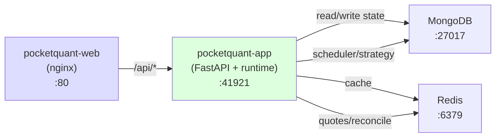

# System Architecture

DDD + Clean Architecture + Dishka. Single Python package `src/pocketquant/` (core, engine, app) + Node SPA `web/`. Dependency: `core ◁ engine ◁ app`, `web → app`. Backtest and live are two drivers on one shared engine. Binance public REST/WS (@aggTrade), OKX live trading, single FastAPI process on :41921 with scheduler, WS feed, strategy lifecycle, reconcile loop.

For local run/test steps and canonical routes, use [README](../README.md).

## High-Level Architecture

PocketQuant uses **Clean Architecture + DDD** with strict unidirectional dependency flow: Routes → Services → Domain, Adapters → Domain. Command/Query services orchestrate domain logic. A modern React 19 SPA frontend consumes the REST API.

```
┌─────────────────────────────────────────────────────────────────┐
│                    Client Layer (Browser)                       │
│  pocketquant-web: React 19 + Vite + Lightweight Charts         │
│  Candlestick chart, 5 indicators, symbol/interval selectors     │
└──────────────────────┬──────────────────────────────────────────┘
                       │ HTTP/REST (proxy to :41921 app)
                       ▼
          ┌──────────────────────────────────────────────┐
          │  pocketquant-app (FastAPI + runtime)         │
          │  :41921 (all /api/v1/* routes)               │
          │  Scheduler, WS feed, strategy lifecycle,     │
          │  reconcile loop, backtest tasks              │
          └──────┬───────────────────────────────────────┘
                 │
                 ▼
┌─────────────────────────────────────────────────────────────────┐
│   External Services & Infrastructure                             │
│  Binance REST+WS | OKX REST+WS | MongoDB | Redis | APScheduler │
└─────────────────────────────────────────────────────────────────┘
                         │
            ┌────────────┴────────────┐
            │                         │
            ▼                         ▼
┌──────────────────────────┐   ┌──────────────────────────┐
│  Application Layer       │   │   Domain Layer           │
│  (Orchestrators)         │◄──┤   (Pure Logic)           │
│  ├─ StrategyAppService       │   │   ├─ Aggregates         │
│  ├─ BacktestAppService       │   │   ├─ Value Objects      │
│  ├─ BarAppService           │   │   ├─ Domain Events      │
│  ├─ OrderAppService         │   │   ├─ Interfaces         │
│  └─ PositionAppService      │   │   └─ Domain Services    │
└──────────┬───────────────┘   └──────────────────────────┘
           │                            │
           │    ┌───────────────────────┘
           │    │
           ▼    ▼
┌─────────────────────────────────────────────────────────────────┐
│              Infrastructure Layer (External I/O)                 │
│  ┌──────────┐  ┌──────────┐  ┌──────────┐  ┌──────────────┐   │
│  │ Brokers  │  │Providers │  │Persistence│  │ Scheduling  │   │
│  │ (OKX,   │  │(Binance  │  │(MongoDB,  │  │  (APScheduler)  │
│  │ Paper)  │  │ REST/WS) │  │ Redis)    │  │              │   │
│  └──────────┘  └──────────┘  └──────────┘  └──────────────┘   │
└─────────────────────────────────────────────────────────────────┘
        │              │               │            │
        ▼              ▼               ▼            ▼
    ┌────────┐  ┌──────────┐  ┌──────────────┐  ┌──────────┐
    │  OKX   │  │ Binance  │  │  MongoDB     │  │ Redis /  │
    │ Live   │  │  Public  │  │  (Bars,     │  │BackgroundJobs
    │Trading │  │  REST/WS │  │  Orders,    │  │          │
    │        │  │          │  │  Positions) │  │          │
    └────────┘  └──────────┘  └──────────────┘  └──────────┘
```

**Dependency Direction:** Features ← Application ← Domain, Adapters ← Domain (no reverse dependencies)

**Real-Time Streaming:** Inbound WebSocket: Binance `@aggTrade` (singleton, market data), OKX private (per-broker, order/position). Outbound SSE: `/api/v1/market-data/bars/stream/{symbol}?interval={interval}` (1s poll, emit on change), `/api/v1/quotes/stream/{symbol}` (0.5s poll). Redis intermediary: WS writes, SSE reads. Frontend EventSource with staleness detection (30s bar, 10s quote); fallback to REST.

## Strategy Declarative Control Plane (SP1)

**Architecture:** Kubernetes-style control-plane/data-plane split.

```
Control plane (desired state)           Data plane (live engine)
 Mongo: subscription.desired_state       RAM: StrategyAppService instances
      ▲                 │                    ▲           │
 API  │                 │ read desired       │ start/stop
      │                 ▼                    │           ▼
 [handlers]  ┌──────────────────┐           │    [market events]
             │  reconcile loop  │───────────┴────────────
             │  5s poll         │ write actual_state → Mongo
             └──────────────────┘
```

**Control-plane sources of truth:** `Subscription` entity persists two state fields:
- `desired_state: "running" | "stopped"` — what a handler (or human) intends → written by HTTP start/stop handlers
- `actual_state: "running" | "stopped"` — live engine's observed state → written by reconcile loop when it detects drift

**Handlers are declarative:** `StartStrategyCommand` and `StopStrategyCommand` write `desired_state` only (no direct engine call) and return before the strategy starts/stops; the reconcile loop converges within ≤1 interval.

**Reconcile loop:** `StrategyReconcileAppService` (in `engine` subpackage) polls every `Settings.reconcile_interval_seconds` (default 5.0s):
1. Iterates `sub_repo.list_all()` (reads from Mongo)
2. For each subscription, compares `desired_state` to live `StrategyAppService` instance's run-state
3. Calls `start_strategy()` or `stop_strategy()` to converge
4. Mirrors observed `actual_state` back to Mongo only on drift (idempotent, no per-tick churn)
5. Subscription-driven: never enumerates RAM, so injected backtest strategies (synthetic ids) are invisible

**Add new subscription:** `StrategyCommandService.add_symbol(AddSymbolCommand)` persists với `desired_state="stopped"` (opt-in to trading; no auto-start on add) và pre-load instance mà không start.

**List subscriptions:** `StrategyQueryService.list_symbols(ListSymbolsQuery)` source run-state từ Mongo: trả `desired_state`, `actual_state`, và `is_running` (derived `actual_state == "running"`). No RAM read.

**Defensive read on legacy docs:** Subscriptions lacking `desired_state` or `actual_state` fields (legacy docs pre-control-plane) read both as `"stopped"` via `Subscription.from_mongo()` defensive `.get()` defaults. Reconcile loop then converges `actual_state` to match `desired_state`, so no manual re-migration required across deploys.

## Clean Architecture Layer Breakdown

### Layer 1: Domain (Pure Business Logic) — src/pocketquant/core/domain/

**Purpose:** Core business rules with ZERO external dependencies. Reusable domain concepts.

**Rules:**
- No I/O imports (no pymongo, redis, aiohttp, http)
- Immutable value objects (frozen dataclasses, enums)
- Domain events for state changes (HistoricalDataSyncedEvent, OrderFilledEvent, etc.)
- Validation via __post_init__
- Enforced via `test_domain_purity.py` (AST check)

**Structure:**
```
domain/
├── backtest/               # Backtesting domain
│   ├── entities.py         # BacktestResult
│   ├── value_objects.py    # OpenLot
│   └── config.py           # BacktestConfig
├── bar/                    # TOP-LEVEL: Market bars (renamed from ohlcv/)
│   ├── entities.py         # Bar entity with to_mongo/from_mongo
│   ├── events.py           # BarCompletedEvent, HistoricalDataSyncedEvent
│   ├── value_objects.py    # OHLCV, BarRange
│   └── services/bar_builder_domain_service.py  # BarBuilderDomainService service
├── order/                  # TOP-LEVEL: Order lifecycle
│   ├── entities.py         # OrderAggregate with to_mongo/from_mongo
│   ├── enums.py            # OrderType, OrderSide, OrderStatus
│   ├── events.py           # Order events
│   └── records.py          # OrderRecord (audit trail, separate from live aggregate)
├── position/               # TOP-LEVEL: Position tracking
│   ├── entities.py         # PositionAggregate with to_mongo/from_mongo
│   ├── enums.py            # PositionSide
│   ├── events.py           # Position events
│   └── value_objects.py    # PnL
├── symbol/                 # TOP-LEVEL: Tradeable instruments
│   └── entities.py         # Symbol (flattened from SymbolAggregate)
├── sync_status/            # TOP-LEVEL: Sync tracking
│   └── entities.py         # SyncStatus
├── trading/                # Universal trading contracts (source-agnostic)
│   ├── value_objects.py    # Trade, Fill, EquityPoint, PerformanceMetrics
│   ├── performance_calculator_domain_service.py  # PerformanceCalculatorDomainService with static .build()
│   └── trade_stats.py      # trade_stats functions (histogram, streaks, profit_factor, drawdowns)
├── quote/                  # NON-PERSISTED: real-time quote logic
│   ├── events.py           # QuoteReceivedEvent, QuoteUpdatedEvent
│   └── value_objects.py    # Price, QuoteTick
├── risk/                   # NON-PERSISTED: position sizing / risk
│   ├── enums.py            # RiskModel enum
│   ├── value_objects.py    # RiskConfig
│   ├── position_calculation.py  # PositionCalculation VO (calc result)
│   └── services/position_calculator_domain_service.py  # PositionCalculatorDomainService (pure calc)
├── strategy/               # NON-PERSISTED: strategy contracts + impls
│   ├── enums.py            # Direction enum
│   ├── events.py           # SignalGeneratedEvent
│   ├── strategy_service_interface.py   # IStrategyService ABC
│   ├── value_objects.py    # Signal, StrategyConfig, OrderConfig, StopLossConfig, TakeProfitConfig
│   ├── patterns/engulfing_detector.py  # Engulfing pattern detector (pure)
│   └── services/           # HitNRun2StrategyService, EngulfingStrategyService, EngulfingPullback30TouchStrategyService
└── shared/                 # Cross-cutting
    ├── enums.py            # Interval enum
    ├── events.py           # DomainEvent base (was domain_event.py)
    └── value_objects.py    # INTERVAL_SECONDS mapping
```

**Example - Bar Entity with MongoDB Persistence:**
All domain entities use Pydantic BaseModel with built-in `to_mongo()` / `from_mongo()` for persistence.

**Example - Symbol Entity (Flattened from SymbolAggregate):**
Symbol is now a simple flat entity with `code`, `exchange`, `name`, `asset_type`, `is_active` fields and standard `to_mongo()`/`from_mongo()` methods.

**Composite Symbol Format:**
Exchange encapsulation replaces standalone `exchange` field across domain entities (Bar, Order, Position, Symbol, SyncStatus, Subscription, TrackedSymbol). Symbol identifier format is now composite: `{CODE}:{EXCHANGE}` (e.g., `BTCUSDT:BINANCE`). Single immutable `symbol: str` field replaces `(code, exchange)` pairs. Business logic never decomposes—exchange is opaque postfix.

**Example - Domain Service (Pure Logic):**
BarBuilderDomainService and PositionCalculatorDomainService are pure domain services with zero I/O, implementing domain business rules.

### Layer 2: Application (Orchestrators) — `engine` and `app` packages

**Purpose:** Orchestrate domain logic + adapter I/O to fulfill business use cases. Stateful services and engines that coordinate between layers. Backtest and live are two **drivers** on one shared engine in `engine` subpackage.

**Structure:**
```
src/pocketquant/engine/                     # SHARED engine (used by backtest + live)
├── strategy/                                # Strategy feature area
│   ├── strategy_app_service.py
│   ├── strategy_command_service.py         # StrategyCommandService (dispatch, signal handling)
│   └── strategy_query_service.py           # StrategyQueryService (read strategies, subscriptions)
├── execution/                               # Order/Position feature area
│   ├── order_app_service.py
│   ├── position_app_service.py
│   ├── orders_positions_service.py         # OrdersPositionsService (combined query service)
│   └── risk_check.py                       # RiskCheckHandler (validation)
├── market_data/                             # Market data feature area
│   ├── sync_service.py, ohlcv_service.py, quotes_service.py, symbols_service.py
│   └── app_services/                        # BarAppService, QuoteAppService, WsSubscriptionAppService, sync/integrity jobs
├── backtest/                                # Backtest driver (isolated per run)
│   ├── backtest_app_service.py
│   ├── backtest_sandbox_app_service.py
│   ├── backtest_execution_service.py       # AsyncTask body: run + persist
│   ├── backtest_command_service.py         # BacktestCommandService
│   ├── backtest_query_service.py           # BacktestQueryService
│   ├── backtest_stats_service.py           # Stats + keyset pagination
│   ├── backtest_report_app_service.py      # Report collection (Trade+equity → metrics)
│   ├── historical_replay_app_service.py    # Historical replay
│   ├── collected_results.py                # Result aggregation
│   └── backtest_dispatch.py                # Worker dispatch
└── live/                                    # Live trading driver
    ├── strategy_reconcile_app_service.py  # Reconcile loop (5s poll) + bootstrap()
    ├── live_trade_collector.py            # EventBus subscriber → persist live Trade (run_id=sub_id)
    └── live_metrics_query_service.py      # On-demand per-subscription metrics (M1)

src/pocketquant/core/domain/trading/        # Trading contracts (universal, source-agnostic)
├── value_objects.py                        # Trade, Fill, EquityPoint, PerformanceMetrics
├── commission_model.py                     # CommissionModel (Protocol) + PercentageCommissionModel(bps)
├── performance_calculator_domain_service.py  # PerformanceCalculatorDomainService (NumPy metrics)
└── trade_stats.py                          # Pure functions: histogram, streaks, profit_factor, drawdowns

src/pocketquant/core/domain/bar/services/    # Domain service layer (top-level)
├── bar_builder_domain_service.py           # BarBuilderDomainService (OHLCV aggregation)

src/pocketquant/core/domain/risk/services/   # Domain service layer
├── position_calculator_domain_service.py   # PositionCalculatorDomainService (risk calculations)
```

**Example - Application Service:**
```python
# StrategyAppService - orchestrates domain + adapter I/O
class StrategyAppService:
    def __init__(self, broker: IBrokerPort, event_bus: EventBus):
        self.broker = broker
        self.event_bus = event_bus
        self.strategy: Optional[IStrategyService] = None

    async def _on_bar_completed(self, event: BarCompletedEvent) -> None:
        """Called when bar completes."""
        # 1. Domain: Get strategy signal
        signal = await self.strategy.on_bar_completed(event.bar)

        # 2. Adapter: Check risk
        approved = await risk_check(signal)

        # 3. Adapter: Execute via broker
        if approved:
            order = await self.broker.submit_order(approved.order)

        # 4. Adapter: Publish event
        await self.event_bus.publish(SignalGeneratedEvent(...))
```

### Layer 3: Routes (API Layer) — `app/routes/`

**Purpose:** Thin HTTP routing layer. Routes receive requests, delegate to command/query services, return responses.

**Pattern:** Routes use FastAPI's `APIRouter(route_class=DishkaRoute)` and inject service dependencies via `FromDishka[CommandService]` or `FromDishka[QueryService]`. Each route accepts a Pydantic command/query model and returns a DTO.

**Structure:**
Routes are organized by feature (backtest, strategy, market_data) with APIRouter registering endpoints. Example route calls a command service method directly:

```python
# src/pocketquant/app/routes/strategy.py (example)
router = APIRouter(route_class=DishkaRoute)

@router.post("/strategies/{strategy_code}/subscriptions")
async def add_symbol(
    strategy_code: str,
    cmd: AddSymbolCommand,
    strategy_svc: FromDishka[StrategyCommandService]
) -> SubscriptionDTO:
    return await strategy_svc.add_symbol(cmd.symbol, cmd.interval)
```

**Service 5-Step Pattern** (in all command/query services): 1. Receive Command/Query (Pydantic) 2. Fetch adapters 3. Execute domain 4. Persist 5. Return DTO

### Layer 4: Adapters (External I/O) — src/pocketquant/core/ + other subpackages

**Purpose:** All external integrations: databases, brokers, data providers, scheduling, HTTP. Concrete adapters live in `core/infra/` and `core/common/`. Abstractions (ports/DTOs) live in `core/domain/{brokers,market_data}` so engine/backtest/trading depend on contracts, not implementations (DIP). Domain purity enforced: `core/domain/` imports zero I/O.

**Structure:**
```
core/
├── persistence/                       # Data access (MongoDB, Redis, repositories)
│   ├── mongodb.py           # Database async singleton (PyMongo)
│   ├── redis.py             # Cache async singleton (redis-py)
│   ├── base_repository.py   # BaseRepository mixin (_collection() helper)
│   ├── health_checks.py     # check_database / check_redis
│   └── repositories/        # All 12 repos (instance methods via DI)
│       ├── bar_repository.py
│       ├── order_repository.py
│       ├── position_repository.py
│       ├── subscription_repository.py
│       ├── backtest_repository.py
│       ├── backtest_order_repository.py
│       ├── backtest_trade_repository.py
│       ├── symbol_repository.py
│       ├── tracked_symbol_repository.py
│       ├── sync_status_repository.py
│       ├── job_history_repository.py
│       └── trade_repository.py         # Live trading: subscription_id FK
├── brokers/
│   └── paper/               # PaperBrokerAdapter (in-memory simulation)
│       └── paper_broker_adapter.py
├── market_data/
│   └── binance/             # Binance REST + WS integration
│       ├── binance_adapter.py            # BinanceAdapter (implements core.domain IDataProviderPort)
│       ├── binance_websocket_adapter.py  # BinanceWebSocketAdapter (@aggTrade stream)
│       └── binance_mappers.py           # Binance-specific mapping
├── scheduling/
│   └── scheduler.py         # JobScheduler (APScheduler + MongoDBJobStore)
├── http_client/
│   └── client.py            # ResilientHttpClient (retry/backoff)
└── domain/                           # Domain (pure business logic, zero I/O)
    ├── brokers/            # Ports: IBrokerPort, IBrokerFactoryPort + DTOs
    └── market_data/        # Ports: IDataProviderPort, IRealtimeQuoteProviderPort + DTOs
```

**Notes:**
- OKX live broker (OKXBrokerAdapter + websocket) lives in `src/pocketquant/core/infra/brokers/okx/` (next to `paper/`).
- Ports + DTOs (IBrokerPort, IBrokerFactoryPort, OrderResult, AccountBalance, OrderEvent, IDataProviderPort, IRealtimeQuoteProviderPort) live in `core.domain.{brokers,market_data}`.
- No schemas/ — persistence lives in domain entities via `to_mongo()`/`from_mongo()` methods.

**Key Services:**

| Service | Purpose |
|---------|---------|
| **MongoDBConnection** | Async collection access, pooling (5-50 connections) |
| **RedisConnection** | JSON serialization, pattern deletion, TTL support |
| **PaperBrokerAdapter** | In-memory simulation, configurable slippage/delay |
| **OKXBrokerAdapter** | Live trading, HMAC auth, exponential backoff reconnection |
| **BinanceAdapter** | Implements IDataProviderPort; public REST API (no auth). Returns bars with delta volume per tick (required by BarBuilderDomainService). Rate limit: 1200 weight/min. |
| **BinanceWebSocketAdapter** | @aggTrade stream for real-time quote ingestion. Implements IRealtimeQuoteProviderPort. |
| **JobScheduler** | APScheduler wrapper, async job execution, supports `second` param for cron offset (dodge bar-close race) |

### Layer 5: Common (Cross-Cutting) — src/pocketquant/core/common/

**Purpose:** Shared utilities: event bus, middleware, tracing, health checks, logging, UUID generation.

**Structure:**
```
common/
├── messaging/
│   ├── event_bus.py          # EventBus (in-memory, FIFO, 50-event history)
│   ├── event_handler.py      # EventHandler base class
│   ├── event_registry.py     # @event_handler decorator + auto-discovery
│   └── ...
├── middleware/
│   ├── correlation_id.py     # CorrelationIdMiddleware (request tracking)
│   ├── request_logging.py    # RequestLoggingMiddleware
│   ├── idempotency.py        # IdempotencyMiddleware (24h TTL)
│   └── rate_limit.py         # RateLimitMiddleware (200 req/10s per IP)
├── tracing/
│   ├── correlation.py        # CorrelationID context management
│   └── context.py            # ContextVar storage
├── health/
│   ├── coordinator.py        # HealthCoordinator (parallel checks)
│   └── checks.py             # Database, cache, jobs health probes
├── database.py               # Database singleton (MongoDB)
├── cache.py                  # Cache singleton (Redis)
├── jobs.py                   # JobScheduler singleton (APScheduler)
├── uuid.py                   # UUID7 generation (time-ordered IDs)
├── logging.py                # Structured logging (structlog)
├── constants.py              # Cache keys, TTLs, limits, headers
└── __init__.py
```

**Key Components:**

| Component | Purpose |
|-----------|---------|
| **EventBus** | Publish domain events, subscribe handlers via @event_handler |
| **CorrelationIdMiddleware** | Inject request ID for distributed tracing |
| **RateLimitMiddleware** | Token bucket per IP (200 req/10s) |
| **IdempotencyMiddleware** | Cache POST responses by idempotency_key header |
| **Database** | MongoDB async singleton |
| **Cache** | Redis async singleton |
| **JobScheduler** | APScheduler async wrapper |

### Layer 6: Presentation (Web UI) — web (React SPA)

**Purpose:** TradingView-like charting interface for real-time market visualization, indicator analysis, strategy management, and backtesting.

**Tech Stack:**
- **Vite 8** - Build tool with HMR
- **React 19** - UI framework with Hooks
- **TypeScript 5.9** - Type safety
- **TanStack Router** - File-based routing (layout routes via `__root.tsx`)
- **Lightweight Charts 5.1** - High-performance candlestick rendering
- **TanStack Query 5.x** - Server state management, real-time polling

**Structure:**
```
src/
├── api/                  # REST client layer
│   ├── api-client.ts    # HTTP fetch wrapper (proxy to :41921 app)
│   ├── market-data-api.ts   # Market data queries
│   ├── backtest-api.ts      # Backtest run + poll
│   └── strategy-api.ts      # Strategy subscription queries
├── components/
│   ├── chart/           # Charting components
│   │   ├── trading-chart.tsx  # Candlestick + volume + indicators
│   │   ├── use-chart.ts       # Lightweight Charts initialization
│   │   └── indicator-series.ts  # SMA, EMA, RSI, MACD, Bollinger
│   ├── controls/        # User controls
│   │   ├── symbol-selector.tsx   # Symbol dropdown
│   │   ├── interval-selector.tsx  # Timeframe picker (1m-1w)
│   │   └── indicator-toggles.tsx  # Show/hide indicators
│   ├── backtest/        # Backtest run components
│   │   └── backtest-form.tsx  # Strategy/symbol/dates + timezone, trigger run
│   └── layout/
│       ├── app-header.tsx       # Symbol + interval + indicators
│       ├── theme-toggle.tsx     # Dark/light mode switcher
│       ├── timezone-switcher.tsx # Timezone picker
│       └── live-clock.tsx       # Realtime clock in app-nav
├── hooks/               # React custom hooks
│   ├── use-ohlcv.ts     # Fetch historical bars
│   ├── use-realtime-bar.ts  # Real-time polling (TanStack Query)
│   ├── use-symbols.ts   # Fetch symbol list
│   ├── use-indicators.ts  # Indicator calculation
│   ├── use-run-backtest.ts  # Start single backtest run
│   └── use-timezone.ts  # Timezone context consumer
├── lib/
│   ├── theme-context.tsx  # Dark/light mode state + localStorage persist
│   ├── theme-colors.ts    # Read CSS tokens for chart colors
│   ├── timezone-context.tsx # Timezone picker state
│   └── indicators/      # Pure indicator algorithms
│       ├── moving-average.ts  # SMA, EMA
│       ├── rsi.ts             # Relative Strength Index
│       ├── macd.ts            # MACD + signal line
│       └── bollinger-bands.ts # Upper, middle, lower bands
├── routes/              # TanStack Router file-based routes
│   ├── __root.tsx       # Root layout: nav + theme toggle + timezone + clock
│   ├── index.tsx        # Charts page
│   ├── strategies.tsx   # Strategy dashboard
│   ├── backtest.tsx     # Backtest runner
│   └── monitor.tsx      # System monitoring
├── main.tsx             # App entry: QueryClient + Providers + Router
└── index.css            # Global styles + theme tokens (data-theme: dark|light)
```

**Routes:**
- `/` — Charts: TradingChart + SymbolSelector + IntervalSelector + StrategySelector + IndicatorToggles + AppHeader
- `/strategies` — Operator Dashboard: 3-pane layout (list/start/stop strategies, config+chart embed with indicator toggles, positions/metrics)
- `/backtest` — Ad-hoc Backtest Runner: form with symbol/interval/strategy/date range (datetime-local inputs with timezone dropdown), run job, poll + display results
- `/monitor` — System Monitoring: HealthBanner + DataHealthTable (sync/integrity, expandable rows, check/repair) + BackgroundJobsList (auto-poll 30s)

**Key Features:**
- **Candlestick Chart:** Real-time OHLCV visualization via Lightweight Charts with theme-aware colors
- **Volume Overlay:** Trading volume as histogram below price
- **5 Indicators:** SMA (20/50), EMA (12/26), RSI (14), MACD (12,26,9), Bollinger Bands (20,2) with show/hide toggles (reusable on strategies page)
- **Symbol/Interval Selectors:** Switch data without page reload
- **Theme Toggle:** Dark/light mode switcher in top-right; persists to `localStorage:pq.theme.mode`, applies `data-theme` attribute to `<html>`, chart re-reads colors on flip
- **Timezone Picker:** Select timezone for backtest date inputs; displayed as `datetime-local` UI for minute-precision selection
- **Live Clock:** Realtime wall-clock in app-nav
- **Real-time Polling:** TanStack Query refetches bar data every 5-10s (configurable)
- **API Proxy:** Vite dev server proxies `/api/*` to `http://localhost:41921` (app)

**Custom Hooks:**

| Hook | Purpose | Interval |
|------|---------|----------|
| `useOHLCV()` | Fetch historical bars (TanStack Query + cache) | on-demand |
| `useRunBacktest()` / `useBacktestRun()` | Start a single backtest + poll the run to terminal | poll 1.5s while `started` |
| `useSymbols()` | List available symbols | on-demand |
| `useAvailableIntervals()` | Get compatible timeframes from sync status | on-demand |
| `useRealtimeBar()` / `useRealtimeQuote()` | Poll API for latest bar/quote | 5–10s |
| `useIndicators()` | Calculate SMA/EMA/RSI/MACD/BB from bars | derived |
| `useSyncStatus()` | Poll sync status | 30s |
| `useIntegrityRepair()` | Data integrity mutation | manual |
| `useBackgroundJobs()` / `useJobRuns()` / `useJobStats()` | Poll background job list/runs/stats | 30s |
| `useSubscriptions()` | Poll strategy subscription list | polling |

**API Layer:** `apiFetch()` / `apiPost()` wrappers in `src/api/api-client.ts`; modules: `market-data-api.ts`, `backtest-api.ts`, `strategy-api.ts`, `system-jobs-api.ts`, `monitor-api.ts`.

**Deployment:** Vite `dist/` served as static assets behind FastAPI (no separate server).

## Where Does X Live?

| Topic | Location |
|-------|----------|
| Domain entities (Bar, Order, Position, Symbol) | `core/domain/{bar,order,position,symbol}/entities.py` |
| Value objects (OHLCV, Signal, PnL, QuoteTick) | `core/domain/{bar,strategy,position,quote}/value_objects.py` |
| Trading value objects (Trade, Fill, EquityPoint, PerformanceMetrics) | `core/domain/trading/value_objects.py` |
| OrderRecord (audit trail) | `core/domain/order/records.py` |
| BacktestConfig | `core/domain/backtest/config.py` |
| Domain events (11 events) | `core/domain/{bar,order,position,quote,strategy}/events.py` |
| Enums (OrderStatus, Interval, Direction, etc.) | `core/domain/{bar,order,position,shared}/enums.py` |
| Event bus + @event_handler decorator | `core/common/messaging/` |
| Middleware (correlation, rate limit, idempotency) | `core/common/middleware/` |
| MongoDB connection | `core/infra/persistence/mongodb.py` |
| Redis connection | `core/infra/persistence/redis.py` |
| All repositories | `core/infra/persistence/repositories/` |
| Binance REST + WS clients | `core/infra/binance/` |
| OKX broker + WS + reconnection | `core/infra/brokers/okx/` |
| PaperBrokerAdapter (simulation) | `core/infra/brokers/paper/` |
| APScheduler wrapper | `core/infra/scheduling/scheduler.py` |
| Dishka DI container (6 providers) | `app/di/` |
| FastAPI app + middleware wiring | `app/main.py`, `app/main_extensions.py` |
| Command/Query services | `engine/`, `backtest/`, `app/` (subpackage service classes) |
| Backtest trigger (save started doc) | `engine/backtest/backtest_command_service.py` |
| Backtest task body (run + persist) | `engine/backtest/backtest_execution_service.py` |
| Backtest stats + paged trades + markers | `engine/backtest/backtest_stats_service.py` (orchest) + `core/domain/trading/trade_stats.py` (domain) |
| Backtest engine setup + replay | `engine/backtest/backtest_dispatch.py`, `engine/backtest/backtest_app_service.py` |
| Strategy runtime dispatch | `engine/strategy/strategy_command_service.py`, `engine/strategy/strategy_query_service.py` |
| Order state machine | `engine/execution/order_app_service.py` |
| Position tracking + P&L | `engine/execution/orders_positions_service.py` |
| HitNRun2 strategy (hitnrun2) | `core/domain/strategy/services/hitnrun2_strategy_service.py` |
| Background sync job registration | `app/main_extensions.py` → `register_sync_jobs()` |
| UUID7 generation | `core/common/uuid.py` |
| Cache keys, TTLs, constants | `core/common/constants.py` |
| Frontend API client layer | `web/src/api/` |
| Frontend custom hooks | `web/src/hooks/` |
| Chart + indicator components | `web/src/components/chart/` |
| Theme context + toggle + colors | `web/src/lib/theme-context.tsx`, `web/src/components/layout/theme-toggle.tsx`, `web/src/lib/theme-colors.ts` |
| Timezone context + picker | `web/src/lib/timezone-context.tsx`, `web/src/components/layout/timezone-switcher.tsx` |
| Live clock | `web/src/components/layout/live-clock.tsx` |
| Theme CSS tokens + data-theme attribute | `web/src/index.css` (`:root[data-theme="dark|light"]` with token definitions) |
| Backtest form (datetime-local + timezone) | `web/src/components/backtest/backtest-form.tsx` |
| Domain purity test (AST check) | `tests/core_test/unit/domain/test_domain_purity.py` |
| BacktestSandboxAppService | Backtest engine isolated instance | `engine/backtest/backtest_sandbox_app_service.py` |
| StrategyReconcileAppService | Reconciliation loop + `bootstrap()` (boot instance load) | `engine/live/strategy_reconcile_app_service.py` |
| LiveTradeCollector | EventBus subscriber → persist live `Trade` (`run_id`=sub_id) | `engine/live/live_trade_collector.py` |
| LiveMetricsQueryService | On-demand per-subscription performance metrics (M1) | `engine/live/live_metrics_query_service.py` |
| WsSubscriptionAppService | WebSocket subscription mgmt | `engine/market_data/app_services/ws_subscription_app_service.py` |
| QuoteAppService | WS feed + tick→bar processing | `engine/market_data/app_services/quote_app_service.py` |
| BrokerFactory | Concrete broker construction (paper/OKX) | `core/infra/brokers/broker_factory.py` |
| PerformanceCalculatorDomainService | NumPy metrics calculator | `core/domain/trading/performance_calculator_domain_service.py` |
| SyncProgressTrackerDomainService | Sync status tracking | `core/domain/sync_status/services/sync_progress_tracker_domain_service.py` |
| BacktestReportAppService | Backtest report: collect Trade+equity, build metrics | `engine/backtest/backtest_report_app_service.py` |
| EngulfingStrategyService | Engulfing strategy impl | `core/domain/strategy/services/engulfing_strategy_service.py` |
| EngulfingPullback30TouchStrategyService | Engulfing variant (`engulfing_pullback30_touch`): arm on pattern, enter at next bar close on a 30% intrabar pullback | `core/domain/strategy/services/engulfing_pullback30_touch_strategy_service.py` |

## Request Flow

**Command (POST):** Middleware (correlation, rate-limit, idempotency) → Route (parse command) → Service (1. fetch adapter, 2. validate domain, 3. persist, 4. invalidate cache, 5. publish event) → Response DTO.

**Query (GET):** Middleware → Route → Service (1. fetch/cache, 2. validate, 3. cache result, 4. return DTO) → Response.

## MongoDB & Repositories

13 collections. All `_id` are UUIDv7 except `apscheduler_jobs` (job name, APScheduler-managed). Join keys: **`subscription_id`** (uuid7 string) links live trading records to subscription; **`run_id`** links backtest records to run; composite **`symbol`** (`BTCUSDT:BINANCE`) shared across market-data + trading. Unique index on `(strategy_code, symbol, interval)` dedup subscriptions. All repositories in `core/infra/persistence/repositories/`, inherit `BaseRepository`, injected with `Database`, zero direct collection calls outside persistence layer.

| Collection | `_id` | Repository | Purpose |
|---|---|---|---|
| `symbols` | uuid7 | SymbolRepository | Symbol metadata |
| `bars` | uuid7 | BarRepository | Historical OHLCV |
| `sync_status` | uuid7 | SyncStatusRepository | Market-data sync progress |
| `tracked_symbols` | uuid7 | TrackedSymbolRepository | Symbols to sync |
| `subscriptions` | uuid7 | SubscriptionRepository | Strategy subscriptions + control plane (desired_state, actual_state) |
| `orders` | uuid7 | OrderRepository | Live orders, subscription_id FK |
| `positions` | uuid7 | PositionRepository | Live positions, subscription_id FK |
| `trades` | uuid7 | TradeRepository | Live trades (avg-cost round-trips), subscription_id FK, run_id=subscription_id for live |
| `backtest_runs` | uuid7 | BacktestRepository | Single-run backtest results, keyed by run_id |
| `backtest_orders` | uuid7 | BacktestOrderRepository | Backtest order fills |
| `backtest_trades` | uuid7 | BacktestTradeRepository | Backtest round-trip trades |
| `job_history` | uuid7 | JobHistoryRepository | APScheduler job execution history |
| `apscheduler_jobs` | job name | (APScheduler) | Serialized scheduled jobs |

### Strategy Lifecycle (User POV)

**Create subscription:** `POST /api/v1/strategies/{strategy_code}/subscriptions` with `{symbol, interval}`. Validates symbol is tracked, looks up strategy in `STRATEGY_REGISTRY`, computes deterministic `sub_id = sha256(strategy_code|symbol|interval)[:16]`, instantiates `IStrategyService` via `StrategyAppService.load_strategy()`, persists `Subscription` to MongoDB with `desired_state="stopped"` (opt-in to trading, no auto-start). Returns `{id, strategy_code, symbol, interval, created_at, is_running}`.

**Start/Stop:** `POST /subscriptions/{sub_id}/start`, `POST /subscriptions/{sub_id}/stop` write `desired_state` to Mongo. Reconcile loop (5s poll) converges engine state within one interval.

**Reconcile loop:** `StrategyReconcileAppService` (background task, started at boot) every 5s: (1) fetch all subscriptions from Mongo, (2) compare `desired_state` vs live `is_running` (RAM), (3) call `start_strategy()` or `stop_strategy()` on drift, (4) mirror `actual_state` back to Mongo (idempotent, no churn unless drift).

**Delete:** `DELETE /subscriptions/{sub_id}` deletes the subscription; the reconcile orphan-unload tears down the in-memory instance out of band. Subscriptions hold no backtest state — forward-testing only.

### Backtest (ad-hoc single run)

Backtest is fully decoupled from subscriptions. `POST /api/v1/backtest/run` (free-form `{strategy_id, symbol, interval, start_date, end_date, parameters}`) runs one ad-hoc backtest. `start_date` and `end_date` are `datetime` with minute precision (format: ISO 8601, e.g. `2024-01-15T09:30:00`); date-only strings are accepted and parsed as 00:00:00 UTC for backward compatibility.

1. The route allocates a `run_id`, persists a `started` `BacktestResult` doc immediately, then spawns `BacktestExecutionService.execute_and_persist` as an in-process `asyncio.create_task` (no queue) and returns `202 {request_id: <run_id>}`.
2. The engine runs in a per-run `BacktestSandboxAppService` (isolated EventBus + StrategyAppService + throwaway trackers via a local EventRegistry). Trades are collected via broker-emitted `TradeClosedEvent` (published after each `PositionAggregate.reduce()` or `close()`), persisted orders → trades → run, and flips the doc to `finished` (or `failed` + `error_message`).
3. FE polls `GET /backtest/{run_id}` until terminal; `GET /backtest/{run_id}/equity`, `GET /backtest/{run_id}/trades` (keyset paged), `GET /backtest/{run_id}/trade-markers`, `GET /backtest/{run_id}/stats`, and `GET /backtest/{run_id}/orders` (orders with embedded `fills[]` + lifecycle `events[]`, DTO keyed by `order_id`) serve the result detail.

**Trade emission flow:**
```
PositionAggregate.reduce_quantity/close()
  ↓ emits
TradeClosedEvent (avg-cost, quantity, direction)
  ↓ forwarded via
IBrokerPort.subscribe_trades(callback)
  ├─ PaperBrokerAdapter: fires the trade callback AFTER the fill OrderResult
  └─ OKXBrokerAdapter: no-op (defers live-trade collection to R8)
  ↓
BacktestReportAppService.on_trade(event)
  ├─ Build Trade (stamp run_id, strategy_code) + credit pnl
  └─ Back-link exit OrderRecord.resulting_trade_id
```

Dispatch order (fill `OrderResult` before `TradeClosedEvent`) lets `on_trade` back-link the
exit order. Commission: per-fill debit in `on_fill`; `on_trade` credits pnl only (no
double-count). `entry_time` = first open; each reduce = 1 Trade record (partial closes =
round-trip chunk).

**Equity-curve granularity:** realized-equity points come only from `on_trade` (one per close, open fills add none), while the persisted curve is the per-bar `_mtm_curve` (broker `total_equity`), so `total_return`/`cagr` depend on closing equity and are independent of intra-bar fill timing.

**Trades endpoint (keyset pagination):** `GET /backtest/{run_id}/trades` returns paginated trades via keyset cursor, server-side filtered (all/wins/losses) and sorted. Query params: `limit` (default 50), `cursor` (opaque base64 token), `sort_key` (9 keys: entry_time, pnl, quantity, duration_seconds, entry_price, exit_price, commission, direction, status), `sort_dir` (asc/desc), `filter` (all/wins/losses). Footer `total` and `total_pnl` computed once per run (first page, `cursor is None`). Response: `{items, next_cursor, has_more, total, total_pnl}`.

**Markers endpoint (lite chart arrows):** `GET /backtest/{run_id}/trade-markers` returns list of `{trade_id, entry_time, exit_time, direction}` for the chart's BUY/SELL arrows (1 per trade, no paging).

**Stats endpoint (analytics):** `GET /backtest/{run_id}/stats` returns `{pnl_histogram, duration_histogram, streaks (max_win_streak, max_loss_streak), profit_factor_by_direction, drawdowns (top 5), profit_factor_all}` — all computed from trades via domain calculator, cached in app memory during route lifetime.

**History scope:** `GET /backtest/strategy/{strategy_id}` lists a strategy's runs, optionally narrowed by `?symbol=&interval=`. `symbol` is composite `CODE:EXCHANGE` (e.g. `BTCUSDT:BINANCE`) — a bare code never matches. `BacktestResult` denormalizes `symbol`/`interval` top-level (from `config_snapshot`, uppercased) so the scope filter hits an index; pre-denormalization docs fall back to the snapshot in `from_mongo`.

**Run-id invariant:** the route-allocated `run_id` is the run doc `_id` and every `backtest_orders.run_id` / `backtest_trades.run_id`.

**Isolation:** the sandbox owns its own bus, so live subscriptions never see replayed bars or synthetic fills, and concurrent runs don't cross-talk. No concurrency cap — runs share the live Mongo pool (`MONGODB_MAX_POOL_SIZE`); the operator owns traffic.

**Resilience:** in-flight tasks are held in `app.state.backtest_tasks`, drained (awaited) on shutdown; a boot sweep flips any orphan `started` run (killed mid-run) to `failed`. Status vocabulary is `started`/`finished`/`failed`.

## Real-Time Streaming

**Inbound (WebSocket):**
1. **Binance `@aggTrade`** — singleton, app-wide. `BinanceWebSocketAdapter` (reconnect 1s→60s backoff). `WsSubscriptionAppService` every 5s diffs `tracked_symbols` Mongo vs current subscriptions, calls `subscribe()/unsubscribe()` (20ms throttle, 50/s cap). Frames → `aggtrade_to_quote_dict` → `QuoteAppService.on_quote_update` → Redis `quote:latest:{symbol}` (TTL 60s).
2. **OKX private channels** — per-broker instance. `OKXWebSocketAdapter` + HMAC-SHA256 login, custom heartbeat (25s PING_INTERVAL, OKX timeout 30s). Exponential backoff 1s→30s, circuit breaker: pause 5min after 10 consecutive failures. Reconnect: re-subscribe channels, REST `get_orders_history(limit=100)` refresh dedupe set (prevent re-processing fills during downtime). Routes: **orders** → `OkxOrderMapper.to_order_result` → dedupe terminal states → notify callbacks → broker publishes `OrderFilledEvent` (routed via `StrategyAppService._on_order_filled` to the strategy); **positions** → logged only (TODO: emit PositionUpdatedEvent).

**Outbound (SSE):**
- **Bars:** `GET /api/v1/market-data/bars/stream/{symbol}?interval={interval}`. Poll Redis 1s, emit if `bar_start` changed or volume/price increased. Fields: `symbol, interval, bar_start, open, high, low, close, volume, tick_count, is_in_progress, staleness_ms`. Merge Redis in-progress + MongoDB fallback. TTL: `max(300, interval_seconds*2)`. Frontend stale threshold: 30s.
- **Quotes:** `GET /api/v1/quotes/stream/{symbol}`. Poll Redis 0.5s, emit if `last_price` or `volume` changed. Fields: `symbol, last_price, bid, ask, volume, change, change_percent, ts`. TTL ~60s. Frontend stale threshold: 10s, fallback to REST.

**Trade emission (backtest & live):** `IBrokerPort.subscribe_trades(callback)` — broker forwards a `TradeClosedEvent` for each position reduce/close (average-cost). `PaperBrokerAdapter` fires the trade callback right after the fill `OrderResult`. `OKXBrokerAdapter.subscribe_trades()` is a no-op (OKX live trades collected via R8 pipeline).

**Live trade pipeline (R8):** On `TradeClosedEvent` (paper or any reduce in engine), `StrategyAppService._forward_trade_to_bus` publishes to EventBus. `LiveTradeCollector` (EventBus subscriber, live-only) receives event → stamps `run_id=subscription_id` + `strategy_code` → persists Trade to `trades` collection (TradeRepository). Backtest bypasses via `inject_prepared_strategy` (synthetic ids, no double-count). Metrics queried live via `LiveMetricsQueryService.get_metrics(sub_id)` — calculates M1 (Sharpe, Sortino, win_rate, etc.) from `trades` table, returns via `GET /api/v1/subscriptions/{sub_id}/metrics`.

**Known issues:** (1) OKX heartbeat races with message iterator, non-pong frames dropped under load; (2) OKX position updates logged only, no EventBus; (3) Binance unsubscribe defers reconnect (new URL built only on next drop); (4) SSE poll latency 0.5–1.2s vs WebSocket trade-off (acceptable for bar intervals ≥1m).

## In-Memory Runtime State

`StrategyAppService` (per-process, NOT shared): `_strategies[sub_id] = IStrategyService`, `_brokers[sub_id] = IBrokerPort`, `_configs[sub_id] = StrategyConfig`. Broker reuse: multiple subscriptions on same broker share one connection (name match). Event handlers auto-registered on `start()`: `_on_bar_completed(event)` → `BarCompletedEvent`, `_on_quote_received(event)` → `QuoteReceivedEvent`, `_on_order_filled(event)` → `OrderFilledEvent`.

**Signal flow:** Event (bar/quote) → `_find_strategies(symbol, interval, trigger)` → `strategy.on_bar_completed(bar)` / `strategy.on_quote_received(tick)` → Signal? → `_process_signal` (1. broker.get_balance() 2. position_app_service.get() 3. RiskCheckHandler.validate() 4. PositionCalculatorDomainService.calculate() 5. OrderAggregate creation 6. OrderAppService.submit()).

**Order/Position state:** `OrderRepository.load_pending_orders()` on startup restore in-memory state + broker_order_id mapping. `PositionRepository.find_open()` restore open positions. `OrderFilledEvent` → `PositionAppService._on_order_filled` → position state update. Fills route via `StrategyAppService._on_order_filled` to the owning strategy by `subscription_id` → calls `strategy.on_order_filled(order, fill_price)`.

## Broker & Middleware

**Brokers:** `PaperBrokerAdapter` (simulation, slippage/delays), `OKXBrokerAdapter` (live, HMAC auth, 1s→30s backoff, 10-fail circuit breaker 5m pause).

### PaperBrokerAdapter accounting model (futures/margin, 1× leverage)

`PaperBrokerAdapter` dùng **futures/margin accounting**, không phải spot. Domain là OKX perpetual SWAP (`okx_broker_adapter.py` instType `SWAP`), nên mở vị thế không tiêu cash — chỉ realized pnl mới chạm `_balance`.

| | Spot | Futures/margin (PaperBrokerAdapter) |
|---|---|---|
| Open / add | `cash -= notional` | `_balance` không đổi |
| Close / reduce | `cash += proceeds` | `_balance += Δrealized` (delta của lần reduce này) |
| `total_equity` | `cash + Σ market_value` | `_balance + Σ unrealized_pnl` (mark per-bar) |
| `available_balance` | `cash` | `= _balance` |

**Vì sao futures:** (1) tránh điểm `total_equity ≈ 0` khi mở all-in (notional ≈ balance) — điểm 0 đó từng ép Sharpe/Sortino về 0 và bịa drawdown −100%; (2) `_balance + unrealized` đúng cho cả long lẫn short mà không cần signed market value; (3) khớp domain OKX SWAP. Leverage cố định 1× (không margin call).

**Delta-realized (không cumulative):** `PositionAggregate.reduce_quantity` cộng dồn vào `position.realized_pnl`. Broker credit phần delta kể từ lần reduce trước (`_reduce_and_credit`), không phải giá trị cumulative — nếu credit cumulative thì partial-close lần hai cộng lại toàn bộ → multi-count. Kết quả: `_balance` cuối = `initial + Σ realized` đúng một lần.

**Price propagation:** mark-to-market chạy ở cuối `_on_bar_completed` (sau SL/TP loop), set `current_price = event.close` cho các vị thế còn mở. `get_balance` thuần đọc (không side-effect trong getter). `BacktestSandboxAppService._mtm_on_bar` subscribe `BarCompletedEvent` SAU broker handler nên đọc equity đã mark → equity curve track giá per-bar, không phẳng giữa các fill.

**`available_balance = _balance` (known semantics):** field giữ nguyên công thức, không chuyển sang free-margin. Hệ quả: khi đang có vị thế mở, vì futures không trừ notional khỏi `_balance`, `available_balance` cao hơn so với mô hình spot. Strategy round-trip một vị thế (đóng trước khi mở mới — engulfing, hitnrun2) sizing **không đổi**. Pyramiding / multi-symbol (size entry chồng khi đang positioned) sẽ size theo full balance — đúng cho futures (margin không tiêu cash) nhưng là behavior change so với spot; không strategy hiện tại pyramiding nên tác động forward thực tế = 0.

**Affordability gate:** `_can_afford` chỉ gate BUY mở/tăng vị thế (`notional <= _balance`). BUY để cover/reduce một SHORT đang mở không tiêu margin nên không bị gate — nếu không, short thua lỗ có cover notional vượt balance sẽ bị REJECT và kẹt vị thế.

**Live vs paper:** `OKXBrokerAdapter` lấy balance thẳng từ sàn (`map_okx_balance_to_domain`), KHÔNG qua `_execute_fill`. OKX định nghĩa `availBal`/`eq` riêng cho SWAP account (external) — PaperBrokerAdapter không claim khớp `availBal`; bảng trên chỉ mô tả model của PaperBrokerAdapter.

**Middleware:** CorrelationIdMiddleware (tracing) → RateLimitMiddleware (200 req/10s token bucket per IP) → IdempotencyMiddleware (24h TTL POST cache) → Route.

**Event Bus:** In-memory, FIFO, 50-event max history, sync + async handlers, no persistence (lost on crash).

## Dependency Injection (Dishka)

6 providers + auto-resolution via type hints. Files: `src/pocketquant/app/di/`, `src/pocketquant/app/main.py` lifespan.

**Providers:** CoreProvider (Settings, EventBus max_history=50) → PersistenceProvider (Database, Cache, 12 repos) → InfrastructureProvider (BrokerFactory, Binance/OKX WS, JobScheduler) → MarketDataProvider (BarAppService, QuoteAppService, 8 sync jobs) → ExecutionProvider (OrderAppService, PositionAppService, StrategyAppService, LiveTradeCollector, LiveMetricsQueryService, StrategyReconcileAppService).

**8 Background Jobs:** `sync_5m/15m/hourly/swing` (every Nm +2s offset, prevent bar-close race), `sync_daily` (cron 00:05 UTC), `sync_backfill` (03:00 UTC), `sync_integrity` (04:00 UTC check gaps 7d), `sync_repair` (every 12h delete/resync). Sub-daily bounded retry (0/3/8s, 15s budget); catch-up on startup if > grace window.

## Resource Lifecycle

### Startup Sequence

1. FastAPI lifespan async context manager started
2. Load settings from .env via pydantic-settings
3. Setup structured logging (structlog)
4. Create dishka AsyncContainer with providers (initialization order: Core → Persistence → Infrastructure → MarketData → Execution → Services)
5. Register command/query services with container
6. `ensure_all_indexes()` creates MongoDB indexes
7. `register_health_checks()` registers DB/Redis/job health probes
8. `recover_stale_backtests()` marks backtests stuck >10min in `running` state as `failed`
9. `recover_orphan_jobs()` detects and resets scheduler jobs stuck in `running` state (crash recovery)
10. `seed_tracked_symbols()` ensures at least one symbol in registry
11. `start_background_jobs()` registers APScheduler sync jobs (with per-job `misfire_grace_time` tuning)
12. `setup_dishka(container, app)` integrates dishka with FastAPI routes
13. Server ready: app on port 41921 (serves `/api/*` + SPA) — single process only

> ⚠ **Adding new persistent jobs or async workers?** See `code-standards.md` → "Async Suspension Points — Await Is Preemption" before wiring. The rule: wire every dependency (globals, container handles, registrations) BEFORE the call that starts the worker. APScheduler replays `next_run_time` on startup; first tick fires within `misfire_grace_time` seconds of `start()`. Per-job grace time configured in `register_sync_jobs()`; adjust based on job criticality.

### Graceful Shutdown (container.close() in finally)

1. Stop accepting new requests
2. `container.close()` runs all provider cleanups in reverse order:
   - StrategyAppService.stop() — stop strategy engine
   - JobScheduler.shutdown(wait=True) — stop background jobs
   - Cache.disconnect() — close Redis
   - Database.disconnect() — close MongoDB

## SP3: Single-Process Backend Architecture

**Goal:** Unified backend combining all routes, scheduler, WS feed, and strategy lifecycle in one FastAPI process on port 41921.

**Single command:**



**app (Single Process):**
- Container-internal port 41921, serves all `/api/v1/*` routes + SPA fallback
- Owns: scheduler, WS feed (Binance/OKX), strategy lifecycle, reconcile loop, backtest tasks, all API routes
- Lifespan runs `ensure_all_indexes()` + recovery/seeding steps before yielding
- Single-worker-only constraint: scheduler/WS/broker are in-process singletons; `--workers N` duplicates reconcile loop and live broker connection
- `ENABLE_JOBS` gates `start_background_jobs` (scheduler + `sync_1m`/cascade) and `start_reconcile_loop` only. `start_quote_feed` is **ungated** — the WS feed runs even when jobs are off, writing ephemeral `quote:latest` / `bar:current` to Redis + publishing in-process `BarCompletedEvent`. It never upserts `bars`; the gated `sync_1m` + cascade cron is the sole Mongo `bars` writer (`bar_app_service.py` keeps no `upsert_bar`). Remote-DB dev (`ENABLE_JOBS=false`) therefore streams the live chart without persisting any bar to prod.
- Command: `uvicorn pocketquant.app.main:app --host 0.0.0.0 --port 41921`

**Dependency Graph (top tier only):**

```
core ◁ engine ◁ app
 └─ app imports core + engine only (verified by import-linter contracts)
```

**Engine Internal Independence (enforced):**
- `engine.backtest` ⟂ `engine.live` (two drivers, no cross-imports)
- `engine.{strategy,execution,market_data}` cannot import `engine.{backtest,live}` (shared machinery stays independent)

**Local Dev Ports:**
- app: `http://localhost:41921/api/v1/docs` (Swagger)
- app: `http://localhost:41921/` (SPA root)
- Vite proxy: `/api/*` → `http://localhost:41921` (app)

**Container Network (compose.prod.yml):**
- web + app + mongo + redis + portainer on same bridge network (`pocketquant-prod`)
- No published port for app — nginx in web container reverse-proxies `/api/*` to app service name (`http://app:41921`)
- External clients reach the public domain `pocketquant.xyz` via Cloudflare (orange-cloud proxy, terminates browser TLS) → web origin on `WEB_PORT`; nginx (`server_name _`) routes `/api/*` internally to app on :41921. SPA is host-agnostic (calls `window.location.origin + /api/...`)

## Integration & Performance

**Binance:** REST (no auth, 1200 weight/min limit) + `@aggTrade` WS. Bars must include per-tick delta volume.

**OKX:** REST + WS with HMAC-SHA256 auth, 1s-30s backoff, 10-fail circuit breaker.

**Data stores:** PyMongo (5-50 pool), redis-py (60s quotes, 300s bars, 86400s idempotency).

**Transient errors:** Exponential backoff 0/3/8s (15s budget), auto-reconnect. Permanent: log + continue.

**Perf:** Sync 1-5s per 5k bars, Quote <100ms, Bar aggregation <1ms/tick, Quote throughput 1000+/sec.

**Security:** Env-var credentials only, Rate 200 req/10s per IP, Idempotency 24h TTL, MongoDB/Redis auth via DSN.

## Configuration

Env vars (`.env`): `MONGODB_URL`, `REDIS_URL`, `LOG_FORMAT` (json/console), `LOG_LEVEL`, `ENVIRONMENT` (dev/prod), `APP_PORT` (host; container :41921), `ENABLE_JOBS` (bool), `OKX_API_KEY/SECRET/PASSPHRASE` (optional), `OKX_DEMO_MODE` (true). See [deployment.md](./deployment.md) for per-env details.

## Dependencies

FastAPI, Pydantic (settings + command/query models), PyMongo (native async, NOT Motor), redis-py (async), structlog (logging), APScheduler (cron/interval/one-off), aiohttp (Binance REST/WS), dishka (DI), pytest, ruff (lint), pyright (type check).

## Known Limitations

- EventBus in-memory: events lost on crash (acceptable for non-critical events)
- APScheduler in-memory: jobs reschedule on startup; persistent history in `job_history` Mongo collection
- No outbox pattern: async event delivery not guaranteed after crash
- Rate limit state lost on Redis restart: acceptable for burst protection
- Single-process-only strategy execution: reconcile loop + WS feed + broker singletons; `--workers N` duplicates all
- Domain purity via AST: I/O imports forbidden in `core/domain/`

## Ops Context

**Two Repositories (secret boundary):** `pocketquant` (code, no secrets) ← `pocketquant-config` (prod .env, creds). CI/CD secret: `POCKETQUANT_CONFIG_DEPLOY_KEY` (read-only git key).

**External Services:** Binance (REST + `@aggTrade` WS, public), OKX (REST + WS, API key optional), Docker Hub, GitHub Actions.

**Deployment:** Public entry `pocketquant.xyz` via Cloudflare proxy → Compose 4-service bridge: `web` (nginx :80 → app:41921), `app` (FastAPI :41921, single process), `mongodb` (:27017), `redis` (:6379). Cloudflare proxies HTTP/HTTPS only — SSH + published DB ports reach the VPS by IP directly. Config flow: `pocketquant-config/.env` → CI reads at deploy → rsync → VPS:/opt/pocketquant/deploy/.env → compose env_file. APScheduler coordinates via `apscheduler_jobs` Mongo collection; first to claim `next_run_time` wins. Remote-DB dev mode must set `ENABLE_JOBS=false` (else double-schedule).

See [deployment.md](./deployment.md) for CI/CD runbook, `.github/workflows/cicd.yml` for build→ship→run.

## Bounded Contexts

| Context | Responsibility | Events |
|---|---|---|
| **Market Data** | Bar/quote ingestion, storage, real-time streaming | `BarCompletedEvent`, `QuoteReceivedEvent` |
| **Strategy** | Signal generation, subscription lifecycle | `SignalGeneratedEvent` |
| **Trading** | Order execution, position lifecycle | `OrderFilledEvent`, `PositionOpenedEvent` |
| **Risk** | Position sizing, pre-trade validation | — |
| **Backtest** | Historical replay, performance metrics | — |

## Ubiquitous Language

| Term | Meaning | Notes |
|---|---|---|
| **Symbol** | Composite `CODE:EXCHANGE` (e.g. `BTCUSDT:BINANCE`), immutable | shared key across market-data + trading |
| **Bar** | Time-bucketed OHLCV record | "candle" only in UI; domain: "bar" |
| **Quote** | Latest tick (price, size, ts), cached in Redis 60s | ephemeral, not persisted |
| **Subscription** | Strategy binding: `(strategy_code, symbol, interval)` + control plane state | `desired_state` / `actual_state` (reconcile loop) |
| **Sync** | Update Bar storage from Binance to present | cron jobs: 5m, 15m, hourly, swing, daily, backfill, integrity, repair |
| **Strategy** | IStrategyService plugin, registered by code name (e.g. `hitnrun2`) | instantiated per subscription |
| **Aggregate** | Entity with invariants + lifecycle + events | OrderAggregate, PositionAggregate only |
| **Deterministic ID** | `sha256(strategy_code|symbol|interval)[:16]` for subscription | idempotent dedup |
