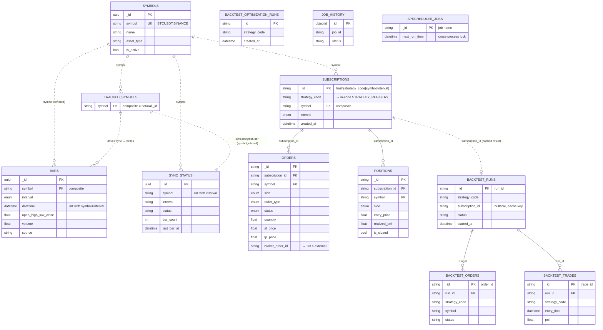

# System Relationship Map

Whole-system view: how the **two repos**, **CI/CD**, **image registry**, **VPS runtime**, **external services**, and **clients** relate. This is the zoomed-out companion to [System Architecture](./system-architecture.md) (which zooms *into* the app's internal layers) and [Deployment](./deployment.md) (which is the ops runbook). Read this first to see the forest; the others are the trees.

## 1. The Two Repositories

PocketQuant is split across two sibling repos by **secret boundary**:

| Repo | Holds | Secrets? | Who reads it |
|---|---|---|---|
| `pocketquant` | All application code (5 packages), Dockerfiles, compose files, CI/CD workflow, deploy scripts, docs | No | Developers, GitHub Actions |
| `pocketquant-config` | Prod `.env`, SSH deploy key, Docker Hub creds, Portainer creds, local-run env templates | **Yes — the repo IS the secret store** | GitHub Actions (read-only deploy key), operators |

The only secret stored *inside* `pocketquant` is `POCKETQUANT_CONFIG_DEPLOY_KEY` (a GitHub Actions secret), which is the read-only key CI/CD uses to clone `pocketquant-config` at deploy time. Everything else lives in `pocketquant-config`.

```
┌─────────────────────────┐         ┌─────────────────────────────┐
│       pocketquant        │  reads  │     pocketquant-config       │
│  (code, no secrets)      │ ──────▶ │  (secrets: .env, ssh, creds) │
│  CI secret:              │ via     │  read-only deploy key        │
│  POCKETQUANT_CONFIG_     │ deploy  │                              │
│   DEPLOY_KEY ────────────┼─────────┤▶ grants clone access         │
└─────────────────────────┘  key    └─────────────────────────────┘
```

## 2. End-to-End Relationship (build → ship → run)

```
   Developer
      │ git push origin develop|master
      ▼
┌──────────────────────────────────────────────────────────────────────┐
│ GitHub Actions  (.github/workflows/cicd.yml)                           │
│                                                                        │
│   tests ─┐                                                             │
│          ├─▶ build-api ─┐                                              │
│          └─▶ build-web ─┤  (parallel docker build + push)             │
│                         ├─▶ cleanup-tags  (prune old SHA tags)        │
│                         └─▶ deploy  (needs both builds green)         │
│                              │                                         │
│        get-vps-config ───────┤ clones pocketquant-config via deploy key│
│        (composite action)    │  → ssh_key, host, env_content,         │
│                              │     docker-hub creds                    │
└──────────────┬───────────────┴─────────────────────────────┬─────────┘
               │ push images                                   │ rsync + ssh
               ▼                                               ▼
        ┌──────────────┐                          ┌────────────────────────┐
        │  Docker Hub  │   pull :latest/:sha       │      Vultr VPS         │
        │ pocketquant  │ ◀──────────────────────── │  /opt/pocketquant/     │
        │ pocketquant- │                           │  docker compose up     │
        │     web      │                           │  (compose.prod.yml)    │
        └──────────────┘                           └───────────┬────────────┘
                                                               │
                                                   5 containers on one bridge net
                                                               ▼
                          ┌──────────┬──────────┬──────────┬──────────┬───────────┐
                          │   web    │   app    │ mongodb  │  redis   │ portainer │
                          │  :80 →   │ :41920   │ :27017   │  :6379   │  :9000    │
                          │  /api/*  │ FastAPI  │  bars,   │ quote,   │  docker   │
                          │  proxy → │ (uvicorn)│ orders,  │ bar,     │  admin UI │
                          │   app    │          │ positions│ idempot, │           │
                          └────┬─────┘          │ ...      │ rate     │           │
                               │                └──────────┴──────────┴───────────┘
                               │ public entry (WEB_PORT)
                               ▼
                          ┌──────────┐
                          │  Trader  │  browser → SPA → /api/* → app
                          │ (client) │
                          └──────────┘
```

## 3. Runtime Container Topology (on the VPS)

5 containers, one Docker bridge network, defined by `deploy/compose.prod.yml`:

| Container | Image | Host port | Role | Talks to |
|---|---|---|---|---|
| `pocketquant-web` | `…/pocketquant-web` | `WEB_PORT` (public) | SPA static serve + reverse proxy `/api/*` → app | app:41920 |
| `pocketquant-app` | `…/pocketquant` | `APP_PORT` | FastAPI + APScheduler jobs + outbound WS clients | mongodb, redis, Binance, OKX |
| `pocketquant-mongodb` | `mongo:7.0` | `MONGO_PORT` | Persistent store (bars, orders, positions, apscheduler_jobs) | — |
| `pocketquant-redis` | `redis:7.2-alpine` | `REDIS_PORT` | TTL cache (latest quote/bar), idempotency, rate-limit, SSE backing | — |
| `portainer` | portainer | `PORTAINER_PORT` | Container admin UI | docker socket |

**Internal vs external addressing (the recurring gotcha):**
- Inside the compose network, app reaches DBs by **service name**: `mongodb:27017`, `redis:6379`. The prod `.env` `MONGODB_URL`/`REDIS_URL` use these names because that file *is* the app container's env.
- From a laptop, you reach the same DBs by **VPS IP + published host port** (`MONGO_PORT`/`REDIS_PORT`) — which is why `local/remote-db.env` exists with different URLs.

## 4. External Service Relationships

| External | Direction | Protocol | Purpose | Auth |
|---|---|---|---|---|
| Binance | app → Binance | REST + WS `@aggTrade` | Historical bar sync + live quote ingestion | None (public) |
| OKX | app ↔ OKX | REST + WS | Live order/position execution (live trading mode) | API key/secret/passphrase (optional) |
| Docker Hub | CI push / VPS pull | HTTPS | Image registry | `DOCKERHUB_USERNAME`/`TOKEN` (from config repo) |
| GitHub Actions | push-triggered | — | Build + deploy orchestration | — |

App is **outbound-only** to exchanges — no server-side WebSocket; clients get real-time data via SSE (`/bars/stream/{symbol}`, `/quotes/stream/{symbol}`) backed by Redis. See [WebSocket Architecture](./websocket-architecture.md).

## 5. Config Flow — single source of truth for prod env

```
pocketquant-config/vps/default/.env   (edit here, git push)
        │
        │ CI/CD `get-vps-config` reads at deploy time
        ▼
GitHub Actions writes deploy/.env  → rsync → VPS:/opt/pocketquant/deploy/.env
        │
        │ compose.prod.yml: app service `env_file: .env`
        ▼
pocketquant-app container env  (MONGODB_URL=mongodb:27017, etc.)
```

Any manual `.env` edit on the VPS is **overwritten every deploy**. To change prod config: edit in `pocketquant-config`, push there, then push any commit to `pocketquant` (or `gh workflow run cicd.yml`).

## 6. Two Local-Dev Modes vs Prod

| Mode | Code | Mongo + Redis | Env template | Jobs |
|---|---|---|---|---|
| Local sandbox | laptop | local Docker (`just up`) | `local/all-local.env` | safe to enable |
| Remote-DB | laptop | **prod VPS** (published ports) | `local/remote-db.env` | `ENABLE_JOBS=false` (scheduler runs on prod only) |
| Production | VPS container | VPS containers (internal names) | `vps/default/.env` | enabled |

APScheduler coordinates across processes via the shared `apscheduler_jobs` MongoDB collection — first to claim `next_run_time` wins. That's why a remote-DB laptop must keep `ENABLE_JOBS=false`: enabling it would double-schedule against live prod state.

## 7. Where Each Concern Lives

| Concern | Location |
|---|---|
| App layers (DDD/CQRS/DI internals) | [System Architecture](./system-architecture.md), [Architecture Visual Map](./architecture-visual-map.md) |
| CI/CD pipeline + ops procedures | [Deployment](./deployment.md) |
| Secret/config storage | `pocketquant-config/` (own README) |
| Container definitions | `deploy/compose.prod.yml`, `deploy/Dockerfile` |
| Deploy scripts | `deploy/vps/10-deploy.sh`, `11-verify.sh` |
| CI workflow | `.github/workflows/cicd.yml` |

## 8. MongoDB Collection ERD (read this like an RDBMS schema)

MongoDB has **no enforced foreign keys** — the relationships below are *logical* joins the application code performs. Two join keys carry the whole model:

- **`subscription_id`** — deterministic hash of `(strategy_code, symbol, interval)`. Links live trading records back to their strategy subscription.
- **composite `symbol`** string (`BTCUSDT:BINANCE`) — the shared natural key across market-data + trading collections. `symbols` is reference data; everyone reads it, no one mutates it (Conformist).

13 collections, grouped by bounded context. Rendered PNG: [`visuals/collection-erd.png`](./visuals/collection-erd.png) (source: [`visuals/collection-erd.mmd`](./visuals/collection-erd.mmd)).

> **On `_id`:** almost every collection's `_id` **is a UUIDv7** (`generate_id()` / `generate_id_str()` → `uuid7()`, see `core/common/uuid.py`) — the aggregate-root rule holds. It's only the *representation* that varies: entities with a `UUID` field (`Bar`, `Symbol`, `SyncStatus`) stringify it on `to_mongo()` (`"_id": str(self.id)`); entities that declare `id: str` (`OrderAggregate`, `PositionAggregate`, `BacktestResult`) already hold the uuid7 as a string. **Three deliberate exceptions** use a *natural / domain* key instead of a random UUID:
> - `subscriptions._id` = **deterministic hash** of `(strategy_code, symbol, interval)` — so re-subscribing the same triple is idempotent (no duplicate).
> - `tracked_symbols._id` = the **composite `symbol`** string itself — the symbol *is* the identity.
> - `job_history._id` = Mongo **ObjectId** (APScheduler/insert default; never surfaced as a domain id), and `apscheduler_jobs._id` = the **job name** (managed entirely by APScheduler, not our code).



### Collection Reference Table

| Collection | `_id` strategy | Key fields | Logical FK → | Unique index | Context |
|---|---|---|---|---|---|
| `symbols` | uuid7 (stringified) | `symbol`, name, asset_type, is_active | — (reference data) | `symbol` | Symbol |
| `bars` | uuid7 (stringified) | `symbol`, `interval`, `datetime`, OHLCV, source | `symbol` → symbols | `(symbol, interval, datetime)` | Market Data |
| `sync_status` | uuid7 (stringified) | `symbol`, `interval`, status, bar_count | `(symbol,interval)` ↔ bars | `(symbol, interval)` | Market Data |
| `tracked_symbols` | **natural**: `symbol` | `symbol` | drives bars + sync_status | `symbol` | Market Data |
| `subscriptions` | **deterministic**: `hash(code\|symbol\|interval)` | `strategy_code`, `symbol`, `interval` | `symbol` → symbols; `strategy_code` → in-code registry | `_id` | Strategy |
| `orders` | uuid7 (str field) | `subscription_id`, `symbol`, side, status, sl/tp, broker_order_id | `subscription_id` → subscriptions; `broker_order_id` → OKX | idx: subscription_id, status, symbol | Trading |
| `positions` | uuid7 (str field) | `subscription_id`, `symbol`, side, pnl, is_closed | `subscription_id` → subscriptions | idx: subscription_id, is_closed, symbol | Trading |
| `backtest_runs` | uuid7 (str field, `run_id`) | `strategy_code`, `subscription_id`, status | `subscription_id` → subscriptions (cache; one doc/sub) | — | Backtest |
| `backtest_orders` | uuid7 (str field, `order_id`) | `run_id`, `strategy_code`, symbol, status | `run_id` → backtest_runs | idx: run_id, submitted_at | Backtest |
| `backtest_trades` | uuid7 (str field, `trade_id`) | `run_id`, `strategy_code`, entry_time, pnl | `run_id` → backtest_runs | idx: run_id | Backtest |
| `backtest_optimization_runs` | uuid7 (str field) | `strategy_code`, created_at | — | idx: strategy_code, created_at | Backtest |
| `job_history` | **ObjectId** (Mongo default) | job_id, status | — | unique idx (job run) | Scheduling |
| `apscheduler_jobs` | **natural**: job name | `next_run_time` | — (APScheduler-managed) | `_id` | Scheduling |

### How to read the relationships

- **Live trading chain:** `subscriptions` is the hub. One subscription → many `orders` and many `positions` (both carry `subscription_id`). A subscription's *cached* latest backtest also lands in `backtest_runs` keyed by `subscription_id`.
- **Backtest chain (mirror of live):** one `backtest_runs` (`run_id`) → many `backtest_orders` + many `backtest_trades`. These are **separate** collections from live `orders`/`trades` so backtests never touch production trading data.
- **Market-data chain:** `tracked_symbols` is the input list → cron sync jobs write `bars` and update `sync_status` per `(symbol, interval)`. `symbols` is the descriptive catalog all of them reference by composite string.
- **No physical joins:** everything is resolved app-side by `subscription_id` or composite `symbol`. There is no `$lookup`-enforced integrity — orphan records are possible if a subscription is deleted (cleanup is explicit in repo methods like `delete_by_strategy_code`).

## Unresolved Questions

- `deployment.md` describes CI as "4 jobs" but the workflow also has a `tests` job (so 5). Confirm whether `tests` should be folded into the deployment.md job list, or is intentionally omitted as a pre-build gate.
