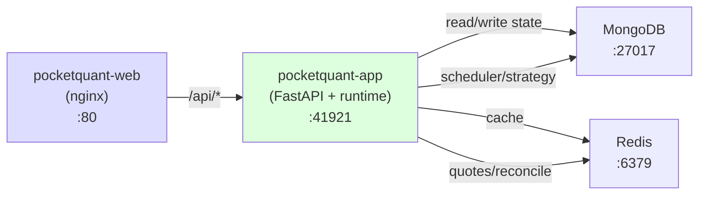

# System Architecture

DDD + Clean Architecture + Dishka. Một Python package `src/pocketquant/` (core, engine, app) + Node SPA `web/`. Phụ thuộc: `core ◁ engine ◁ app`, `web → app`. Backtest và live là hai driver trên cùng một shared engine. Binance public REST/WS (@aggTrade), OKX live trading, một tiến trình FastAPI trên :41921 kèm scheduler, WS feed, strategy lifecycle, reconcile loop.

Với các bước chạy/test cục bộ và các route chuẩn, xem [README](../../README.md).

## High-Level Architecture

PocketQuant dùng **Clean Architecture + DDD** với luồng phụ thuộc một chiều nghiêm ngặt: Routes → Services → Domain, Adapters → Domain. Command/Query service điều phối logic domain. Một frontend SPA React 19 hiện đại tiêu thụ REST API.

```
┌─────────────────────────────────────────────────────────────────┐
│                    Client Layer (Browser)                       │
│  pocketquant-web: React 19 + Vite + Lightweight Charts         │
│  Candlestick chart, 5 indicators, symbol/interval selectors     │
└──────────────────────┬──────────────────────────────────────────┘
                       │ HTTP/REST (proxy to :41921 app)
                       ▼
          ┌──────────────────────────────────────────────┐
          │  pocketquant-app (FastAPI + runtime)         │
          │  :41921 (all /api/v1/* routes)               │
          │  Scheduler, WS feed, strategy lifecycle,     │
          │  reconcile loop, backtest tasks              │
          └──────┬───────────────────────────────────────┘
                 │
                 ▼
┌─────────────────────────────────────────────────────────────────┐
│   External Services & Infrastructure                             │
│  Binance REST+WS | OKX REST+WS | MongoDB | Redis | APScheduler │
└─────────────────────────────────────────────────────────────────┘
                         │
            ┌────────────┴────────────┐
            │                         │
            ▼                         ▼
┌──────────────────────────┐   ┌──────────────────────────┐
│  Application Layer       │   │   Domain Layer           │
│  (Orchestrators)         │◄──┤   (Pure Logic)           │
│  ├─ StrategyAppService       │   │   ├─ Aggregates         │
│  ├─ BacktestAppService       │   │   ├─ Value Objects      │
│  ├─ BarAppService           │   │   ├─ Domain Events      │
│  ├─ OrderAppService         │   │   ├─ Interfaces         │
│  └─ PositionAppService      │   │   └─ Domain Services    │
└──────────┬───────────────┘   └──────────────────────────┘
           │                            │
           │    ┌───────────────────────┘
           │    │
           ▼    ▼
┌─────────────────────────────────────────────────────────────────┐
│              Infrastructure Layer (External I/O)                 │
│  ┌──────────┐  ┌──────────┐  ┌──────────┐  ┌──────────────┐   │
│  │ Brokers  │  │Providers │  │Persistence│  │ Scheduling  │   │
│  │ (OKX,   │  │(Binance  │  │(MongoDB,  │  │  (APScheduler)  │
│  │ Paper)  │  │ REST/WS) │  │ Redis)    │  │              │   │
│  └──────────┘  └──────────┘  └──────────┘  └──────────────┘   │
└─────────────────────────────────────────────────────────────────┘
        │              │               │            │
        ▼              ▼               ▼            ▼
    ┌────────┐  ┌──────────┐  ┌──────────────┐  ┌──────────┐
    │  OKX   │  │ Binance  │  │  MongoDB     │  │ Redis /  │
    │ Live   │  │  Public  │  │  (Bars,     │  │BackgroundJobs
    │Trading │  │  REST/WS │  │  Orders,    │  │          │
    │        │  │          │  │  Positions) │  │          │
    └────────┘  └──────────┘  └──────────────┘  └──────────┘
```

**Dependency Direction:** Features ← Application ← Domain, Adapters ← Domain (không có phụ thuộc ngược)

**Real-Time Streaming:** WebSocket inbound: Binance `@aggTrade` (singleton, market data), OKX private (per-broker, order/position). SSE outbound: `/api/v1/market-data/bars/stream/{symbol}?interval={interval}` (poll 1s, emit khi thay đổi), `/api/v1/quotes/stream/{symbol}` (poll 0.5s). Redis trung gian: WS ghi, SSE đọc. Frontend EventSource với staleness detection (30s bar, 10s quote); fallback về REST.

## Strategy Declarative Control Plane (SP1)

**Architecture:** Tách control-plane/data-plane kiểu Kubernetes.

```
Control plane (desired state)           Data plane (live engine)
 Mongo: subscription.desired_state       RAM: StrategyAppService instances
      ▲                 │                    ▲           │
 API  │                 │ read desired       │ start/stop
      │                 ▼                    │           ▼
 [handlers]  ┌──────────────────┐           │    [market events]
             │  reconcile loop  │───────────┴────────────
             │  5s poll         │ write actual_state → Mongo
             └──────────────────┘
```

**Nguồn sự thật của control-plane:** entity `Subscription` lưu hai trường trạng thái:
- `desired_state: "running" | "stopped"` — trạng thái mà một handler (hoặc con người) mong muốn → được ghi bởi handler HTTP start/stop
- `actual_state: "running" | "stopped"` — trạng thái quan sát được của live engine → được ghi bởi reconcile loop khi phát hiện drift

**Handler mang tính declarative:** `StartStrategyCommand` và `StopStrategyCommand` chỉ ghi `desired_state` (không gọi engine trực tiếp) và trả về trước khi strategy start/stop; reconcile loop hội tụ trong vòng ≤1 interval.

**Reconcile loop:** `StrategyReconcileAppService` (trong subpackage `engine`) poll mỗi `Settings.reconcile_interval_seconds` (mặc định 5.0s):
1. Duyệt `sub_repo.list_all()` (đọc từ Mongo)
2. Với mỗi subscription, so sánh `desired_state` với run-state của live `StrategyAppService` instance
3. Gọi `start_strategy()` hoặc `stop_strategy()` để hội tụ
4. Phản chiếu `actual_state` quan sát được về lại Mongo chỉ khi có drift (idempotent, không churn mỗi tick)
5. Điều khiển theo subscription: không bao giờ enumerate RAM, nên các backtest strategy được inject (synthetic id) là vô hình

**Thêm subscription mới:** `StrategyCommandService.add_symbol(AddSymbolCommand)` lưu với `desired_state="stopped"` (opt-in vào trading; không auto-start khi thêm) và pre-load instance mà không start.

**List subscriptions:** `StrategyQueryService.list_symbols(ListSymbolsQuery)` lấy run-state từ Mongo: trả `desired_state`, `actual_state`, và `is_running` (dẫn xuất `actual_state == "running"`). Không đọc RAM.

**Đọc phòng thủ trên legacy docs:** các subscription thiếu trường `desired_state` hoặc `actual_state` (legacy docs trước control-plane) đọc cả hai thành `"stopped"` qua các giá trị mặc định `.get()` phòng thủ trong `Subscription.from_mongo()`. Reconcile loop sau đó hội tụ `actual_state` để khớp `desired_state`, nên không cần re-migration thủ công qua các lần deploy.

## Clean Architecture Layer Breakdown

### Layer 1: Domain (Pure Business Logic) — src/pocketquant/core/domain/

**Purpose:** Các quy tắc nghiệp vụ cốt lõi với ZERO phụ thuộc bên ngoài. Các khái niệm domain tái sử dụng được.

**Rules:**
- Không import I/O (không pymongo, redis, aiohttp, http)
- Immutable value object (frozen dataclass, enum)
- Domain event cho thay đổi trạng thái (HistoricalDataSyncedEvent, OrderFilledEvent, v.v.)
- Validation qua __post_init__
- Được kiểm soát bởi `test_domain_purity.py` (AST check)

**Structure:**
```
domain/
├── backtest/               # Backtesting domain
│   ├── entities.py         # BacktestResult
│   ├── value_objects.py    # OpenLot
│   └── config.py           # BacktestConfig
├── bar/                    # TOP-LEVEL: Market bars (renamed from ohlcv/)
│   ├── entities.py         # Bar entity with to_mongo/from_mongo
│   ├── events.py           # BarCompletedEvent, HistoricalDataSyncedEvent
│   ├── value_objects.py    # OHLCV, BarRange
│   └── services/bar_builder_domain_service.py  # BarBuilderDomainService service
├── order/                  # TOP-LEVEL: Order lifecycle
│   ├── entities.py         # OrderAggregate with to_mongo/from_mongo
│   ├── enums.py            # OrderType, OrderSide, OrderStatus
│   ├── events.py           # Order events
│   └── records.py          # OrderRecord (audit trail, separate from live aggregate)
├── position/               # TOP-LEVEL: Position tracking
│   ├── entities.py         # PositionAggregate with to_mongo/from_mongo
│   ├── enums.py            # PositionSide
│   ├── events.py           # Position events
│   └── value_objects.py    # PnL
├── symbol/                 # TOP-LEVEL: Tradeable instruments
│   └── entities.py         # Symbol (flattened from SymbolAggregate)
├── sync_status/            # TOP-LEVEL: Sync tracking
│   └── entities.py         # SyncStatus
├── trading/                # Universal trading contracts (source-agnostic)
│   ├── value_objects.py    # Trade, Fill, EquityPoint, PerformanceMetrics
│   ├── performance_calculator_domain_service.py  # PerformanceCalculatorDomainService with static .build()
│   └── trade_stats.py      # trade_stats functions (histogram, streaks, profit_factor, drawdowns)
├── quote/                  # NON-PERSISTED: real-time quote logic
│   ├── events.py           # QuoteReceivedEvent, QuoteUpdatedEvent
│   └── value_objects.py    # Price, QuoteTick
├── risk/                   # NON-PERSISTED: position sizing / risk
│   ├── enums.py            # RiskModel enum
│   ├── value_objects.py    # RiskConfig
│   ├── position_calculation.py  # PositionCalculation VO (calc result)
│   └── services/position_calculator_domain_service.py  # PositionCalculatorDomainService (pure calc)
├── strategy/               # NON-PERSISTED: strategy contracts + impls
│   ├── enums.py            # Direction enum
│   ├── events.py           # SignalGeneratedEvent
│   ├── strategy_service_interface.py   # IStrategyService ABC
│   ├── value_objects.py    # Signal, StrategyConfig, OrderConfig, StopLossConfig, TakeProfitConfig
│   ├── patterns/engulfing_detector.py  # Engulfing pattern detector (pure)
│   └── services/           # HitNRun2StrategyService, EngulfingStrategyService, EngulfingPullback30TouchStrategyService
└── shared/                 # Cross-cutting
    ├── enums.py            # Interval enum
    ├── events.py           # DomainEvent base (was domain_event.py)
    └── value_objects.py    # INTERVAL_SECONDS mapping
```

**Example - Bar Entity with MongoDB Persistence:**
Tất cả domain entity dùng Pydantic BaseModel với `to_mongo()` / `from_mongo()` tích hợp sẵn cho persistence.

**Example - Symbol Entity (Flattened from SymbolAggregate):**
Symbol giờ là một entity phẳng đơn giản với các trường `code`, `exchange`, `name`, `asset_type`, `is_active` và các method chuẩn `to_mongo()`/`from_mongo()`.

**Composite Symbol Format:**
Exchange encapsulation thay thế trường `exchange` độc lập trên các domain entity (Bar, Order, Position, Symbol, SyncStatus, Subscription, TrackedSymbol). Định dạng định danh symbol giờ là composite: `{CODE}:{EXCHANGE}` (ví dụ `BTCUSDT:BINANCE`). Một trường bất biến `symbol: str` thay thế các cặp `(code, exchange)`. Business logic không bao giờ tách nhỏ—exchange là postfix opaque.

**Example - Domain Service (Pure Logic):**
BarBuilderDomainService và PositionCalculatorDomainService là các pure domain service với zero I/O, hiện thực các quy tắc nghiệp vụ domain.

### Layer 2: Application (Orchestrators) — `engine` and `app` packages

**Purpose:** Điều phối logic domain + adapter I/O để hoàn thành các use case nghiệp vụ. Các service và engine có trạng thái, phối hợp giữa các layer. Backtest và live là hai **driver** trên cùng một shared engine trong subpackage `engine`.

**Structure:**
```
src/pocketquant/engine/                     # SHARED engine (used by backtest + live)
├── strategy/                                # Strategy feature area
│   ├── strategy_app_service.py
│   ├── strategy_command_service.py         # StrategyCommandService (dispatch, signal handling)
│   └── strategy_query_service.py           # StrategyQueryService (read strategies, subscriptions)
├── execution/                               # Order/Position feature area
│   ├── order_app_service.py
│   ├── position_app_service.py
│   ├── orders_positions_service.py         # OrdersPositionsService (combined query service)
│   └── risk_check.py                       # RiskCheckHandler (validation)
├── market_data/                             # Market data feature area
│   ├── sync_service.py, ohlcv_service.py, quotes_service.py, symbols_service.py
│   └── app_services/                        # BarAppService, QuoteAppService, WsSubscriptionAppService, sync/integrity jobs
├── backtest/                                # Backtest driver (isolated per run)
│   ├── backtest_app_service.py
│   ├── backtest_sandbox_app_service.py
│   ├── backtest_execution_service.py       # AsyncTask body: run + persist
│   ├── backtest_command_service.py         # BacktestCommandService
│   ├── backtest_query_service.py           # BacktestQueryService
│   ├── backtest_stats_service.py           # Stats + keyset pagination
│   ├── backtest_report_app_service.py      # Report collection (Trade+equity → metrics)
│   ├── historical_replay_app_service.py    # Historical replay
│   ├── collected_results.py                # Result aggregation
│   └── backtest_dispatch.py                # Worker dispatch
└── live/                                    # Live trading driver
    ├── strategy_reconcile_app_service.py  # Reconcile loop (5s poll) + bootstrap()
    ├── live_trade_collector.py            # EventBus subscriber → persist live Trade (run_id=sub_id)
    └── live_metrics_query_service.py      # On-demand per-subscription metrics (M1)

src/pocketquant/core/domain/trading/        # Trading contracts (universal, source-agnostic)
├── value_objects.py                        # Trade, Fill, EquityPoint, PerformanceMetrics
├── commission_model.py                     # CommissionModel (Protocol) + PercentageCommissionModel(bps)
├── performance_calculator_domain_service.py  # PerformanceCalculatorDomainService (NumPy metrics)
└── trade_stats.py                          # Pure functions: histogram, streaks, profit_factor, drawdowns

src/pocketquant/core/domain/bar/services/    # Domain service layer (top-level)
├── bar_builder_domain_service.py           # BarBuilderDomainService (OHLCV aggregation)

src/pocketquant/core/domain/risk/services/   # Domain service layer
├── position_calculator_domain_service.py   # PositionCalculatorDomainService (risk calculations)
```

**Example - Application Service:**
```python
# StrategyAppService - orchestrates domain + adapter I/O
class StrategyAppService:
    def __init__(self, broker: IBrokerPort, event_bus: EventBus):
        self.broker = broker
        self.event_bus = event_bus
        self.strategy: Optional[IStrategyService] = None

    async def _on_bar_completed(self, event: BarCompletedEvent) -> None:
        """Called when bar completes."""
        # 1. Domain: Get strategy signal
        signal = await self.strategy.on_bar_completed(event.bar)

        # 2. Adapter: Check risk
        approved = await risk_check(signal)

        # 3. Adapter: Execute via broker
        if approved:
            order = await self.broker.submit_order(approved.order)

        # 4. Adapter: Publish event
        await self.event_bus.publish(SignalGeneratedEvent(...))
```

### Layer 3: Routes (API Layer) — `app/routes/`

**Purpose:** Layer HTTP routing mỏng. Route nhận request, ủy quyền cho command/query service, trả về response.

**Pattern:** Route dùng `APIRouter(route_class=DishkaRoute)` của FastAPI và inject các service dependency qua `FromDishka[CommandService]` hoặc `FromDishka[QueryService]`. Mỗi route nhận một Pydantic command/query model và trả về một DTO.

**Structure:**
Route được tổ chức theo feature (backtest, strategy, market_data) với APIRouter đăng ký endpoint. Ví dụ route gọi trực tiếp một method của command service:

```python
# src/pocketquant/app/routes/strategy.py (example)
router = APIRouter(route_class=DishkaRoute)

@router.post("/strategies/{strategy_code}/subscriptions")
async def add_symbol(
    strategy_code: str,
    cmd: AddSymbolCommand,
    strategy_svc: FromDishka[StrategyCommandService]
) -> SubscriptionDTO:
    return await strategy_svc.add_symbol(cmd.symbol, cmd.interval)
```

**Service 5-Step Pattern** (trong tất cả command/query service): 1. Nhận Command/Query (Pydantic) 2. Lấy adapter 3. Thực thi domain 4. Persist 5. Trả về DTO

### Layer 4: Adapters (External I/O) — src/pocketquant/core/ + other subpackages

**Purpose:** Tất cả tích hợp bên ngoài: database, broker, data provider, scheduling, HTTP. Các adapter cụ thể nằm trong `core/infra/` và `core/common/`. Các abstraction (port/DTO) nằm trong `core/domain/{brokers,market_data}` để engine/backtest/trading phụ thuộc vào contract, không phải implementation (DIP). Domain purity được kiểm soát: `core/domain/` không import I/O.

**Structure:**
```
core/
├── persistence/                       # Data access (MongoDB, Redis, repositories)
│   ├── mongodb.py           # Database async singleton (PyMongo)
│   ├── redis.py             # Cache async singleton (redis-py)
│   ├── base_repository.py   # BaseRepository mixin (_collection() helper)
│   ├── health_checks.py     # check_database / check_redis
│   └── repositories/        # All 12 repos (instance methods via DI)
│       ├── bar_repository.py
│       ├── order_repository.py
│       ├── position_repository.py
│       ├── subscription_repository.py
│       ├── backtest_repository.py
│       ├── backtest_order_repository.py
│       ├── backtest_trade_repository.py
│       ├── symbol_repository.py
│       ├── tracked_symbol_repository.py
│       ├── sync_status_repository.py
│       ├── job_history_repository.py
│       └── trade_repository.py         # Live trading: subscription_id FK
├── brokers/
│   └── paper/               # PaperBrokerAdapter (in-memory simulation)
│       └── paper_broker_adapter.py
├── market_data/
│   └── binance/             # Binance REST + WS integration
│       ├── binance_adapter.py            # BinanceAdapter (implements core.domain IDataProviderPort)
│       ├── binance_websocket_adapter.py  # BinanceWebSocketAdapter (@aggTrade stream)
│       └── binance_mappers.py           # Binance-specific mapping
├── scheduling/
│   └── scheduler.py         # JobScheduler (APScheduler + MongoDBJobStore)
├── http_client/
│   └── client.py            # ResilientHttpClient (retry/backoff)
└── domain/                           # Domain (pure business logic, zero I/O)
    ├── brokers/            # Ports: IBrokerPort, IBrokerFactoryPort + DTOs
    └── market_data/        # Ports: IDataProviderPort, IRealtimeQuoteProviderPort + DTOs
```

**Notes:**
- OKX live broker (OKXBrokerAdapter + websocket) nằm trong `src/pocketquant/core/infra/brokers/okx/` (cạnh `paper/`).
- Port + DTO (IBrokerPort, IBrokerFactoryPort, OrderResult, AccountBalance, OrderEvent, IDataProviderPort, IRealtimeQuoteProviderPort) nằm trong `core.domain.{brokers,market_data}`.
- Không có schemas/ — persistence nằm trong domain entity qua các method `to_mongo()`/`from_mongo()`.

**Key Services:**

| Service | Purpose |
|---------|---------|
| **MongoDBConnection** | Truy cập collection bất đồng bộ, pooling (5-50 connection) |
| **RedisConnection** | JSON serialization, xóa theo pattern, hỗ trợ TTL |
| **PaperBrokerAdapter** | Mô phỏng in-memory, slippage/delay cấu hình được |
| **OKXBrokerAdapter** | Live trading, HMAC auth, reconnection với exponential backoff |
| **BinanceAdapter** | Hiện thực IDataProviderPort; public REST API (không auth). Trả về bar với delta volume mỗi tick (BarBuilderDomainService yêu cầu). Rate limit: 1200 weight/min. |
| **BinanceWebSocketAdapter** | Stream @aggTrade cho real-time quote ingestion. Hiện thực IRealtimeQuoteProviderPort. |
| **JobScheduler** | Wrapper APScheduler, chạy job bất đồng bộ, hỗ trợ tham số `second` cho cron offset (né bar-close race) |

### Layer 5: Common (Cross-Cutting) — src/pocketquant/core/common/

**Purpose:** Tiện ích dùng chung: event bus, middleware, tracing, health check, logging, sinh UUID.

**Structure:**
```
common/
├── messaging/
│   ├── event_bus.py          # EventBus (in-memory, FIFO, 50-event history)
│   ├── event_handler.py      # EventHandler base class
│   ├── event_registry.py     # @event_handler decorator + auto-discovery
│   └── ...
├── middleware/
│   ├── correlation_id.py     # CorrelationIdMiddleware (request tracking)
│   ├── request_logging.py    # RequestLoggingMiddleware
│   ├── idempotency.py        # IdempotencyMiddleware (24h TTL)
│   └── rate_limit.py         # RateLimitMiddleware (200 req/10s per IP)
├── tracing/
│   ├── correlation.py        # CorrelationID context management
│   └── context.py            # ContextVar storage
├── health/
│   ├── coordinator.py        # HealthCoordinator (parallel checks)
│   └── checks.py             # Database, cache, jobs health probes
├── database.py               # Database singleton (MongoDB)
├── cache.py                  # Cache singleton (Redis)
├── jobs.py                   # JobScheduler singleton (APScheduler)
├── uuid.py                   # UUID7 generation (time-ordered IDs)
├── logging.py                # Structured logging (structlog)
├── constants.py              # Cache keys, TTLs, limits, headers
└── __init__.py
```

**Key Components:**

| Component | Purpose |
|-----------|---------|
| **EventBus** | Publish domain event, subscribe handler qua @event_handler |
| **CorrelationIdMiddleware** | Inject request ID cho distributed tracing |
| **RateLimitMiddleware** | Token bucket per IP (200 req/10s) |
| **IdempotencyMiddleware** | Cache response POST theo header idempotency_key |
| **Database** | MongoDB async singleton |
| **Cache** | Redis async singleton |
| **JobScheduler** | APScheduler async wrapper |

### Layer 6: Presentation (Web UI) — web (React SPA)

**Purpose:** Giao diện charting kiểu TradingView cho hiển thị market real-time, phân tích indicator, quản lý strategy, và backtesting.

**Tech Stack:**
- **Vite 8** - Build tool với HMR
- **React 19** - UI framework với Hooks
- **TypeScript 5.9** - Type safety
- **TanStack Router** - File-based routing (layout route qua `__root.tsx`)
- **Lightweight Charts 5.1** - Render candlestick hiệu năng cao
- **TanStack Query 5.x** - Quản lý server state, real-time polling

**Structure:**
```
src/
├── api/                  # REST client layer
│   ├── api-client.ts    # HTTP fetch wrapper (proxy to :41921 app)
│   ├── market-data-api.ts   # Market data queries
│   ├── backtest-api.ts      # Backtest run + poll
│   └── strategy-api.ts      # Strategy subscription queries
├── components/
│   ├── chart/           # Charting components
│   │   ├── trading-chart.tsx  # Candlestick + volume + indicators
│   │   ├── use-chart.ts       # Lightweight Charts initialization
│   │   └── indicator-series.ts  # SMA, EMA, RSI, MACD, Bollinger
│   ├── controls/        # User controls
│   │   ├── symbol-selector.tsx   # Symbol dropdown
│   │   ├── interval-selector.tsx  # Timeframe picker (1m-1w)
│   │   └── indicator-toggles.tsx  # Show/hide indicators
│   ├── backtest/        # Backtest run components
│   │   └── backtest-form.tsx  # Strategy/symbol/dates + timezone, trigger run
│   └── layout/
│       ├── app-header.tsx       # Symbol + interval + indicators
│       ├── theme-toggle.tsx     # Dark/light mode switcher
│       ├── timezone-switcher.tsx # Timezone picker
│       └── live-clock.tsx       # Realtime clock in app-nav
├── hooks/               # React custom hooks
│   ├── use-ohlcv.ts     # Fetch historical bars
│   ├── use-realtime-bar.ts  # Real-time polling (TanStack Query)
│   ├── use-symbols.ts   # Fetch symbol list
│   ├── use-indicators.ts  # Indicator calculation
│   ├── use-run-backtest.ts  # Start single backtest run
│   └── use-timezone.ts  # Timezone context consumer
├── lib/
│   ├── theme-context.tsx  # Dark/light mode state + localStorage persist
│   ├── theme-colors.ts    # Read CSS tokens for chart colors
│   ├── timezone-context.tsx # Timezone picker state
│   └── indicators/      # Pure indicator algorithms
│       ├── moving-average.ts  # SMA, EMA
│       ├── rsi.ts             # Relative Strength Index
│       ├── macd.ts            # MACD + signal line
│       └── bollinger-bands.ts # Upper, middle, lower bands
├── routes/              # TanStack Router file-based routes
│   ├── __root.tsx       # Root layout: nav + theme toggle + timezone + clock
│   ├── index.tsx        # Charts page
│   ├── strategies.tsx   # Strategy dashboard
│   ├── backtest.tsx     # Backtest runner
│   └── monitor.tsx      # System monitoring
├── main.tsx             # App entry: QueryClient + Providers + Router
└── index.css            # Global styles + theme tokens (data-theme: dark|light)
```

**Routes:**
- `/` — Charts: TradingChart + SymbolSelector + IntervalSelector + StrategySelector + IndicatorToggles + AppHeader
- `/strategies` — Operator Dashboard: layout 3 pane (list/start/stop strategy, config+chart embed với indicator toggle, positions/metrics)
- `/backtest` — Ad-hoc Backtest Runner: form với symbol/interval/strategy/date range (input datetime-local với dropdown timezone), chạy job, poll + hiển thị kết quả
- `/monitor` — System Monitoring: HealthBanner + DataHealthTable (sync/integrity, hàng mở rộng được, check/repair) + BackgroundJobsList (auto-poll 30s)

**Key Features:**
- **Candlestick Chart:** Hiển thị OHLCV real-time qua Lightweight Charts với màu theo theme
- **Volume Overlay:** Volume giao dịch dạng histogram dưới price
- **5 Indicators:** SMA (20/50), EMA (12/26), RSI (14), MACD (12,26,9), Bollinger Bands (20,2) với toggle show/hide (tái sử dụng trên trang strategy)
- **Symbol/Interval Selectors:** Đổi dữ liệu không reload trang
- **Theme Toggle:** Switcher dark/light mode ở góc trên phải; persist vào `localStorage:pq.theme.mode`, áp thuộc tính `data-theme` lên `<html>`, chart đọc lại màu khi lật
- **Timezone Picker:** Chọn timezone cho các input ngày của backtest; hiển thị dạng UI `datetime-local` để chọn với độ chính xác phút
- **Live Clock:** Đồng hồ wall-clock real-time trong app-nav
- **Real-time Polling:** TanStack Query refetch dữ liệu bar mỗi 5-10s (cấu hình được)
- **API Proxy:** Vite dev server proxy `/api/*` tới `http://localhost:41921` (app)

**Custom Hooks:**

| Hook | Purpose | Interval |
|------|---------|----------|
| `useOHLCV()` | Fetch historical bar (TanStack Query + cache) | on-demand |
| `useRunBacktest()` / `useBacktestRun()` | Start một backtest + poll run tới trạng thái terminal | poll 1.5s trong khi `started` |
| `useSymbols()` | List symbol khả dụng | on-demand |
| `useAvailableIntervals()` | Lấy timeframe tương thích từ sync status | on-demand |
| `useRealtimeBar()` / `useRealtimeQuote()` | Poll API lấy bar/quote mới nhất | 5–10s |
| `useIndicators()` | Tính SMA/EMA/RSI/MACD/BB từ bar | dẫn xuất |
| `useSyncStatus()` | Poll sync status | 30s |
| `useIntegrityRepair()` | Mutation data integrity | thủ công |
| `useBackgroundJobs()` / `useJobRuns()` / `useJobStats()` | Poll background job list/runs/stats | 30s |
| `useSubscriptions()` | Poll danh sách strategy subscription | polling |

**API Layer:** wrapper `apiFetch()` / `apiPost()` trong `src/api/api-client.ts`; các module: `market-data-api.ts`, `backtest-api.ts`, `strategy-api.ts`, `system-jobs-api.ts`, `monitor-api.ts`.

**Deployment:** Vite `dist/` được serve dạng static asset sau FastAPI (không có server riêng).

## Where Does X Live?

| Topic | Location |
|-------|----------|
| Domain entities (Bar, Order, Position, Symbol) | `core/domain/{bar,order,position,symbol}/entities.py` |
| Value objects (OHLCV, Signal, PnL, QuoteTick) | `core/domain/{bar,strategy,position,quote}/value_objects.py` |
| Trading value objects (Trade, Fill, EquityPoint, PerformanceMetrics) | `core/domain/trading/value_objects.py` |
| OrderRecord (audit trail) | `core/domain/order/records.py` |
| BacktestConfig | `core/domain/backtest/config.py` |
| Domain events (11 events) | `core/domain/{bar,order,position,quote,strategy}/events.py` |
| Enums (OrderStatus, Interval, Direction, etc.) | `core/domain/{bar,order,position,shared}/enums.py` |
| Event bus + @event_handler decorator | `core/common/messaging/` |
| Middleware (correlation, rate limit, idempotency) | `core/common/middleware/` |
| MongoDB connection | `core/infra/persistence/mongodb.py` |
| Redis connection | `core/infra/persistence/redis.py` |
| All repositories | `core/infra/persistence/repositories/` |
| Binance REST + WS clients | `core/infra/binance/` |
| OKX broker + WS + reconnection | `core/infra/brokers/okx/` |
| PaperBrokerAdapter (simulation) | `core/infra/brokers/paper/` |
| APScheduler wrapper | `core/infra/scheduling/scheduler.py` |
| Dishka DI container (6 providers) | `app/di/` |
| FastAPI app + middleware wiring | `app/main.py`, `app/main_extensions.py` |
| Command/Query services | `engine/`, `backtest/`, `app/` (subpackage service classes) |
| Backtest trigger (save started doc) | `engine/backtest/backtest_command_service.py` |
| Backtest task body (run + persist) | `engine/backtest/backtest_execution_service.py` |
| Backtest stats + paged trades + markers | `engine/backtest/backtest_stats_service.py` (orchest) + `core/domain/trading/trade_stats.py` (domain) |
| Backtest engine setup + replay | `engine/backtest/backtest_dispatch.py`, `engine/backtest/backtest_app_service.py` |
| Strategy runtime dispatch | `engine/strategy/strategy_command_service.py`, `engine/strategy/strategy_query_service.py` |
| Order state machine | `engine/execution/order_app_service.py` |
| Position tracking + P&L | `engine/execution/orders_positions_service.py` |
| HitNRun2 strategy (hitnrun2) | `core/domain/strategy/services/hitnrun2_strategy_service.py` |
| Background sync job registration | `app/main_extensions.py` → `register_sync_jobs()` |
| UUID7 generation | `core/common/uuid.py` |
| Cache keys, TTLs, constants | `core/common/constants.py` |
| Frontend API client layer | `web/src/api/` |
| Frontend custom hooks | `web/src/hooks/` |
| Chart + indicator components | `web/src/components/chart/` |
| Theme context + toggle + colors | `web/src/lib/theme-context.tsx`, `web/src/components/layout/theme-toggle.tsx`, `web/src/lib/theme-colors.ts` |
| Timezone context + picker | `web/src/lib/timezone-context.tsx`, `web/src/components/layout/timezone-switcher.tsx` |
| Live clock | `web/src/components/layout/live-clock.tsx` |
| Theme CSS tokens + data-theme attribute | `web/src/index.css` (`:root[data-theme="dark|light"]` with token definitions) |
| Backtest form (datetime-local + timezone) | `web/src/components/backtest/backtest-form.tsx` |
| Domain purity test (AST check) | `tests/core_test/unit/domain/test_domain_purity.py` |
| BacktestSandboxAppService | Backtest engine isolated instance | `engine/backtest/backtest_sandbox_app_service.py` |
| StrategyReconcileAppService | Reconciliation loop + `bootstrap()` (boot instance load) | `engine/live/strategy_reconcile_app_service.py` |
| LiveTradeCollector | EventBus subscriber → persist live `Trade` (`run_id`=sub_id) | `engine/live/live_trade_collector.py` |
| LiveMetricsQueryService | On-demand per-subscription performance metrics (M1) | `engine/live/live_metrics_query_service.py` |
| WsSubscriptionAppService | WebSocket subscription mgmt | `engine/market_data/app_services/ws_subscription_app_service.py` |
| QuoteAppService | WS feed + tick→bar processing | `engine/market_data/app_services/quote_app_service.py` |
| BrokerFactory | Concrete broker construction (paper/OKX) | `core/infra/brokers/broker_factory.py` |
| PerformanceCalculatorDomainService | NumPy metrics calculator | `core/domain/trading/performance_calculator_domain_service.py` |
| SyncProgressTrackerDomainService | Sync status tracking | `core/domain/sync_status/services/sync_progress_tracker_domain_service.py` |
| BacktestReportAppService | Backtest report: collect Trade+equity, build metrics | `engine/backtest/backtest_report_app_service.py` |
| EngulfingStrategyService | Engulfing strategy impl | `core/domain/strategy/services/engulfing_strategy_service.py` |
| EngulfingPullback30TouchStrategyService | Biến thể engulfing (`engulfing_pullback30_touch`): arm tại pattern, vào tại close bar kế tiếp khi pullback 30% intrabar | `core/domain/strategy/services/engulfing_pullback30_touch_strategy_service.py` |

## Request Flow

**Command (POST):** Middleware (correlation, rate-limit, idempotency) → Route (parse command) → Service (1. lấy adapter, 2. validate domain, 3. persist, 4. invalidate cache, 5. publish event) → Response DTO.

**Query (GET):** Middleware → Route → Service (1. fetch/cache, 2. validate, 3. cache result, 4. return DTO) → Response.

## MongoDB & Repositories

13 collection. Tất cả `_id` là UUIDv7 trừ `apscheduler_jobs` (job name, do APScheduler quản lý). Join key: **`subscription_id`** (chuỗi uuid7) liên kết các bản ghi live trading với subscription; **`run_id`** liên kết các bản ghi backtest với run; composite **`symbol`** (`BTCUSDT:BINANCE`) dùng chung giữa market-data + trading. Unique index trên `(strategy_code, symbol, interval)` dedup subscription. Tất cả repository trong `core/infra/persistence/repositories/`, kế thừa `BaseRepository`, được inject `Database`, zero lời gọi collection trực tiếp bên ngoài persistence layer.

| Collection | `_id` | Repository | Purpose |
|---|---|---|---|
| `symbols` | uuid7 | SymbolRepository | Metadata symbol |
| `bars` | uuid7 | BarRepository | Historical OHLCV |
| `sync_status` | uuid7 | SyncStatusRepository | Tiến độ sync market-data |
| `tracked_symbols` | uuid7 | TrackedSymbolRepository | Symbol cần sync |
| `subscriptions` | uuid7 | SubscriptionRepository | Strategy subscription + control plane (desired_state, actual_state) |
| `orders` | uuid7 | OrderRepository | Live order, subscription_id FK |
| `positions` | uuid7 | PositionRepository | Live position, subscription_id FK |
| `trades` | uuid7 | TradeRepository | Live trade (round-trip avg-cost), subscription_id FK, run_id=subscription_id cho live |
| `backtest_runs` | uuid7 | BacktestRepository | Kết quả backtest single-run, key theo run_id |
| `backtest_orders` | uuid7 | BacktestOrderRepository | Backtest order fill |
| `backtest_trades` | uuid7 | BacktestTradeRepository | Backtest round-trip trade |
| `job_history` | uuid7 | JobHistoryRepository | Lịch sử thực thi job APScheduler |
| `apscheduler_jobs` | job name | (APScheduler) | Scheduled job đã serialize |

### Strategy Lifecycle (User POV)

**Create subscription:** `POST /api/v1/strategies/{strategy_code}/subscriptions` với `{symbol, interval}`. Validate symbol đã được track, tra strategy trong `STRATEGY_REGISTRY`, tính `sub_id = sha256(strategy_code|symbol|interval)[:16]` mang tính deterministic, khởi tạo `IStrategyService` qua `StrategyAppService.load_strategy()`, persist `Subscription` vào MongoDB với `desired_state="stopped"` (opt-in vào trading, không auto-start). Trả về `{id, strategy_code, symbol, interval, created_at, is_running}`.

**Start/Stop:** `POST /subscriptions/{sub_id}/start`, `POST /subscriptions/{sub_id}/stop` ghi `desired_state` vào Mongo. Reconcile loop (poll 5s) hội tụ trạng thái engine trong một interval.

**Reconcile loop:** `StrategyReconcileAppService` (background task, khởi động lúc boot) mỗi 5s: (1) fetch tất cả subscription từ Mongo, (2) so sánh `desired_state` vs live `is_running` (RAM), (3) gọi `start_strategy()` hoặc `stop_strategy()` khi có drift, (4) phản chiếu `actual_state` về lại Mongo (idempotent, không churn trừ khi có drift).

**Delete:** `DELETE /subscriptions/{sub_id}` xóa subscription; reconcile orphan-unload tháo instance in-memory ngoài luồng. Subscription không giữ backtest state — chỉ forward-testing.

### Backtest (ad-hoc single run)

Backtest hoàn toàn tách rời khỏi subscription. `POST /api/v1/backtest/run` (`{strategy_id, symbol, interval, start_date, end_date, parameters}` tự do) chạy một backtest ad-hoc. `start_date` và `end_date` là `datetime` với độ chính xác phút (định dạng: ISO 8601, ví dụ `2024-01-15T09:30:00`); chuỗi chỉ có ngày được chấp nhận và parse thành 00:00:00 UTC để tương thích ngược.

1. Route cấp một `run_id`, persist ngay một `BacktestResult` doc trạng thái `started`, rồi spawn `BacktestExecutionService.execute_and_persist` dưới dạng `asyncio.create_task` in-process (không queue) và trả về `202 {request_id: <run_id>}`.
2. Engine chạy trong một `BacktestSandboxAppService` per-run (EventBus + StrategyAppService cô lập + tracker dùng-một-lần qua một EventRegistry cục bộ). Trade được thu thập qua `TradeClosedEvent` do broker emit (publish sau mỗi `PositionAggregate.reduce()` hoặc `close()`), persist order → trade → run, và lật doc sang `finished` (hoặc `failed` + `error_message`).
3. FE poll `GET /backtest/{run_id}` tới trạng thái terminal; `GET /backtest/{run_id}/equity`, `GET /backtest/{run_id}/trades` (keyset paged), `GET /backtest/{run_id}/trade-markers`, `GET /backtest/{run_id}/stats`, và `GET /backtest/{run_id}/orders` (order với `fills[]` nhúng + `events[]` lifecycle, DTO key theo `order_id`) phục vụ chi tiết kết quả.

**Trade emission flow:**
```
PositionAggregate.reduce_quantity/close()
  ↓ emits
TradeClosedEvent (avg-cost, quantity, direction)
  ↓ forwarded via
IBrokerPort.subscribe_trades(callback)
  ├─ PaperBrokerAdapter: fires the trade callback AFTER the fill OrderResult
  └─ OKXBrokerAdapter: no-op (defers live-trade collection to R8)
  ↓
BacktestReportAppService.on_trade(event)
  ├─ Build Trade (stamp run_id, strategy_code) + credit pnl
  └─ Back-link exit OrderRecord.resulting_trade_id
```

Thứ tự dispatch (fill `OrderResult` trước `TradeClosedEvent`) cho phép `on_trade` back-link
exit order. Commission: debit per-fill trong `on_fill`; `on_trade` chỉ credit pnl (không
double-count). `entry_time` = open đầu tiên; mỗi reduce = 1 bản ghi Trade (partial close =
chunk round-trip).

**Equity-curve granularity:** các điểm realized-equity chỉ đến từ `on_trade` (một điểm mỗi lần close, các open fill không thêm điểm), trong khi curve được persist là `_mtm_curve` per-bar (broker `total_equity`), nên `total_return`/`cagr` phụ thuộc vào closing equity và độc lập với thời điểm fill trong bar.

**Trades endpoint (keyset pagination):** `GET /backtest/{run_id}/trades` trả về các trade phân trang qua keyset cursor, filter server-side (all/wins/losses) và sort. Query param: `limit` (mặc định 50), `cursor` (token base64 opaque), `sort_key` (9 key: entry_time, pnl, quantity, duration_seconds, entry_price, exit_price, commission, direction, status), `sort_dir` (asc/desc), `filter` (all/wins/losses). Footer `total` và `total_pnl` tính một lần mỗi run (trang đầu, `cursor is None`). Response: `{items, next_cursor, has_more, total, total_pnl}`.

**Markers endpoint (lite chart arrows):** `GET /backtest/{run_id}/trade-markers` trả về danh sách `{trade_id, entry_time, exit_time, direction}` cho các mũi tên BUY/SELL của chart (1 mỗi trade, không paging).

**Stats endpoint (analytics):** `GET /backtest/{run_id}/stats` trả về `{pnl_histogram, duration_histogram, streaks (max_win_streak, max_loss_streak), profit_factor_by_direction, drawdowns (top 5), profit_factor_all}` — tất cả tính từ trade qua domain calculator, cache trong bộ nhớ app suốt vòng đời route.

**History scope:** `GET /backtest/strategy/{strategy_id}` list các run của một strategy, có thể thu hẹp bằng `?symbol=&interval=`. `symbol` là composite `CODE:EXCHANGE` (ví dụ `BTCUSDT:BINANCE`) — code trần không bao giờ khớp. `BacktestResult` denormalize `symbol`/`interval` ở top-level (từ `config_snapshot`, viết hoa) để filter scope trúng index; các doc trước denormalization fallback về snapshot trong `from_mongo`.

**Run-id invariant:** `run_id` do route cấp là `_id` của run doc và là mọi `backtest_orders.run_id` / `backtest_trades.run_id`.

**Isolation:** sandbox sở hữu bus riêng, nên live subscription không bao giờ thấy bar replay hoặc synthetic fill, và các run đồng thời không cross-talk. Không có cap concurrency — các run dùng chung live Mongo pool (`MONGODB_MAX_POOL_SIZE`); operator tự chịu trách nhiệm về traffic.

**Resilience:** các task đang chạy được giữ trong `app.state.backtest_tasks`, được drain (await) khi shutdown; một boot sweep lật bất kỳ run `started` mồ côi (bị kill giữa chừng) sang `failed`. Bộ từ vựng trạng thái là `started`/`finished`/`failed`.

## Real-Time Streaming

**Inbound (WebSocket):**
1. **Binance `@aggTrade`** — singleton, phạm vi toàn app. `BinanceWebSocketAdapter` (reconnect backoff 1s→60s). `WsSubscriptionAppService` mỗi 5s diff `tracked_symbols` Mongo vs subscription hiện tại, gọi `subscribe()/unsubscribe()` (throttle 20ms, cap 50/s). Frame → `aggtrade_to_quote_dict` → `QuoteAppService.on_quote_update` → Redis `quote:latest:{symbol}` (TTL 60s).
2. **OKX private channels** — instance per-broker. `OKXWebSocketAdapter` + HMAC-SHA256 login, heartbeat tùy chỉnh (25s PING_INTERVAL, OKX timeout 30s). Exponential backoff 1s→30s, circuit breaker: pause 5min sau 10 lần fail liên tiếp. Reconnect: re-subscribe channel, REST `get_orders_history(limit=100)` refresh dedupe set (ngăn re-process fill trong downtime). Route: **orders** → `OkxOrderMapper.to_order_result` → dedupe trạng thái terminal → notify callback → broker publish `OrderFilledEvent` (route qua `StrategyAppService._on_order_filled` tới strategy); **positions** → chỉ log (TODO: emit PositionUpdatedEvent).

**Outbound (SSE):**
- **Bars:** `GET /api/v1/market-data/bars/stream/{symbol}?interval={interval}`. Poll Redis 1s, emit nếu `bar_start` đổi hoặc volume/price tăng. Trường: `symbol, interval, bar_start, open, high, low, close, volume, tick_count, is_in_progress, staleness_ms`. Merge Redis in-progress + MongoDB fallback. TTL: `max(300, interval_seconds*2)`. Ngưỡng stale frontend: 30s.
- **Quotes:** `GET /api/v1/quotes/stream/{symbol}`. Poll Redis 0.5s, emit nếu `last_price` hoặc `volume` đổi. Trường: `symbol, last_price, bid, ask, volume, change, change_percent, ts`. TTL ~60s. Ngưỡng stale frontend: 10s, fallback về REST.

**Trade emission (backtest & live):** `IBrokerPort.subscribe_trades(callback)` — broker forward một `TradeClosedEvent` cho mỗi lần position reduce/close (average-cost). `PaperBrokerAdapter` fire trade callback ngay sau fill `OrderResult`. `OKXBrokerAdapter.subscribe_trades()` là no-op (OKX live trade thu thập qua pipeline R8).

**Live trade pipeline (R8):** Khi có `TradeClosedEvent` (paper hoặc bất kỳ reduce nào trong engine), `StrategyAppService._forward_trade_to_bus` publish lên EventBus. `LiveTradeCollector` (EventBus subscriber, chỉ live) nhận event → stamp `run_id=subscription_id` + `strategy_code` → persist Trade vào collection `trades` (TradeRepository). Backtest bypass qua `inject_prepared_strategy` (synthetic id, không double-count). Metrics được query live qua `LiveMetricsQueryService.get_metrics(sub_id)` — tính M1 (Sharpe, Sortino, win_rate, v.v.) từ bảng `trades`, trả qua `GET /api/v1/subscriptions/{sub_id}/metrics`.

**Known issues:** (1) OKX heartbeat race với message iterator, các frame non-pong bị drop dưới tải; (2) OKX position update chỉ log, không EventBus; (3) Binance unsubscribe hoãn reconnect (URL mới chỉ build ở lần drop kế); (4) latency poll SSE 0.5–1.2s vs trade-off WebSocket (chấp nhận được với bar interval ≥1m).

## In-Memory Runtime State

`StrategyAppService` (per-process, KHÔNG shared): `_strategies[sub_id] = IStrategyService`, `_brokers[sub_id] = IBrokerPort`, `_configs[sub_id] = StrategyConfig`. Broker reuse: nhiều subscription trên cùng broker dùng chung một connection (khớp tên). Event handler tự đăng ký khi `start()`: `_on_bar_completed(event)` → `BarCompletedEvent`, `_on_quote_received(event)` → `QuoteReceivedEvent`, `_on_order_filled(event)` → `OrderFilledEvent`.

**Signal flow:** Event (bar/quote) → `_find_strategies(symbol, interval, trigger)` → `strategy.on_bar_completed(bar)` / `strategy.on_quote_received(tick)` → Signal? → `_process_signal` (1. broker.get_balance() 2. position_app_service.get() 3. RiskCheckHandler.validate() 4. PositionCalculatorDomainService.calculate() 5. tạo OrderAggregate 6. OrderAppService.submit()).

**Order/Position state:** `OrderRepository.load_pending_orders()` lúc startup restore state in-memory + mapping broker_order_id. `PositionRepository.find_open()` restore position mở. `OrderFilledEvent` → `PositionAppService._on_order_filled` → cập nhật position state. Fill route qua `StrategyAppService._on_order_filled` tới strategy sở hữu theo `subscription_id` → gọi `strategy.on_order_filled(order, fill_price)`.

## Broker & Middleware

**Brokers:** `PaperBrokerAdapter` (mô phỏng, slippage/delay), `OKXBrokerAdapter` (live, HMAC auth, backoff 1s→30s, circuit breaker 10-fail pause 5m).

### PaperBrokerAdapter accounting model (futures/margin, 1× leverage)

`PaperBrokerAdapter` dùng **futures/margin accounting**, không phải spot. Domain là OKX perpetual SWAP (`okx_broker_adapter.py` instType `SWAP`), nên mở vị thế không tiêu cash — chỉ realized pnl mới chạm `_balance`.

| | Spot | Futures/margin (PaperBrokerAdapter) |
|---|---|---|
| Open / add | `cash -= notional` | `_balance` không đổi |
| Close / reduce | `cash += proceeds` | `_balance += Δrealized` (delta của lần reduce này) |
| `total_equity` | `cash + Σ market_value` | `_balance + Σ unrealized_pnl` (mark per-bar) |
| `available_balance` | `cash` | `= _balance` |

**Vì sao futures:** (1) tránh điểm `total_equity ≈ 0` khi mở all-in (notional ≈ balance) — điểm 0 đó từng ép Sharpe/Sortino về 0 và bịa drawdown −100%; (2) `_balance + unrealized` đúng cho cả long lẫn short mà không cần signed market value; (3) khớp domain OKX SWAP. Leverage cố định 1× (không margin call).

**Delta-realized (không cumulative):** `PositionAggregate.reduce_quantity` cộng dồn vào `position.realized_pnl`. Broker credit phần delta kể từ lần reduce trước (`_reduce_and_credit`), không phải giá trị cumulative — nếu credit cumulative thì partial-close lần hai cộng lại toàn bộ → multi-count. Kết quả: `_balance` cuối = `initial + Σ realized` đúng một lần.

**Price propagation:** mark-to-market chạy ở cuối `_on_bar_completed` (sau SL/TP loop), set `current_price = event.close` cho các vị thế còn mở. `get_balance` thuần đọc (không side-effect trong getter). `BacktestSandboxAppService._mtm_on_bar` subscribe `BarCompletedEvent` SAU broker handler nên đọc equity đã mark → equity curve track giá per-bar, không phẳng giữa các fill.

**`available_balance = _balance` (known semantics):** field giữ nguyên công thức, không chuyển sang free-margin. Hệ quả: khi đang có vị thế mở, vì futures không trừ notional khỏi `_balance`, `available_balance` cao hơn so với mô hình spot. Strategy round-trip một vị thế (đóng trước khi mở mới — engulfing, hitnrun2) sizing **không đổi**. Pyramiding / multi-symbol (size entry chồng khi đang positioned) sẽ size theo full balance — đúng cho futures (margin không tiêu cash) nhưng là behavior change so với spot; không strategy hiện tại pyramiding nên tác động forward thực tế = 0.

**Affordability gate:** `_can_afford` chỉ gate BUY mở/tăng vị thế (`notional <= _balance`). BUY để cover/reduce một SHORT đang mở không tiêu margin nên không bị gate — nếu không, short thua lỗ có cover notional vượt balance sẽ bị REJECT và kẹt vị thế.

**Live vs paper:** `OKXBrokerAdapter` lấy balance thẳng từ sàn (`map_okx_balance_to_domain`), KHÔNG qua `_execute_fill`. OKX định nghĩa `availBal`/`eq` riêng cho SWAP account (external) — PaperBrokerAdapter không claim khớp `availBal`; bảng trên chỉ mô tả model của PaperBrokerAdapter.

**Middleware:** CorrelationIdMiddleware (tracing) → RateLimitMiddleware (token bucket 200 req/10s per IP) → IdempotencyMiddleware (cache POST 24h TTL) → Route.

**Event Bus:** In-memory, FIFO, lịch sử tối đa 50 event, handler sync + async, không persistence (mất khi crash).

## Dependency Injection (Dishka)

6 provider + auto-resolution qua type hint. File: `src/pocketquant/app/di/`, lifespan `src/pocketquant/app/main.py`.

**Providers:** CoreProvider (Settings, EventBus max_history=50) → PersistenceProvider (Database, Cache, 12 repos) → InfrastructureProvider (BrokerFactory, Binance/OKX WS, JobScheduler) → MarketDataProvider (BarAppService, QuoteAppService, 8 sync jobs) → ExecutionProvider (OrderAppService, PositionAppService, StrategyAppService, LiveTradeCollector, LiveMetricsQueryService, StrategyReconcileAppService).

**8 Background Jobs:** `sync_5m/15m/hourly/swing` (mỗi Nm +2s offset, ngăn bar-close race), `sync_daily` (cron 00:05 UTC), `sync_backfill` (03:00 UTC), `sync_integrity` (04:00 UTC check gap 7d), `sync_repair` (mỗi 12h delete/resync). Sub-daily retry giới hạn (0/3/8s, budget 15s); catch-up lúc startup nếu > grace window.

## Resource Lifecycle

### Startup Sequence

1. FastAPI lifespan async context manager started
2. Load settings từ .env qua pydantic-settings
3. Setup structured logging (structlog)
4. Tạo dishka AsyncContainer với các provider (thứ tự khởi tạo: Core → Persistence → Infrastructure → MarketData → Execution → Services)
5. Đăng ký command/query service với container
6. `ensure_all_indexes()` tạo MongoDB index
7. `register_health_checks()` đăng ký health probe DB/Redis/job
8. `recover_stale_backtests()` đánh dấu các backtest kẹt >10min ở trạng thái `running` thành `failed`
9. `recover_orphan_jobs()` phát hiện và reset các scheduler job kẹt ở trạng thái `running` (crash recovery)
10. `seed_tracked_symbols()` đảm bảo có ít nhất một symbol trong registry
11. `start_background_jobs()` đăng ký các APScheduler sync job (với tinh chỉnh `misfire_grace_time` per-job)
12. `setup_dishka(container, app)` tích hợp dishka với các FastAPI route
13. Server sẵn sàng: app trên port 41921 (serve `/api/*` + SPA) — chỉ một process

> ⚠ **Thêm persistent job hoặc async worker mới?** Xem `code-standards.md` → "Async Suspension Points — Await Is Preemption" trước khi wire. Quy tắc: wire mọi dependency (global, container handle, registration) TRƯỚC lời gọi khởi động worker. APScheduler replay `next_run_time` lúc startup; tick đầu tiên fire trong vòng `misfire_grace_time` giây kể từ `start()`. Grace time per-job cấu hình trong `register_sync_jobs()`; điều chỉnh theo mức độ quan trọng của job.

### Graceful Shutdown (container.close() in finally)

1. Ngừng nhận request mới
2. `container.close()` chạy tất cả provider cleanup theo thứ tự ngược:
   - StrategyAppService.stop() — dừng strategy engine
   - JobScheduler.shutdown(wait=True) — dừng background job
   - Cache.disconnect() — đóng Redis
   - Database.disconnect() — đóng MongoDB

## SP3: Single-Process Backend Architecture

**Goal:** Backend hợp nhất gộp tất cả route, scheduler, WS feed, và strategy lifecycle trong một FastAPI process trên port 41921.

**Single command:**



**app (Single Process):**
- Port nội bộ container 41921, serve tất cả route `/api/v1/*` + SPA fallback
- Sở hữu: scheduler, WS feed (Binance/OKX), strategy lifecycle, reconcile loop, backtest task, tất cả API route
- Lifespan chạy `ensure_all_indexes()` + các bước recovery/seeding trước khi yield
- Ràng buộc single-worker-only: scheduler/WS/broker là in-process singleton; `--workers N` nhân đôi reconcile loop và live broker connection
- `ENABLE_JOBS` gate `start_background_jobs` (scheduler + `sync_1m`/cascade) và `start_reconcile_loop` mà thôi. `start_quote_feed` **không bị gate** — WS feed chạy ngay cả khi job tắt, ghi `quote:latest` / `bar:current` ephemeral vào Redis + publish `BarCompletedEvent` in-process. Nó không bao giờ upsert `bars`; cron `sync_1m` + cascade bị gate là bộ ghi `bars` Mongo duy nhất (`bar_app_service.py` không giữ `upsert_bar`). Do đó dev remote-DB (`ENABLE_JOBS=false`) stream live chart mà không persist bar nào vào prod.
- Command: `uvicorn pocketquant.app.main:app --host 0.0.0.0 --port 41921`

**Dependency Graph (top tier only):**

```
core ◁ engine ◁ app
 └─ app imports core + engine only (verified by import-linter contracts)
```

**Engine Internal Independence (enforced):**
- `engine.backtest` ⟂ `engine.live` (hai driver, không cross-import)
- `engine.{strategy,execution,market_data}` không thể import `engine.{backtest,live}` (shared machinery giữ độc lập)

**Local Dev Ports:**
- app: `http://localhost:41921/api/v1/docs` (Swagger)
- app: `http://localhost:41921/` (SPA root)
- Vite proxy: `/api/*` → `http://localhost:41921` (app)

**Container Network (compose.prod.yml):**
- web + app + mongo + redis + portainer trên cùng bridge network (`pocketquant-prod`)
- Không publish port cho app — nginx trong web container reverse-proxy `/api/*` tới service name app (`http://app:41921`)
- Client bên ngoài truy cập domain công khai `pocketquant.xyz` qua Cloudflare (orange-cloud proxy, terminate browser TLS) → web origin trên `WEB_PORT`; nginx (`server_name _`) route `/api/*` nội bộ tới app trên :41921. SPA không phụ thuộc host (gọi `window.location.origin + /api/...`)

## Integration & Performance

**Binance:** REST (không auth, limit 1200 weight/min) + `@aggTrade` WS. Bar phải kèm delta volume per-tick.

**OKX:** REST + WS với HMAC-SHA256 auth, backoff 1s-30s, circuit breaker 10-fail.

**Data stores:** PyMongo (pool 5-50), redis-py (quote 60s, bar 300s, idempotency 86400s).

**Transient errors:** Exponential backoff 0/3/8s (budget 15s), auto-reconnect. Permanent: log + tiếp tục.

**Perf:** Sync 1-5s per 5k bar, Quote <100ms, Bar aggregation <1ms/tick, Quote throughput 1000+/sec.

**Security:** Chỉ credential qua env-var, Rate 200 req/10s per IP, Idempotency TTL 24h, MongoDB/Redis auth qua DSN.

## Configuration

Env var (`.env`): `MONGODB_URL`, `REDIS_URL`, `LOG_FORMAT` (json/console), `LOG_LEVEL`, `ENVIRONMENT` (dev/prod), `APP_PORT` (host; container :41921), `ENABLE_JOBS` (bool), `OKX_API_KEY/SECRET/PASSPHRASE` (optional), `OKX_DEMO_MODE` (true). Xem [deployment.md](./deployment.md) cho chi tiết per-env.

## Dependencies

FastAPI, Pydantic (settings + command/query model), PyMongo (native async, KHÔNG phải Motor), redis-py (async), structlog (logging), APScheduler (cron/interval/one-off), aiohttp (Binance REST/WS), dishka (DI), pytest, ruff (lint), pyright (type check).

## Known Limitations

- EventBus in-memory: event mất khi crash (chấp nhận được với event không quan trọng)
- APScheduler in-memory: job reschedule lúc startup; lịch sử persistent trong collection `job_history` Mongo
- Không có outbox pattern: async event delivery không đảm bảo sau crash
- Rate limit state mất khi Redis restart: chấp nhận được cho burst protection
- Strategy execution chỉ single-process: reconcile loop + WS feed + broker singleton; `--workers N` nhân đôi tất cả
- Domain purity qua AST: cấm import I/O trong `core/domain/`

## Ops Context

**Two Repositories (secret boundary):** `pocketquant` (code, không secret) ← `pocketquant-config` (prod .env, cred). CI/CD secret: `POCKETQUANT_CONFIG_DEPLOY_KEY` (git key read-only).

**External Services:** Binance (REST + `@aggTrade` WS, public), OKX (REST + WS, API key optional), Docker Hub, GitHub Actions.

**Deployment:** Entry công khai `pocketquant.xyz` qua Cloudflare proxy → Compose 4-service bridge: `web` (nginx :80 → app:41921), `app` (FastAPI :41921, single process), `mongodb` (:27017), `redis` (:6379). Cloudflare chỉ proxy HTTP/HTTPS — SSH + published DB port truy cập VPS trực tiếp qua IP. Config flow: `pocketquant-config/.env` → CI đọc lúc deploy → rsync → VPS:/opt/pocketquant/deploy/.env → compose env_file. APScheduler phối hợp qua collection `apscheduler_jobs` Mongo; ai claim `next_run_time` trước thì thắng. Dev mode remote-DB phải set `ENABLE_JOBS=false` (nếu không sẽ double-schedule).

Xem [deployment.md](./deployment.md) cho CI/CD runbook, `.github/workflows/cicd.yml` cho build→ship→run.

## Bounded Contexts

| Context | Responsibility | Events |
|---|---|---|
| **Market Data** | Bar/quote ingestion, storage, real-time streaming | `BarCompletedEvent`, `QuoteReceivedEvent` |
| **Strategy** | Sinh signal, subscription lifecycle | `SignalGeneratedEvent` |
| **Trading** | Order execution, position lifecycle | `OrderFilledEvent`, `PositionOpenedEvent` |
| **Risk** | Position sizing, validation pre-trade | — |
| **Backtest** | Historical replay, performance metrics | — |

## Ubiquitous Language

| Term | Meaning | Notes |
|---|---|---|
| **Symbol** | Composite `CODE:EXCHANGE` (ví dụ `BTCUSDT:BINANCE`), bất biến | key dùng chung giữa market-data + trading |
| **Bar** | Bản ghi OHLCV theo bucket thời gian | "candle" chỉ trong UI; domain: "bar" |
| **Quote** | Tick mới nhất (price, size, ts), cache trong Redis 60s | ephemeral, không persist |
| **Subscription** | Binding của strategy: `(strategy_code, symbol, interval)` + control plane state | `desired_state` / `actual_state` (reconcile loop) |
| **Sync** | Cập nhật Bar storage từ Binance tới hiện tại | cron job: 5m, 15m, hourly, swing, daily, backfill, integrity, repair |
| **Strategy** | Plugin IStrategyService, đăng ký theo code name (ví dụ `hitnrun2`) | khởi tạo per subscription |
| **Aggregate** | Entity với invariant + lifecycle + event | chỉ OrderAggregate, PositionAggregate |
| **Deterministic ID** | `sha256(strategy_code|symbol|interval)[:16]` cho subscription | dedup idempotent |
