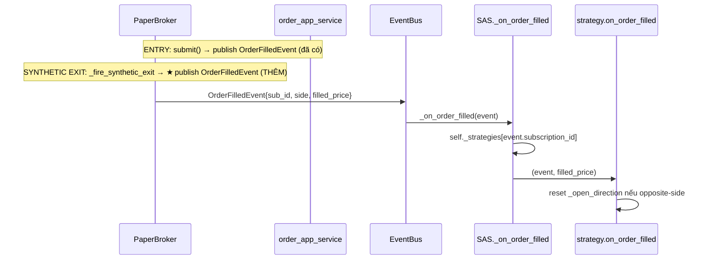

# Phase 2: Wire `strategy.on_order_filled` qua `OrderFilledEvent` (Bug #1)

## Overview

Route fill → `strategy.on_order_filled` qua **`OrderFilledEvent` + `subscription_id`**, KHÔNG qua broker per-callback closure. Đây là redesign sau red-team (4 Critical findings về broker-callback approach). Cùng cơ chế cho backtest (entry + synthetic SL/TP exit) lẫn live.

## Vì sao đổi sang OrderFilledEvent (red-team driven)

Thiết kế cũ (broker `subscribe_order_updates` closure) bị bác bỏ vì:
- Live dùng **shared broker theo type** (`_get_or_create_broker:370-373`) — 1 broker cho N strategy; closure không route được fill về đúng strategy.
- `OrderResult` **không mang** `subscription_id` (`value_objects.py:8-22`) → không có field để route.
- `unsubscribe_order_updates` **clear ALL** (`paper_broker.py:399-401`) → gỡ 1 strategy giết callback của mọi strategy khác.
- `OrderResult.side` là `Optional` → `getattr` no-op silently → tái sinh bug cap-1.

→ Giải pháp: dùng `OrderFilledEvent` (đã có sẵn, mang `subscription_id` + `side` non-optional).

## Verified facts (đọc code)

- `order_app_service.submit()` publish `OrderFilledEvent{order_id, subscription_id, symbol, side, filled_quantity, filled_price}` khi entry fill — `order_app_service.py:32-39`. **Đã có.**
- `order_app_service.on_order_update()` (live broker callback) publish CÙNG event — `order_app_service.py:185-194`. **Đã có.**
- `OrderFilledEvent.side = order.side` (non-optional `OrderSide`) — `order_app_service.py:190`. Né Optional gap.
- `Signal.subscription_id = strategy.id` (`hitnrun2.py:141`) → propagate vào `Order.subscription_id` → `OrderFilledEvent.subscription_id` = key `self._strategies`.
- `StrategyAppService` đã là event-handler base (`@event_handler` dùng được, registry `register_instance:61`).
- **GAP DUY NHẤT:** synthetic SL/TP exit (`PaperBroker._fire_synthetic_exit:636-674`) chỉ gọi `_notify_callbacks`, **KHÔNG publish `OrderFilledEvent`**. Exit chính là cái strategy cần để reset.

## Architecture

Hai thay đổi:

**(1) `StrategyAppService` thêm handler `@event_handler(OrderFilledEvent)`** route theo `subscription_id`:
```python
@event_handler(OrderFilledEvent)
async def _on_order_filled(self, event: OrderFilledEvent) -> None:
    strategy = self._strategies.get(event.subscription_id)
    if strategy is None or not strategy.is_running:
        return
    try:
        await strategy.on_order_filled(event, event.filled_price)  # event has .side
    except Exception as e:
        logger.error("strategy_on_order_filled_error", strategy_id=event.subscription_id, error=str(e))
```

**(2) `PaperBroker._fire_synthetic_exit` publish `OrderFilledEvent`** (nếu có event_bus), mang `subscription_id=pos.subscription_id`, `side=exit_side`, `filled_price=fill_price`.



**`on_order_filled` signature:** `(order, fill_price)` — `order` duck-typed, chỉ cần `.side` (OrderSide). `OrderFilledEvent.side` thoả. Cập nhật docstring hook: `order` đảm bảo có `.side: OrderSide`. `hitnrun2.on_order_filled` thêm guard `getattr(order,'side',None)` (đã có) — nhưng giờ `.side` luôn non-optional.

**Ordering (red-team Finding 11):** collector build trade qua broker callback (`subscribe_order_updates`), strategy reset qua event bus — hai đường độc lập, không cần đảm bảo thứ tự (reset chỉ chạm `_open_direction`, disjoint với trade building). Bỏ claim "collector trước bridge" ở thiết kế cũ.

## Related Code Files

- Modify: `src/pocketquant/engine/app_services/strategy_app_service.py` — thêm `@event_handler(OrderFilledEvent)` `_on_order_filled` (import `OrderFilledEvent` từ `core.domain.order`).
- Modify: `src/pocketquant/core/infra/brokers/paper/paper_broker.py` — `_fire_synthetic_exit:636-674` publish `OrderFilledEvent` qua `self._event_bus` (guard `if self._event_bus`). Import event.
- Modify: `src/pocketquant/core/domain/strategy/services/hitnrun2.py` — `on_order_filled` (đã rename Phase 1) giữ guard side.
- Verify-only: `order_app_service.py:32-39, 185-194` (entry + live publish — không đụng).
- Verify-only: `backtest_app_service.py:90` collector subscribe (không đụng — đường riêng).
- Layer check: `OrderFilledEvent` ở `core.domain.order` — `engine` import core OK (import-linter).

## Implementation Steps

1. Thêm `_on_order_filled` handler vào `StrategyAppService` (route theo `subscription_id`, try/except + log).
2. `_fire_synthetic_exit` publish `OrderFilledEvent` (sub_id, side, filled_price, qty) sau `_notify_callbacks` hoặc cùng chỗ; chỉ khi `event_bus` có.
3. Kiểm tra entry fill ở backtest: `run_single`/`load_strategy_for_backtest` dùng PaperBroker + `order_app_service.submit`? Nếu backtest submit KHÔNG qua order_app_service → entry fill phải publish event ở đâu? **Verify path submit của backtest** (xem Risk).
4. `hitnrun2.on_order_filled`: confirm reset logic với `event.side`.
5. Test: fixture nhiều breakout → multi-trade; test handler route đúng sub_id; test synthetic exit publish event.

## Success Criteria

- [ ] Backtest `hitnrun2` fixture nhiều breakout → `total_trades > 1`.
- [ ] Synthetic SL/TP exit publish `OrderFilledEvent` mang đúng `subscription_id` + `side`.
- [ ] `_on_order_filled` route đúng strategy theo id; strategy lạ id → no-op.
- [ ] Opposite-side fill → `_open_direction is None`; same-side → giữ (test `test_on_fill_same_side_does_not_reset` vẫn xanh).
- [ ] Live path: `order_app_service.on_order_update` → event → handler (cùng cơ chế, verify bằng test handler).
- [ ] Collector build trade không regression (`test_result_collector_fifo` xanh).

## Verified: entry fill publish path (resolved)

`_process_signal:334` gọi `self._order_app_service.submit(order, broker)` → entry fill publish `OrderFilledEvent` **cả ở backtest lẫn live** (cùng path). Vậy:
- **Entry** → `submit()` publish event (`order_app_service.py:32-39`). ✓ có sẵn.
- **Synthetic SL/TP exit** → CHỈ `_notify_callbacks`, phải THÊM publish. ← việc chính của Phase 2.
- Reset logic chỉ cần exit-event (opposite-side); entry-event vô hại (same-side, không reset).

## Risk Assessment

- **Risk:** double-fire nếu cả entry-event lẫn synthetic-exit-event cho cùng position. Mitigation: order_id khác nhau; handler idempotent (reset chỉ khi opposite-side; entry là same-side → no-op).
- **Risk (live):** live OKX fill → `on_order_update` (broker WS callback) phải được wire để publish event. Grep KHÔNG thấy call-site nào subscribe `on_order_update` vào broker hiện tại → live order tracking có thể chưa hoạt động đầy đủ. Live đang OFF nên không chặn backtest goal; ghi nhận là gap live cần verify khi bật live.
- **Risk (event ordering):** `OrderFilledEvent` qua EventBus APP-scoped — single/subscription backtest worker serialize nên không cross-talk. Grid-opt concurrent thì cross-talk → Phase 5 cô lập bằng per-run EventBus.
- **Rollback:** gỡ handler + synthetic-exit publish; về cap-1 (không mất data).

## Live OKX (user chốt: verify-only, follow-up riêng)

Live OKX `on_order_update` wiring là **verify-only** (Phase 4 grep + ghi nhận gap), KHÔNG wire trong plan này. Live đang OFF. `order_app_service.on_order_update` ĐÃ publish `OrderFilledEvent` đúng (`:185`) — gap (nếu có) là ở chỗ ai subscribe nó vào OKX broker WS callback. Mở plan riêng khi bật live. Phase 2 chỉ đảm bảo backtest (PaperBroker) + cơ chế `OrderFilledEvent` chung.
