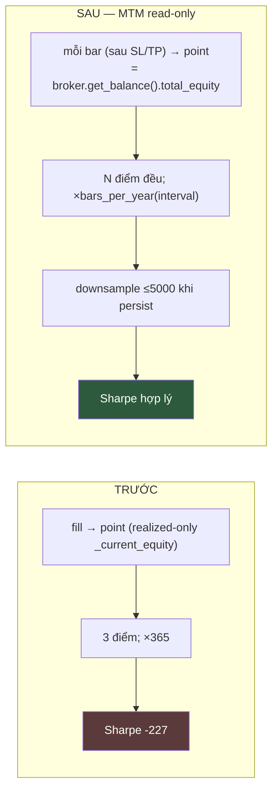

# Phase 3: Fix Sharpe/Sortino annualization (Bug #2)

## Overview

Sửa lỗi đo lường: Sharpe/Sortino annualize hằng số `365` trên equity_curve sample-theo-event → `-227`, `-30`. Fix kép: (a) annualize theo số chu kỳ thật của interval; (b) equity_curve sample đều theo bar bằng mark-to-market **read-only** từ broker. Redesign sau red-team (2 Critical + nhiều High về MTM correctness + 16MB persist).

## Requirements

- Functional: Sharpe/Sortino annualize theo `periods_per_year` của interval, trên chuỗi equity đều theo bar.
- Functional: |Sharpe| < ~10 cho dữ liệu BTC thật.
- Non-functional: `total_return`/`cagr`/`max_drawdown`/`win_rate`/`profit_factor` **byte-identical** trước/sau. MTM KHÔNG mutate `_current_equity`.

## Root cause (verified)

- `sharpe_ratio`/`sortino_ratio` dùng `TRADING_DAYS_PER_YEAR=365` (`performance_calculator.py:4,75-76,115-116`). `cagr:42` cũng dùng const này (calendar-based — ĐÚNG, đừng đụng).
- `_record_equity_point` append theo fill, dùng `_current_equity` realized-only (`result_collector.py:113,272,278`).
- `Interval` enum chỉ string (`shared/enums.py:4-11`).

## Sharpe definition (user-chosen: per-bar annualized)

User chốt **per-bar annualized theo interval**. Caveat đã ghi nhận (red-team Finding 6): chuỗi nhiều bar "flat" (không có vị thế) làm loãng std → Sharpe đo **capital efficiency toàn kỳ**, không phải active-period risk. Đây là lựa chọn có chủ đích, chuẩn ngành, so sánh cross-strategy được. Ghi caveat này vào docstring `sharpe_ratio`.

## Design

### (a) Annualization theo interval

`Interval.periods_per_year` (365d crypto):

| Interval | bars/year | | Interval | bars/year |
|---|---|---|---|---|
| 1m | 525600 | | 4h | 2190 |
| 5m | 105120 | | 1d | 365 |
| 15m | 35040 | | 1w | 52.14 (365/7) |
| 1h | 8760 | | | |

- `sharpe_ratio(equity_curve, *, periods_per_year, risk_free_rate=0)` — `periods_per_year` **keyword-only** (red-team Finding 12: né va `risk_free_rate` positional). Tương tự `sortino_ratio`.
- `annual_return = mean*periods_per_year; annual_std = std*sqrt(periods_per_year)`. Giữ guard `len<2`, `std==0`, `ddof=1`.
- `cagr` GIỮ NGUYÊN `TRADING_DAYS_PER_YEAR` (calendar-based). Thêm `cagr` vào danh sách metric bất biến.
- Lookup an toàn (red-team Finding 15): interval ngoài enum → log + skip annualization (Sharpe=0), KHÔNG raise. Validate interval ở enqueue, không ở finalize.

### (b) Equity curve sample đều theo bar — MTM READ-ONLY

Điều kiện annualize đúng: chuỗi return đo trên khoảng đều → ghi 1 equity point mỗi bar.

**Nguồn equity (red-team Finding 2,3 — KHÔNG reimplement, KHÔNG mutate):**
`broker.get_balance().total_equity` đã = `_balance + Σ unrealized_pnl` (`paper_broker.py:377-384`) — single source of truth, đã xử lý slippage/scale-in/commission. MTM point = giá trị này, **append vào equity_curve, KHÔNG ghi `_current_equity`**.

**Seam (red-team Finding 4,7):** ghi point SAU khi bar xử lý xong (sau broker SL/TP synthetic exit), KHÔNG trong `_wrap_bars_with_price_update` (pre-publish → lệch 1 bar). Vì broker subscribe `BarCompletedEvent` LAST (`paper_broker.py:137`), seam đúng là: subscribe collector vào `BarCompletedEvent` (đăng ký SAU broker), hoặc push trong replay loop sau mỗi `publish`. → collector cần ref tới broker để gọi `get_balance()`. Truyền broker vào collector hoặc push `(timestamp, total_equity)` từ `BacktestAppService` sau publish.

**Persist (red-team Finding 6,8 — 16MB Mongo limit):**
1m×2y ≈ 1.1M điểm > 16MB BSON → `save` throw, except-branch (`:153`) re-save cùng doc → throw lần 2 unhandled.
→ Tính Sharpe trên **full in-memory**; **downsample ≤ 5000 điểm** (stride/reservoir) khi persist. Drawdown/Sharpe lưu kèm metrics (scalar), nên FE đọc downsampled curve vẫn khớp metric. Assert doc size khi test.

## Related Code Files

- Modify: `src/pocketquant/core/domain/shared/enums.py` — `Interval.periods_per_year` (property/map) + safe lookup.
- Modify: `src/pocketquant/backtest/domain/services/performance_calculator.py` — `sharpe_ratio`/`sortino_ratio` keyword-only `periods_per_year`; `cagr` không đụng; docstring caveat.
- Modify: `src/pocketquant/backtest/engine/metrics_builder.py` — `build_metrics(..., periods_per_year)` (single caller `result_collector.py:338` — an toàn).
- Modify: `src/pocketquant/backtest/engine/result_collector.py` — `mark_to_market(timestamp, total_equity)` append point READ-ONLY (không chạm `_current_equity`); `finalize` truyền `periods_per_year`; downsample khi build `BacktestResult.equity_curve`.
- Modify: `src/pocketquant/backtest/engine/backtest_app_service.py` — sau mỗi bar replay (sau publish/SL-TP), push `collector.mark_to_market(ts, broker.get_balance().total_equity)`. Seam SAU broker xử lý.
- Check: `core/domain/backtest/entities.py:48` equity_curve persist; `web/.../use-equity-pane.ts` FE đọc (shape `EquityPoint` giữ nguyên).

## Implementation Steps

1. `Interval.periods_per_year` + safe lookup + unit test 7 interval (1w=52.14).
2. `sharpe_ratio`/`sortino_ratio` keyword-only `periods_per_year` + docstring caveat; add NEW unit test (known curve → known value) — red-team Finding 12: chưa có test nào.
3. `build_metrics(..., periods_per_year)`; truyền từ interval; `cagr` invariant.
4. `result_collector.mark_to_market` READ-ONLY + downsample-on-persist; `BacktestAppService` push sau publish (seam sau SL/TP).
5. Test: total_return/cagr byte-identical; Sharpe hợp lý; doc size < 16MB trên fixture 1m dài.

## Success Criteria

- [ ] `Interval("1m").periods_per_year == 525600`; `1w == 52.14`; interval lạ → không raise.
- [ ] `sharpe_ratio` keyword-only param; NEW unit test pass (known→known).
- [ ] Backtest `hitnrun2` 1m: |Sharpe| < ~10.
- [ ] `total_return`/`cagr`/`max_drawdown`/`win_rate`/`profit_factor` **byte-identical** trước/sau (assert trên fixture).
- [ ] `_current_equity` KHÔNG bị MTM ghi (assert: realized accounting nguyên).
- [ ] equity_curve persist ≤ 5000 điểm; doc < 16MB; backtest 1m dài không OOM/throw.

## Risk Assessment

- **Risk (RED-TEAM CRIT):** MTM ghi `_current_equity` → double-count realized → `total_return` sai. Mitigation: MTM append point từ `broker.get_balance()`, tuyệt đối không chạm `_current_equity`; test byte-identical.
- **Risk (RED-TEAM CRIT):** 1.1M điểm > 16MB → save throw + except re-save throw. Mitigation: downsample ≤5000 khi persist; assert doc size.
- **Risk (RED-TEAM High):** seam sai (pre-publish) → equity point lệch 1 bar. Mitigation: push SAU publish/SL-TP; broker subscribe LAST đảm bảo state đã settle.
- **Risk:** reimplement unrealized lệch broker. Mitigation: dùng `broker.get_balance().total_equity`, không tự tính.
- **Rollback:** revert sharpe param + mark_to_market; metrics về giá trị cũ (sai nhưng không crash).
