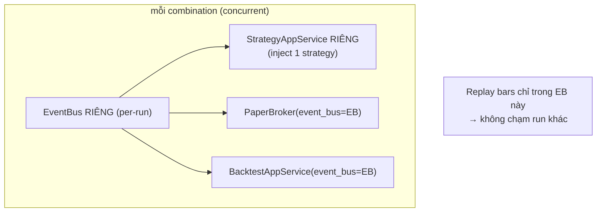

# Phase 5 (file 16): Fix Grid-Opt — strategy injection + concurrency isolation

> Số file là 16 (CLI tự cấp). Thứ tự logic = phase 5, depends 1+2+3 (cần rename, fill-wire, sharpe xong trước).

## Overview

Grid optimization hiện **ra 0 trade** (pre-existing bug, phát hiện khi red-team). `_run_with_semaphore` tạo PaperBroker + `BacktestAppService.run()` nhưng KHÔNG inject strategy → `_on_bar_completed` không tìm thấy strategy → `on_bar`/`on_order_filled` không chạy. Gộp vào plan theo yêu cầu user. Fix = inject strategy per-run + cô lập concurrency.

## Root cause (verified)

- `grid_optimization_app_service.py:177-207`: tạo `PaperBroker` + `BacktestAppService(...).run()`, KHÔNG gọi `inject_prepared_strategy`/`StrategyAppService`. Không reference `StrategyAppService` nào trong file.
- `BacktestAppService.run()` chỉ replay bars + collector; nó KHÔNG load strategy — strategy phải được inject bên ngoài (như `run_single`/`run_subscription` làm: `backtest_dispatch.py:121-127`).
- → grid-opt thiếu bước inject → strategy không chạy → 0 trade.

## Concurrency hazard (verified — phải xử lý)

- `EventBus` là **APP singleton** (`core.py`). `optimize()` chạy `max_workers` run **đồng thời** (`asyncio.gather`, default 4, max 16 — `optimization_config.py:38`).
- `_on_bar_completed` match strategy theo **symbol/interval** (`strategy_app_service.py:280-282`), KHÔNG theo id. → nếu inject N strategy cùng `hitnrun2/BTCUSDT/1m` vào CÙNG `StrategyAppService`, mỗi `BarCompletedEvent` từ run A match TẤT CẢ N strategy + N broker → cross-talk.
- ✓ An toàn: `simulation_time` dùng `ContextVar` (`time/simulation.py:12`) — isolated per async task. `OrderFilledEvent` routing (Phase 2) theo id — an toàn. Vấn đề CHỈ ở bar dispatch.

## Design — per-run isolated EventBus + StrategyAppService

Để concurrency an toàn, mỗi grid-opt run cần **EventBus riêng** (không dùng APP singleton) để bar/fill chỉ chạm strategy+broker của chính run đó:

- Mỗi `_run_with_semaphore`: tạo `EventBus()` mới, `StrategyAppService` mới (hoặc nhẹ hơn: chỉ cần handler bar+fill), inject strategy với synthetic id, `PaperBroker(event_bus=local_eb)`, `BacktestAppService(event_bus=local_eb)`.
- **VERIFIED (validate):** `EventRegistry.register_instance(instance, event_bus)` subscribe handler vào **EventBus được truyền vào** (`event_registry.py:41,60`) — **per-instance binding, KHÔNG global**. → per-run EventBus isolation KHẢ THI: mỗi run tạo `EventBus()` + `StrategyAppService` riêng + `register_instance(sas, local_bus)`. Rủi ro lớn nhất của Phase 5 đã gỡ.

**Alternative đơn giản hơn (KISS — cân nhắc):** vì grid-opt mỗi run đã có broker riêng + replay riêng, có thể inject strategy vào một `StrategyAppService` riêng per-run với EventBus riêng. Nếu chi phí tạo `StrategyAppService` (cần broker_factory, order_app_service, position, risk) quá nặng → tạo helper inject tối thiểu.

## Related Code Files

- Modify: `src/pocketquant/backtest/optimization/grid_optimization_app_service.py` — `_run_with_semaphore`: tạo per-run EventBus + inject strategy (mirror `load_strategy_for_backtest` logic, synthetic id `{code}::opt::{combo_idx}`).
- Possibly need: `StrategyAppService` hoặc lightweight injection helper với per-run EventBus.
- Reuse: `backtest_strategy_loader.load_strategy_for_backtest` pattern (đã có inject + synthetic id + cleanup).
- Verify: `OrderFilledEvent` routing (Phase 2) hoạt động trong per-run EventBus (handler đăng ký trên local bus).

## Implementation Steps

1. ✓ Registry binding per-instance (verified) → per-run EventBus khả thi.
2. Refactor `_run_with_semaphore`: per-run `EventBus()` + `StrategyAppService` (hoặc helper) + inject strategy synthetic id + `register_instance(sas, local_bus)` + cleanup (unload) trong finally.
3. Đảm bảo `target_metric=sharpe_ratio` (default) giờ rank trên Sharpe ĐÚNG (Phase 3) + trade ĐÚNG (Phase 2).
4. Test: grid-opt 2+ combination concurrent → mỗi run ra trade độc lập (không cross-talk); best param chọn đúng.
5. Test isolation: 2 combination cùng symbol/interval chạy đồng thời → trade/equity KHÔNG lẫn.

## Success Criteria

- [ ] Grid-opt run ra `total_trades > 0` cho mỗi combination có breakout (không còn 0 trade).
- [ ] 2+ combination concurrent cùng symbol/interval: trade/equity cô lập (test khẳng định).
- [ ] `target_metric` ranking dùng Sharpe đúng (sau Phase 3) — không rank trên giá trị rác.
- [ ] Cleanup: synthetic strategy unload sau mỗi run (không leak vào registry).
- [ ] `just test` xanh; không regression `run_single`/`run_subscription`.

## Risk Assessment

- **Risk (cao):** shared APP EventBus → cross-talk concurrent. Mitigation: per-run EventBus. Nếu `@event_handler` registry là global (không per-instance) → fallback gọi hook trực tiếp trong replay, không qua event bus cho grid-opt.
- **Risk:** tạo `StrategyAppService` per-run nặng (nhiều dependency). Mitigation: dùng injection helper tối thiểu hoặc tái dùng `load_strategy_for_backtest`.
- **Risk:** Phase 5 phụ thuộc 1+2+3 — phải làm sau. Nếu 1+2+3 trượt thì hoãn 5.
- **Rollback:** grid-opt về trạng thái 0-trade hiện tại (đã hỏng sẵn, không tệ hơn).

## Unresolved (verify khi implement)

1. `@event_handler` + `get_event_registry()` binding: per-instance hay global? Quyết định có dùng per-run EventBus + StrategyAppService được không, hay phải gọi hook trực tiếp.
2. Chi phí tạo `StrategyAppService` per-run (dependencies) — có cần lightweight helper không.
