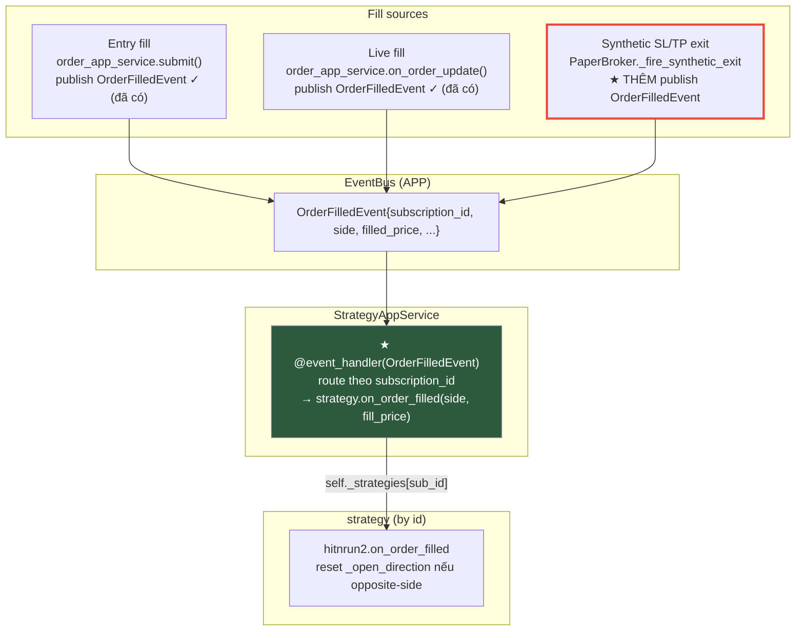

# Backtest fix: wire fill hook + correct Sharpe + rename hooks

## Overview

Sửa 2 bug ở **app/engine code** (không phải `hitnrun2`) từ audit live VPS. Nguồn: `plans/reports/diagnostic-vps-backtest-health-260628-1417-hitnrun2-onfill-sharpe-bugs-report.md`. Plan này **đã redesign sau red-team** (3 reviewer, 4 Critical findings).

- **Bug #1 (P1):** `strategy.on_fill` có 0 call-site → `hitnrun2._open_direction` kẹt sau lệnh đầu → backtest cap 1 trade.
- **Bug #2 (P1):** Sharpe/Sortino annualize hằng số `365` trên equity_curve sample-theo-event → `-227`, `-30`.
- **Rename:** `on_bar→on_bar_completed`, `on_tick→on_quote_received`, `on_fill→on_order_filled`.

## Red-team decisions (đã chốt với user 2026-06-28)

| Quyết định | Chốt |
|---|---|
| **Fill routing** | Route qua **`OrderFilledEvent` + `subscription_id`**, KHÔNG dùng broker per-callback closure. Né shared-broker (live), né unsubscribe clear-all, né `OrderResult.side` Optional. |
| **Live scope** | Wire **cả live** (user yêu cầu) — khả thi vì `order_app_service.on_order_update` đã publish `OrderFilledEvent` mang `subscription_id`. Không cần refactor unsubscribe. |
| **Sharpe def** | **Per-bar annualized theo interval** (chuẩn ngành). Ghi caveat: chuỗi nhiều bar "flat" làm loãng — Sharpe đo capital efficiency toàn kỳ. |
| **MTM** | Read-only: lấy từ `broker.get_balance().total_equity` (đã có unrealized), KHÔNG mutate `_current_equity`. |
| **Grid-opt** | Ban đầu out-of-scope; **user gộp vào → Phase 5** (xem dưới). Plan cover single/subscription backtest + live + grid-opt. |

## Kiến trúc mới — fill routing qua OrderFilledEvent

**Vì sao routing này đúng (verified):**
- `Signal.subscription_id = strategy.id` (`hitnrun2.py:141`) → `Order.subscription_id` → `OrderFilledEvent.subscription_id` = key trong `self._strategies`. Match cho cả run_single (synthetic id), run_subscription (`{code}::bt::{sub_id}`), live (sub_id).
- `OrderFilledEvent.side` = `order.side` (non-optional `OrderSide`) — né Optional gap.
- Single/subscription backtest do worker drain **tuần tự** (`claim_next`) → không concurrency cross-talk. Grid-opt (semaphore concurrent) thì CÓ cross-talk → Phase 5 xử lý bằng per-run EventBus isolation.

**Collision phải nhớ:** `BacktestResultCollector.on_fill(result)` GIỮ NGUYÊN (consumer broker callback build trade) — KHÔNG rename, KHÔNG đụng. Khác hẳn `IStrategy.on_fill`.

## Bug #2 — annualize theo interval + MTM read-only

`Interval` enum thiếu duration → thêm `periods_per_year` (365d crypto):

| Interval | bars/year | | Interval | bars/year |
|---|---|---|---|---|
| 1m | 525600 | | 4h | 2190 |
| 5m | 105120 | | 1d | 365 |
| 15m | 35040 | | 1w | 52.14 (365/7) |
| 1h | 8760 | | | |

- `sharpe_ratio`/`sortino_ratio`: thêm `periods_per_year` **keyword-only** (né va `risk_free_rate` positional). `cagr` GIỮ `TRADING_DAYS_PER_YEAR=365` (calendar-based — đúng, đừng đụng).
- **MTM read-only:** equity point mỗi bar = `broker.get_balance().total_equity` (đã gồm unrealized, `paper_broker.py:377-384`) — KHÔNG tự reimplement, KHÔNG ghi `_current_equity`. `total_return`/`cagr` bất biến.
- **Seam:** ghi point SAU khi bar xử lý xong (sau broker SL/TP), không phải trong `_wrap_bars_with_price_update` (pre-publish).
- **Persist:** downsample ≤ 5000 điểm khi lưu (1m×2y ≈ 1.1M điểm > Mongo 16MB). Sharpe tính trên full in-memory; lưu bản downsample.

## ⚠ Discovered pre-existing bug (IN SCOPE — user gộp vào plan, Phase 5)

**Grid optimization ra 0 trade hôm nay.** `_run_with_semaphore` (`grid_optimization_app_service.py:177-207`) tạo PaperBroker + `BacktestAppService.run()` nhưng **không inject strategy** vào `StrategyAppService` → `_on_bar_completed` không tìm thấy strategy → `on_bar` không chạy. Cộng concurrency hazard: shared APP EventBus + `max_workers` concurrent + `_find_strategies` match theo symbol/interval (không theo id). → Fix ở **Phase 5** (file `phase-16`): inject strategy per-run + per-run EventBus isolation. `simulation_time` là ContextVar (đã isolated). Depends 1+2+3.

## Phases

| Phase | Name | Status | Priority | Depends |
|-------|------|--------|----------|---------|
| 1 | [Rename Hooks](./phase-01-rename-hooks.md) | Done | P2 | — |
| 2 | [Wire Fill via OrderFilledEvent (Bug #1)](./phase-02-wire-fill-hook.md) | Done | P1 | 1 |
| 3 | [Fix Sharpe/Sortino (Bug #2)](./phase-03-fix-sharpe.md) | Done | P1 | — |
| 5 | [Fix Grid-Opt injection + isolation](./phase-16-fix-grid-opt.md) | Done | P1 | 1,2,3 |
| 4 | [Verify](./phase-04-verify.md) | Done | P1 | 1,2,3,5 |

> Phase 5 dùng file `phase-16-fix-grid-opt.md` (CLI tự cấp số 16). Verify (Phase 4) chạy cuối, sau Phase 5.

## Implementation findings (post-build)

Hai fact lộ ra khi build mà red-team bỏ sót; cả hai cần fix in-scope:

1. **Entry fill chưa từng publish `OrderFilledEvent`** (tiền đề "resolved" của plan sai). `order_app_service.submit()` gọi `order.fill()` trên order `PENDING`, nhưng state machine chỉ cho `PENDING→SUBMITTED→FILLED` → raise → order bị REJECTED; nhánh entry-publish là dead code. Cộng shared APP EventBus → synthetic-exit publish của tôi tạo **phantom position** trong `PositionAppService` live.
   → **User chốt: per-run isolated EventBus.** Kéo isolation của Phase 5 lên Phase 2: mỗi backtest run (`run_single`, `run_subscription`, grid-opt) dựng `BacktestSandbox` (EventBus + StrategyAppService riêng + in-mem order/position tracker, bind qua local `EventRegistry`). Bar/fill backtest không chạm engine live. File mới: `backtest/engine/backtest_engine_sandbox.py`.

2. **Re-entry sau khi position đóng raise "Cannot add to closed position"** (`PaperBroker._execute_fill`). Position đã đóng còn nằm trong dict theo key; re-entry gọi `add_quantity` trên nó → raise. Chặn multi-trade kể cả sau khi reset `on_order_filled`. → Fix: coi closed position tại key như vắng mặt (mở fresh).

3. **(code-review H-1) Entry MARKET fill bị REJECTED, entry `OrderFilledEvent` không publish.** `order_app_service.submit()` gọi `order.fill()` trên order `PENDING` → vi phạm state machine (`PENDING→FILLED` cấm) → raise → except branch reject. → Fix: transition qua `SUBMITTED` trước khi `fill()` khi order còn `PENDING`. Giờ entry MARKET fill → FILLED + publish đúng 1 `OrderFilledEvent`.

4. **(code-review H-2) Downsample cap không hard-guaranteed** nếu số điểm-trade > 5000. → Fix: sau khi stride giữ điểm-trade, slice cứng lần 2 để cap luôn ≤ 5000 (giữ first+last).

Verified: `total_trades` 1 (baseline) → 4 (fixed) trên oscillating fixture; grid-opt 0 → N trade/combination; realized metrics byte-identical có/không MTM; Sharpe hợp lý trên dữ liệu realistic-vol; entry+exit `OrderFilledEvent` đều publish; cap cứng kể cả 8000 round-trip.

### Known edges (documented, không fix lần này)
- **(review M-1) `HitNRun2._open_direction` có thể kẹt** nếu entry signal sinh ra nhưng order bị risk/size reject (set `_open_direction` optimistic trong `on_bar_completed` trước khi submit). Pre-existing; post-H-1-fix các MARKET entry fill ngay nên reject path hiếm. Follow-up: notify strategy khi signal không fill, hoặc set `_open_direction` chỉ khi fill confirmed.
- **(review L-1) `realized_pnl` cumulative** có thể double-count nếu partial-reduce nhiều lần cùng lot. Pre-existing; không xảy ra vì strategy full-close qua SL/TP.
- **Live OKX `on_order_update` chưa wire** vào OKX broker WS callback (0 call-site) → live fill chưa publish `OrderFilledEvent`. Live OFF; verify-only finding, follow-up plan khi bật live.

### Code review
`code-reviewer` subagent: **DONE_WITH_CONCERNS** → đã fix H-1 + H-2, document M-1/L-1/live-OKX. 591 passed (4 test mới cho H-1/H-2/re-entry SELL), ruff/pyright/import-linter xanh.

## OpenAPI snapshot — resolved (baseline đã regenerate)

Trước đây flag "drift cần user quyết". Thực tế lúc verify: `tests/baseline/openapi_app_snapshot.json` **đã được regenerate** trong working tree (21 dòng `description` gỡ khỏi response model để khớp schema sau comment-strip). `test_openapi_snapshot` giờ PASS ổn định (5 run liên tiếp xanh). Nguồn drift là **comment-stripping pass toàn repo** (123 file chỉ-xoá-comment, KHÔNG do plan này — plan không định nghĩa route/response model nào). Không còn quyết định nào cần user.

⚠ Hai lần fail đơn lẻ lúc verify (`test_openapi_snapshot` rồi `test_job_history_repository`) là **flaky/order-dependent** ở pre-existing infra tests — cả hai pass khi chạy riêng, full suite xanh 5× liên tiếp (592 passed). Không phải do plan này.

## Acceptance criteria

- [x] Backtest `hitnrun2` ra **nhiều trade** (oscillating fixture: 1→4); `_open_direction` reset sau mỗi round-trip.
- [x] `strategy.on_order_filled` được gọi qua `OrderFilledEvent` — entry (sau fix H-1) + synthetic exit; live cùng cơ chế (handler chung).
- [x] Synthetic SL/TP exit publish `OrderFilledEvent` mang `subscription_id` + `side`.
- [x] Sharpe/Sortino: |Sharpe| < ~10 trên dữ liệu realistic-vol; annualize theo interval; `periods_per_year` keyword-only.
- [x] `total_return`, `cagr`, `max_drawdown`, `win_rate`, `profit_factor` **byte-identical** trước/sau MTM (test pinned).
- [x] equity_curve persist ≤ 5000 điểm (hard cap, giữ điểm-trade); backtest dài không OOM.
- [x] Rename đồng bộ: `interfaces.py` + `hitnrun2.py` + `_DefaultStrategy` + `_CountingStrategy` (test) + call-site.
- [x] `BacktestResultCollector.on_fill` không đổi.
- [x] **Grid-opt (Phase 5):** mỗi combination ra `total_trades > 0`; 2+ run concurrent cùng symbol cô lập (test pinned).
- [x] `ruff`/`pyright` xanh; import-linter 7 contracts KEPT. `just test`: **592 passed, 1 skipped, 0 failed** (ổn định 5 run). OpenAPI snapshot pass (baseline đã regenerate). Re-smoke remote-db: **DONE** (xem dưới).
- [x] **Re-smoke prod (remote-db, 2026-06-28):** grid-opt `hitnrun2 / BTCUSDT:BINANCE / 1h` 2 combination qua `/backtest/optimize` (synchronous, chạy code local fixed). Kết quả: 2/2 completed, 0 failed; **total_trades 262 & 296** (Bug #1 fixed — trước cap 1); Sharpe **11.25 & 0.83** sane + differentiated (trước -227/-30); live `positions: 0` (sandbox isolation — không phantom). `.env` khôi phục về all-local sau đó.

## Out of scope

- Tự refresh subscription backtest theo lịch; chuẩn hoá schema timestamp; tăng log retention.
- Backtest chạy đồng thời với live subscription cùng symbol (pre-existing shared-bus limitation — ghi nhận, không sửa; live đang off).
- Live OKX `on_order_update` wiring (verify khi bật live — live off nên không chặn).

## Dependencies

Không plan nào đang mở chồng lấn. Nguồn: diagnostic report.

## Red Team Review

### Session — 2026-06-28
**Findings:** 15 (13 accepted, 2 rejected) từ 3 reviewer (Failure Mode Analyst, Assumption Destroyer, Correctness Adversary).
**Severity:** 4 Critical, 6 High, 5 Medium.

| # | Finding | Sev | Disposition | Applied To |
|---|---------|-----|-------------|------------|
| 1 | Broker-callback bridge bỏ sót grid-opt (no inject) | Critical | Accept → grid-opt OUT OF SCOPE (flag riêng) | plan.md, P2 |
| 2 | Live shared-broker + OrderResult no sub_id → bridge không route được | Critical | Accept → redesign dùng OrderFilledEvent | P2 (rewrite) |
| 3 | MTM mutate `_current_equity` → total_return sai | Critical | Accept → MTM read-only từ broker.get_balance | P3 |
| 4 | Rename bỏ sót `_DefaultStrategy.on_bar:383` → TypeError live | Critical | Accept | P1 |
| 5 | Sharpe def là user decision (per-bar flat-bar caveat) | High | Accept → user chọn per-bar + caveat | P3 |
| 6 | MTM nên dùng broker.get_balance, không reimplement | High | Accept | P3 |
| 7 | MTM seam/ordering chưa pin (pre-publish lệch bar) | High | Accept → seam sau SL/TP | P3 |
| 8 | equity_curve 1.1M điểm > 16MB Mongo + except re-save throw | High | Accept → downsample ≤5000 | P3 |
| 9 | OrderResult.side Optional → getattr no-op silent | High | Accept → OrderFilledEvent.side non-optional | P2 |
| 10 | "both paths" acceptance mâu thuẫn OKX out-of-scope | High | Accept (gộp #2) | plan.md, P2 |
| 11 | "collector trước bridge" ordering claim sai | High | Accept (modified) → bỏ claim, hai đường độc lập | P2 |
| 12 | periods_per_year positional đụng risk_free_rate; chưa có test sharpe | Med | Accept → keyword-only + new test | P3 |
| 13 | TRADING_DAYS_PER_YEAR cũng feed cagr — đừng phá | Med | Accept → cagr invariant | P3 |
| 14 | Phantom touchpoint test_strategy_handlers_declarative; thiếu _CountingStrategy | Med | Accept | P1 |
| 15 | Interval(bad_string) raise trên queued request cũ | Med | Accept → safe lookup | P3 |
| R1 | Entry-fill false reset | — | **Reject** | Đã guard side + test `test_on_fill_same_side_does_not_reset:201` |
| R2 | len<2 guard | — | **Reject** | Plan không đụng guard |

### Whole-Plan Consistency Sweep
- **Decision deltas applied:** broker-callback bridge → OrderFilledEvent routing (P2 rewrite); MTM mutate → read-only broker.get_balance (P3); grid-opt → out of scope + flagged; rename +`_DefaultStrategy`/`_CountingStrategy` (P1); Sharpe per-bar + caveat; downsample ≤5000; keyword-only periods_per_year; cagr invariant.
- **Stale-term check:** "bridge"/"subscribe_order_updates closure" còn ở P2 chỉ trong phần "Vì sao đổi" (giải thích lý do bác bỏ — đúng ngữ cảnh, không phải thiết kế hiện hành). Không còn chỗ nào mô tả broker-callback là thiết kế chính.
- **Acceptance reconciled:** plan.md acceptance khớp P2 (OrderFilledEvent, synthetic exit publish), P3 (byte-identical metrics, ≤5000, keyword-only), P1 (_DefaultStrategy/_CountingStrategy).
- **Contradictions remaining:** 0. Plan sẵn sàng implement (sau khi user xác nhận 3 unresolved ở P4 — đều là verify-time, không chặn).

## Validation Log

### Session — 2026-06-28
Red Team section đã có evidence → bỏ verification pass (per validate-workflow guard), chỉ phỏng vấn decision points. 4 câu hỏi, 4 quyết định:

| Topic | Quyết định | Áp dụng |
|---|---|---|
| **Prod re-smoke** | **Chạy local với remote-db** (code local → VPS Mongo/Redis, `ENABLE_JOBS=false`, tự enqueue + quan sát). Vẫn ghi prod DB nhưng kiểm soát được. | Phase 4 |
| **Downsample** | **Stride ≤5000 điểm, GIỮ điểm có trade** (fill/exit) để đường equity không mất điểm gãy. | Phase 3 |
| **MTM seam** | **Push từ `BacktestAppService` sau publish** — `collector.mark_to_market(ts, broker.get_balance().total_equity)` sau mỗi bar. Không thêm event coupling vào collector. | Phase 3 |
| **Grid-opt** | **Gộp vào plan** (Phase 5 / file 16). | plan.md, Phase 5 |

### Verification (decisions → code, verified)
- Remote-db mode tồn tại: `pocketquant-config/local/remote-db.env`, `ENABLE_JOBS=false` default (deployment.md:350). Re-smoke local an toàn (worker chỉ chạy nếu enable_jobs — nhưng enqueue qua API + worker trên VPS sẽ drain).
- `simulation_time` = ContextVar (`time/simulation.py:12`) → grid-opt concurrent isolated time ✓.
- `_find_strategies` match symbol/interval không theo id (`strategy_app_service.py:280-282`) → Phase 5 cần per-run EventBus isolation.
- `max_workers` default 4, max 16 (`optimization_config.py:38,78`).

### Session 2 — 2026-06-28 (open questions round 2)
Resolved bằng code đọc trước khi hỏi:
- `@event_handler` registry binding = **per-instance** (`event_registry.py:41,60`) → Phase 5 per-run EventBus khả thi (gỡ rủi ro lớn nhất).

3 quyết định user:
| Topic | Chốt |
|---|---|
| **Live OKX wiring** | Phase 4 **chỉ VERIFY** (grep + doc) gap, không wire. Follow-up riêng khi bật live. |
| **Thứ tự thực thi** | **Tuần tự 1→2→3→5→4** (theo dependency, verify cuối). |
| **Re-smoke timing** | **Tự động chạy cuối Phase 4** (không hỏi lại) — ⚠ ghi prod DB qua remote-db. |

### Whole-Plan Consistency Sweep (post-validation)
- **Decision deltas:** grid-opt out-of-scope → in-scope Phase 5; Verify depends 1,2,3,5; downsample = stride giữ điểm-trade; MTM seam = push sau publish; re-smoke = remote-db local TỰ ĐỘNG cuối Phase 4; live OKX = verify-only; exec tuần tự 1→2→3→5→4; registry per-instance verified.
- **Reconciled:** plan.md phases table, out-of-scope, acceptance, Phase 2 (live OKX verify-only), Phase 3 (downsample + seam), Phase 4 (re-smoke tự động), Phase 5 (registry verified).
- **Contradictions remaining:** 0.

> ⚠ Cảnh báo re-smoke remote-db: writes đi vào **production** DB (deployment.md:347). Backtest doc mới không xoá data cũ; có thể xoá sau. Giữ `ENABLE_JOBS=false` local để không double-schedule.
