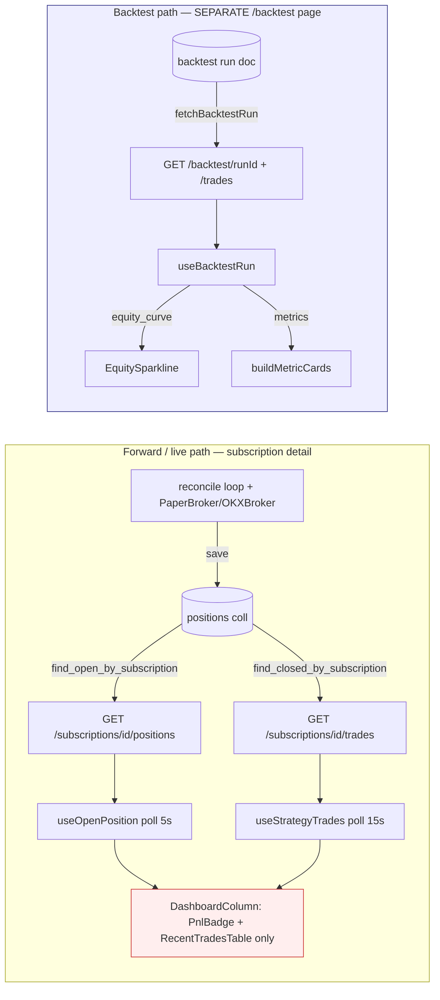

# Slice 3 — Live Equity + KPI + Forward Tab Foundation — Brainstorm Report

## Metadata

- **Priority:** 3/5 · **Stack:** FE + (optional minimal) BE
- **Depends on:** Slice 1 (deep-link 2-tab `Backtest|Forward` shell — *chưa tồn tại trong code hiện tại*, xem §10)
- **Unblocks:** Slice 4 (orders panel cắm vào Forward shell), Slice 5 (explain trade dùng forward trades)
- **Date:** 2026-06-28

> **Re-scout note (verified AS-IS):** codebase đã đổi nền tảng so với draft đầu — **backtest đã decoupled khỏi subscription**, dời sang trang riêng `/backtest` (`web/src/routes/backtest.tsx`). Endpoint `GET /subscriptions/{id}/backtest` và interface FE `SubscriptionBacktest` **đã bị xóa**. `DashboardColumn` đã rewrite thành "forward-testing only". Điều này **củng cố** premise Slice 3 (forward cần equity+KPI riêng, không còn "mượn" từ backtest) và làm **B1 hợp lý hơn**. Mọi citation dưới đây đã re-verify.

---

## 1. Problem Statement

- 1 Subscription `(strategy_code, symbol, interval)` phục vụ cả **backtest** lẫn **forward** (live từ `start`: reconcile loop + PaperBroker/OKXBroker sinh positions/orders/trades thật).
- Backtest giờ là **ad-hoc run trên trang `/backtest`** (`routes/backtest.tsx`), **không** gắn với subscription. Subscription detail giờ thuần **forward**.
- Forward view (`DashboardColumn`, `web/src/components/strategies/dashboard-column.tsx`) hiện **chỉ có** `PnlBadge` (unrealized) + `RecentTradesTable` (live closed trades). **Thiếu**: live equity curve, KPI strip, open-positions panel đầy đủ (side/entry/qty/leverage/liq_price/unrealized/SL/TP).
- Slice này dựng **Forward tab shell** (S4/S5 cắm vào sau) + 3 panel: open positions, live equity, KPI strip.

---

## 2. Current State (evidence — re-verified)

### 2.1 Backend — đã có gì

| Endpoint | Service:method | Trả về | Evidence |
|---|---|---|---|
| `GET /subscriptions/{id}/positions` | `StrategyQueryService.get_positions` | open positions (DB, `is_closed=false`) | `app/routes/strategy.py:130`; `engine/strategy_query_service.py:101` |
| `GET /subscriptions/{id}/trades` | `StrategyQueryService.get_trades` | closed positions = completed trades, newest-first, `limit` Query default 100 ≤500 | `app/routes/strategy.py:138`; `strategy_query_service.py:117` |
| `GET /trading/positions/{strategy_id}` | `OrderPositionQueryService.get_position` | live **in-RAM** position summary (chỉ process chạy engine) | `app/routes/trading_orders_positions.py:37`; `engine/orders_positions_service.py:86` |

- ⚠️ **`GET /subscriptions/{id}/backtest` đã bị XÓA** — không còn import `GetSubscriptionBacktestQuery` (`strategy.py:22-29`), không còn route, `StrategyQueryService` không còn `BacktestRepository` dependency (`strategy_query_service.py:48-54` chỉ còn `subscription_repository, position_repository`), `get_subscription_backtest` method đã gỡ.
- **Positions DTO** (`strategy_query_service.py:103-114`): `symbol, direction(=side.value.upper()), entry_price, quantity, unrealized_pnl, entry_time(=opened_at.isoformat()), sl_price, tp_price`. → **có sl_price/tp_price**; **KHÔNG có `leverage`/`liq_price`** (không tồn tại trên `PositionAggregate`, xem `core/domain/position/entities.py:27-41` — chỉ `sl_price`/`tp_price` ở `:39-40`).
- **Trades DTO** (`strategy_query_service.py:126-139`): `id, direction, entry_price, exit_price(=current_price khi close), entry_time(=opened_at), exit_time(=closed_at|null), pnl(=realized_pnl), quantity`. → đủ derive **cumulative realized PnL curve** + KPI count-based ở FE.
- **PositionAggregate** (`core/domain/position/entities.py:19`): `unrealized_pnl` property mark-to-market theo `current_price` (`:168-172`), `realized_pnl` field (`:34`), `opened_at`/`closed_at` (`:36-37`). **KHÔNG có equity snapshot theo thời gian** — chỉ state hiện tại.
- **Equity curve CHỈ tồn tại trong backtest run**: `EquityPoint{timestamp, equity, drawdown}` (`web/src/api/backtest-api.ts:34-38`), sinh bởi `backtest/engine/metrics_builder.py`. **Zero equity cho live/forward.**
- **KPI formula tham khảo** (`backtest/domain/services/performance_calculator.py`): `win_rate = winning/total` (`:200`), `profit_factor = min(gross_profit/gross_loss, 100)` (`:211`), `max_drawdown` = `min((equity-cummax)/cummax)` (`:162`), `average_win_loss` (`:226`), `total_return` (`:17`), `cagr` (`:28`). Sharpe (`:49`) / Sortino (`:104`) cần **per-bar evenly-sampled returns** (`np.divide(np.diff(equity), prev, where=prev!=0)`, `:81`/`:129`) → **không khả thi từ realized-only** (xem §8).

### 2.2 Frontend — đã có gì

- `DashboardColumn` (`dashboard-column.tsx:17`, **đã rewrite, 58 dòng**): header comment "forward-testing only. Backtest now lives on its own /backtest page, decoupled from subscriptions." Chỉ `PnlBadge` unrealized (`:44`) + `RecentTradesTable trades={liveTrades}` (`:53`); empty-state "No closed trades yet" (`:49`). **KHÔNG còn** 3-tab `metrics|positions|trades`, `useSubscriptionBacktest`, `EquitySparkline`, `MetricsTab`/`PositionsTab`, fallback backtest.
- `useOpenPosition` (`hooks/use-open-position.ts:31`): `refetchInterval: 5_000`, `staleTime: 2_000`; shape `{symbol, direction, entry_price, quantity, unrealized_pnl, entry_time, leverage?, liq_price?}` (`:12-22`) — `leverage/liq_price` optional, **BE chưa trả**. **Thiếu `sl_price/tp_price`** dù BE đã trả.
- `useStrategyTrades` (`hooks/use-strategy-trades.ts:18`): `refetchInterval: 15_000`, `staleTime: 10_000`; trả `StrategyTrade[]`.
- `EquitySparkline` (`equity-sparkline.tsx:16`): nhận `EquityPoint[]`, lightweight-charts 60px, `fitContent` (`:66`); naive ISO treat as UTC qua `parseIso` (`:62`). **Tái dùng được** cho live equity nếu feed đúng shape (vẫn tồn tại, không còn ai import từ `dashboard-column`).
- `PnlBadge` (`pnl-badge.tsx:8`): `{pnl, label='Unrealized PnL'}`, semantic color.
- `RecentTradesTable` (`recent-trades-table.tsx:50`): nhận `StrategyTrade[]` (`:7-16`: `id, direction, entry_price, exit_price|null, entry_time, exit_time|null, pnl, quantity`); render dir/entry/exit/qty/pnl/time.
- `MetricsTab` (`backtest-panel/metrics-tab.tsx:10`): giờ nhận `BacktestRunResult` (`:2`, **không còn `SubscriptionBacktest`**); render `buildMetricCards(backtest.metrics)`.
- `buildMetricCards` (`backtest-panel/metric-cards.ts:62`): map `BacktestMetrics` → 14 cards (total_return, cagr, sharpe, sortino, max_dd, win_rate, profit_factor, total/winning/losing trades, avg_win/loss, avg_duration, total_commission). **Chỉ ăn shape backtest.**
- `backtest-api.ts`: `SubscriptionBacktest` **đã bị xóa** → thay bằng `BacktestRunResult` (`:44`, ad-hoc run); `BacktestStatus = 'started'|'finished'|'failed'` (`:40`, đổi từ `pending|running|completed|failed`); `fetchBacktestRun` join trades client-side (`:117`).
- `strategies-page-layout.tsx:25`: 3-pane grid (sidebar | chart+config | `DashboardColumn`). **KHÔNG có** `Backtest|Forward` tab switch, **KHÔNG có** `tab` search-param. `validateSearch` chỉ ở `routes/index.tsx:17` + `routes/monitor_.jobs.$jobId.tsx:18` — **không** ở `routes/strategies.tsx`. → **Slice 1 shell chưa tồn tại.**
- `forward-status-badge.tsx`: "Forward" hiện chỉ là **run-state badge** (`live|starting|stopping|stopped` từ `desired/actual_state`), **không phải tab**.

### 2.3 Diagram — live data flow vs backtest equity (AS-IS, re-verified)



→ **GAP đỏ:** Forward (`DashboardColumn`) thiếu equity curve + KPI strip + open-positions panel. Backtest (xanh) đã **tách hẳn** sang `/backtest` — không còn nguồn equity để "mượn". Slice 3 phải tự dựng equity+KPI từ live trades.

---

## 3. Requirements (verify được)

- **Expected output:** Forward tab trong subscription detail hiển thị open-positions panel, live equity curve, KPI strip — tất cả derive từ live data (không phải backtest).
- **Acceptance:** chọn sub đang forward `running` → Forward tab show ≥1 open position (nếu có), 1 equity curve dựng từ closed trades, 1 KPI strip ≥5 chỉ số; sub chưa có trade → empty-state rõ ràng, không crash.
- **Scope boundary:** chỉ panel **open positions + equity + KPI**; orders (S4) và explain-trade (S5) chỉ để chỗ cắm (placeholder), không implement.
- **Constraints:** giữ import-linter (`fastapi` chỉ trong `app`), uuid7 PK, single uvicorn worker; nếu chọn B2 không được thêm `await` trong atomic block của reconcile/broker loop.
- **Touchpoints (FE):** `dashboard-column.tsx`, `strategies-page-layout.tsx`/`routes/strategies.tsx` (Forward tab shell + `tab` search-param), reuse `equity-sparkline.tsx`/`pnl-badge.tsx`/`recent-trades-table.tsx`/`metric-card.tsx`, hooks `use-open-position.ts`/`use-strategy-trades.ts`, types `strategy.ts`/`backtest-api.ts`.
- **Touchpoints (BE, optional):** `app/routes/strategy.py` + `engine/strategy_query_service.py` nếu thêm `live-metrics` endpoint hoặc bổ sung `leverage/liq_price` vào positions DTO.

---

## 4. Approaches Evaluated

### 4.1 Equity + KPI source: B1 (FE derive) vs B2 (BE equity snapshot)

| Tiêu chí | **B1 — FE derive 100% từ closed trades** | **B2 — BE ghi equity snapshot live** |
|---|---|---|
| Equity curve | cumulative realized PnL theo `exit_time` (step curve, trade-keyed) | mark-to-market thật, có unrealized theo thời gian |
| KPI | tính client-side từ trades array | tính BE hoặc FE từ snapshot |
| BE cost | **0** (dùng `/trades` sẵn có) | thêm collection `equity_snapshots` + tick hook trong reconcile/broker loop, scoped `sub_id` + index |
| Async risk | none | **đụng async singleton loop** — mỗi `await` save là preemption point; sai thứ tự = race/double-write |
| Độ chính xác | thiếu unrealized-over-time & intra-trade equity (curve "đứng yên" giữa các trade) | đúng đường equity real-time |
| Sharpe/Sortino | **không tính được** (không có per-bar evenly-sampled returns) | tính được nếu snapshot đều theo bar |
| KISS/YAGNI/DRY | ✅ thắng tuyệt đối cho slice này (đặc biệt khi backtest đã decouple) | ❌ over-build cho mục tiêu "dựng shell + KPI cơ bản" |

### 4.2 KPI compute location

| | FE compute (client-side) | BE endpoint `GET /subscriptions/{id}/live-metrics` |
|---|---|---|
| Pros | 0 BE, port formula từ `performance_calculator` sang TS, instant | 1 nguồn chân lý, share shape với `BacktestMetrics`, test dễ ở Python |
| Cons | duplicate formula (DRY nhẹ), tính lại mỗi poll | thêm route + service method + DTO; đọc trades từ DB lần nữa |

### 4.3 Realtime update

| | Poll (react-query `refetchInterval`) | WS feed |
|---|---|---|
| Pros | **đã có infra** (positions 5s `use-open-position.ts:36`, trades 15s `use-strategy-trades.ts:24`), zero mới | push tức thời, ít request |
| Cons | latency tới `refetchInterval`, load nhẹ | thêm WS topic + FE subscribe + lifecycle; single-worker WS feed đã là singleton |

---

## 5. Recommended Solution

- **Equity + KPI → B1 (FE derive)**, RECOMMENDED. Lý do: KISS/YAGNI/DRY, 0 BE, đủ phục vụ mục tiêu slice. `/subscriptions/{id}/trades` đã trả closed positions với `pnl/exit_time/quantity` — đủ dựng **cumulative realized PnL curve** + toàn bộ KPI count-based. Vì backtest đã decouple (`SubscriptionBacktest` bị xóa), không còn lựa chọn "mượn equity từ backtest" → B1 là con đường tự nhiên duy nhất với 0 BE.
- **KPI → FE compute** (port công thức từ `performance_calculator.py`: `win_rate` `:200`, `profit_factor` `:211`, `max_drawdown` `:162`, `total/winning/losing`, `avg_win/avg_loss` `:226`). **Bỏ Sharpe/Sortino** ở live KPI strip (không có per-bar returns; nhồi vào sẽ misleading).
- **Realtime → poll** (reuse `refetchInterval` hiện hành). Note WS là upgrade.
- **B2 là upgrade path** (note trong plan, không làm slice này). ⚠️ Nếu sau làm B2: equity snapshot phải ghi **ngoài** atomic block của reconcile/broker loop (mọi `await` save là preemption point — wire publish-before-subscribe, không `await` giữa read-modify-write của position state); collection scoped `sub_id` + index `(subscription_id, ts)`; giữ uuid7 cho `_id`; vẫn single worker (không nhân bản tick hook).
- **`leverage/liq_price`:** FE đã optional (`use-open-position.ts:19-21`); BE chưa trả & **không tồn tại trên `PositionAggregate`**. Slice 3 render graceful (`—`). Bổ sung field là optional minimal BE (xem §6.1) — KHÔNG bắt buộc để ship slice.

---

## 6. Vertical Slice Breakdown

### 6.1 Backend (B1 → 0 bắt buộc; optional minimal)

- **Bắt buộc:** 0 thay đổi. Dùng `/positions` (`strategy.py:130`) + `/trades` (`strategy.py:138`) sẵn có.
- **Optional A — bổ sung positions DTO `leverage/liq_price`:** cần thêm field vào `PositionAggregate` (`entities.py:19`) + `to_mongo`/`from_mongo` (`:191`/`:209`) → chạm core domain → **defer trừ khi PaperBroker/OKXBroker thực sự set leverage**. Nếu broker chưa có khái niệm leverage → để FE render `—`.
- **Optional B — `GET /subscriptions/{id}/live-metrics`:** thêm `StrategyQueryService.compute_live_metrics(sub_id)` đọc `find_closed_by_subscription`, build dict KPI dùng `PerformanceCalculator`. Lợi: 1 nguồn chân lý, test Python. Defer sau slice (FE compute trước).

### 6.2 Frontend

- **`ForwardTab` component (mới):** shell nhận `sub`, layout dọc: `OpenPositionsPanel` → `LiveEquityCurve` → `LiveKpiStrip` → placeholder slots Orders (S4) / Explain (S5).
- **`Backtest|Forward` tab switch (Slice 1 hoặc Slice 3 tự dựng):** vì backtest đã sang `/backtest` riêng, "Backtest tab" trong subscription detail có thể chỉ là **link/CTA sang `/backtest` prefill** (symbol+interval) hoặc embed read-only — chốt ở plan. Forward tab = `ForwardTab` mới. Đồng bộ qua `tab` search-param trên `routes/strategies.tsx` (thêm `validateSearch` như `routes/index.tsx:17`).
- **`OpenPositionsPanel`:** reuse `useOpenPosition`; render side/entry/qty/leverage(`—`)/liq_price(`—`)/unrealized(`PnlBadge`)/SL/TP. **Bổ sung `sl_price/tp_price` vào FE `OpenPosition` interface** (`use-open-position.ts:12` chưa khai báo dù BE trả `strategy_query_service.py:111-112`).
- **`LiveEquityCurve`:** hook `useLiveEquity(subId)` derive `EquityPoint[]` từ `useStrategyTrades`; feed vào `EquitySparkline` (hoặc full chart). Curve = cumulative sum `pnl` theo `exit_time` tăng dần.
- **`LiveKpiStrip`:** util `computeLiveMetrics(trades)` → object KPI; render bằng `metric-card.tsx`. Reuse subset của `buildMetricCards` shape (**bỏ Sharpe/Sortino/CAGR** — không có timeframe basis tin cậy; giữ realized PnL, win_rate, #trades, max_drawdown, profit_factor, avg_win/loss).
- **Hooks/utils:** `use-live-equity.ts` (derive), `compute-live-metrics.ts` (compute). Không hook fetch mới — tái dùng `useStrategyTrades`.

### 6.3 API Contract / FE compute formulas

- **Không thêm contract bắt buộc.** FE compute từ `StrategyTrade[]`:

```
realized_curve[i] = initial + Σ pnl[0..i]   (sort by exit_time asc; mỗi point {timestamp: exit_time, equity, drawdown})
realized_pnl      = Σ pnl
total_trades      = trades.length
winning           = count(pnl > 0);  losing = count(pnl < 0)
win_rate          = winning / total_trades                       // performance_calculator.py:200
gross_profit      = Σ pnl[pnl>0];  gross_loss = |Σ pnl[pnl<0]|
profit_factor     = gross_loss>0 ? min(gross_profit/gross_loss,100) : (gross_profit>0 ? 100 : 0)   // :211
avg_win           = mean(pnl[pnl>0]);  avg_loss = mean(pnl[pnl<0])  // :226
max_drawdown      = min( (eq - cummax(eq)) / cummax(eq) ) over realized_curve.equity   // :162
```
(khớp định nghĩa backtest để KPI nhất quán giữa 2 ngữ cảnh).

---

## 7. Decomposition into Sub-tasks (ordered, shippable)

1. **[blocker check]** Xác nhận/dựng Slice 1 `Backtest|Forward` tab shell + `tab` search-param trên `routes/strategies.tsx`. Lưu ý backtest đã decouple → "Backtest tab" có thể chỉ là link sang `/backtest`. Nếu Slice 1 chưa ship → Slice 3 tự dựng 2-tab switch tối thiểu trong `dashboard-column.tsx`.
2. FE: `useLiveEquity(subId)` — derive `EquityPoint[]` từ `useStrategyTrades` (sort + cumulative). Unit-test thuần.
3. FE: `computeLiveMetrics(trades)` — port formula §6.3. Unit-test với fixture trades.
4. FE: bổ sung `sl_price/tp_price` vào `OpenPosition` interface (`use-open-position.ts:12`); `OpenPositionsPanel` render full fields, `—` cho leverage/liq_price.
5. FE: `LiveEquityCurve` (feed `EquitySparkline`/full chart) + `LiveKpiStrip` (subset cards reuse `metric-card.tsx`).
6. FE: `ForwardTab` shell ghép 3 panel + placeholder Orders/Explain slots; wire vào tab switch.
7. FE: empty-states (no open position / no trades / sub chưa start) + poll intervals reuse.
8. **(optional, defer)** BE `GET /subscriptions/{id}/live-metrics` + (defer) positions DTO `leverage/liq_price`.
9. Verify: `cd web && npm run lint && npm run build`; (nếu BE optional) `just test` + import-linter.

---

## 8. Risks & Mitigations

| Risk | Tác động | Mitigation |
|---|---|---|
| **Realized-only equity sai lệch** khi có open position lớn (curve không phản ánh unrealized) | hiểu nhầm equity hiện tại | Hiển thị **unrealized PnL riêng** (`PnlBadge`, đã có `dashboard-column.tsx:44`); label curve "Realized equity"; note B2 cho intra-trade equity |
| **Sharpe/Sortino không tính được** từ realized-only (cần per-bar evenly-sampled returns, `performance_calculator.py:81`/`:129`) | nhồi vào ra số sai | **Bỏ** khỏi live KPI strip; chỉ `/backtest` có |
| **Timezone**: `entry_time/exit_time` naive ISO (`opened_at`/`closed_at.isoformat()`); sort sai nếu lẫn tz | curve lệch thứ tự | reuse `parseIso`/`useFmt` (`lib/datetime`, `lib/use-timezone`) như `equity-sparkline.tsx:62`; treat naive = UTC nhất quán |
| **Poll load**: positions 5s + trades 15s + compute mỗi poll | CPU nhẹ FE | compute trong `useMemo`; giữ `refetchInterval` hiện hành; chỉ enable khi tab Forward active |
| `find_closed_by_subscription` limit 100/≤500 (`strategy.py:142`) → equity curve **cụt** với sub nhiều trade | curve thiếu lịch sử | note: forward dài hạn cần pagination/aggregate (B2 hoặc BE endpoint); slice này chấp nhận limit 500 |
| Slice 1 shell **chưa tồn tại** (đã verify) | block Forward tab | sub-task #1 dựng tối thiểu nếu Slice 1 chưa ship |

---

## 9. Success Metrics & Validation

- `cd web && npm run lint && npm run build` pass.
- Unit-test `computeLiveMetrics` + `useLiveEquity` với fixture (≥1 win, ≥1 loss, 1 open) → KPI khớp công thức §6.3.
- Manual: sub forward `running` có trades → Forward tab show equity curve đúng cumulative, KPI strip ≥5 chỉ số, open-positions panel hiển thị unrealized; sub không trade → empty-state, no crash.
- (nếu BE optional) `just test` + import-linter contracts pass (fastapi vẫn chỉ trong app).

---

## 10. Dependencies & Open Questions

**Cross-ref filenames:**
- Slice 1 (shell): `web/src/components/strategies/strategies-page-layout.tsx`, `web/src/components/strategies/dashboard-column.tsx`, `web/src/routes/strategies.tsx` (cần `validateSearch` cho `tab` như `routes/index.tsx:17`). Lưu ý backtest đã sang `web/src/routes/backtest.tsx`.
- Slice 4 (orders): cắm vào `ForwardTab` placeholder slot; dùng `GET /trading/orders` (`trading_orders_positions.py:22`).
- Slice 5 (explain): dùng forward closed trades từ `useStrategyTrades` + `ForwardTab` explain slot.

**Open Questions (chốt ở plan):**
1. **B1 vs B2** — confirm B1 cho slice này, B2 thành ticket riêng? (report recommend B1).
2. **Slice 1 shell đã ship chưa?** Đã verify: `strategies-page-layout.tsx`/`routes/strategies.tsx` **không có** `Backtest|Forward` tab hay `tab` search-param. Backtest đã decouple sang `/backtest` → "Backtest tab" trong subscription detail nghĩa là gì: link sang `/backtest`, embed read-only, hay bỏ hẳn (chỉ còn Forward)?
3. **`initial` equity** cho realized curve: lấy từ đâu? (config sub? hằng số? backtest run `config_snapshot.initial_capital`?) — ảnh hưởng total_return %. Forward không còn backtest gắn liền nên cần nguồn riêng.
4. **`leverage/liq_price`**: PaperBroker/OKXBroker hiện có khái niệm leverage không? `PositionAggregate` hiện **không có** field này → nếu broker không set → FE render `—` vĩnh viễn, bỏ Optional A.
5. **KPI source dài hạn**: FE compute (B1) đủ, hay cần BE `live-metrics` ngay để đồng nhất shape với `BacktestMetrics`?

---

Status: DONE
Summary: Re-scout phát hiện codebase đã đổi nền tảng — backtest decoupled khỏi subscription (endpoint `/subscriptions/{id}/backtest` + interface `SubscriptionBacktest` đã xóa, sang trang `/backtest`; `DashboardColumn` rewrite "forward-only"). Điều này củng cố premise Slice 3 và recommendation B1 (FE derive equity+KPI từ closed trades) giữ nguyên, còn hợp lý hơn. Mọi citation đã sửa drift.
Concerns: Slice 1 `Backtest|Forward` 2-tab shell vẫn CHƯA tồn tại (verified) — block Forward tab; "Backtest tab" trong subscription detail giờ mơ hồ vì backtest đã sang trang riêng (cần định nghĩa lại ở plan); `initial` equity basis cho forward + leverage/liq_price availability cần chốt.
