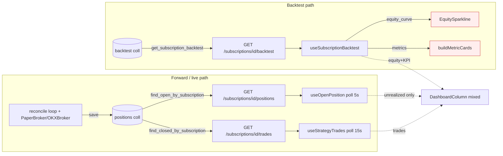

# Slice 3 — Live Equity + KPI + Forward Tab Foundation — Brainstorm Report

## Metadata

- **Priority:** 3/5 · **Stack:** FE + (optional minimal) BE
- **Depends on:** Slice 1 (deep-link 2-tab `Backtest|Forward` shell — *chưa tồn tại trong code hiện tại*, xem §10)
- **Unblocks:** Slice 4 (orders panel cắm vào Forward shell), Slice 5 (explain trade dùng forward trades)
- **Date:** 2026-06-28

---

## 1. Problem Statement

- 1 Subscription `(strategy_code, symbol, interval)` phục vụ cả **backtest** lẫn **forward** (live từ `start`: reconcile loop + PaperBroker/OKXBroker sinh positions/orders/trades thật).
- Hiện UI **không phân tách** backtest vs forward. `DashboardColumn` (`web/src/components/strategies/dashboard-column.tsx:30`) trộn 2 nguồn: equity luôn lấy từ backtest, trades ưu tiên live fallback backtest, KPI chỉ có trong backtest metrics.
- Forward view thiếu 3 thứ cốt lõi: **equity curve thực tế** từ khi forward chạy, **KPI live** (realized PnL, win-rate, #trades, max drawdown, profit factor), và **open-positions panel** đầy đủ (side/entry/qty/leverage/liq_price/unrealized/SL/TP).
- Slice này dựng **Forward tab shell** (S4/S5 cắm vào sau) + nhồi 3 panel: open positions, live equity, KPI strip.

---

## 2. Current State (evidence)

### 2.1 Backend — đã có gì

| Endpoint | Service:method | Trả về | Evidence |
|---|---|---|---|
| `GET /subscriptions/{id}/positions` | `StrategyQueryService.get_positions` | open positions (DB, `is_closed=false`) | `app/routes/strategy.py:131`; `engine/strategy_query_service.py:115` |
| `GET /subscriptions/{id}/trades` | `StrategyQueryService.get_trades` | closed positions = completed trades (entry/exit/pnl/qty), newest-first, limit ≤500 | `app/routes/strategy.py:139`; `strategy_query_service.py:131` |
| `GET /subscriptions/{id}/backtest` | `StrategyQueryService.get_subscription_backtest` | cached BacktestResult (metrics + equity_curve) hoặc 404 | `app/routes/strategy.py:148` |
| `GET /trading/positions/{strategy_id}` | `OrderPositionQueryService.get_position` | live **in-RAM** position summary (chỉ process chạy engine) | `app/routes/trading_orders_positions.py:37`; `engine/orders_positions_service.py:86` |

- **Positions DTO** (`strategy_query_service.py:117-128`): `symbol, direction(UPPER), entry_price, quantity, unrealized_pnl, entry_time, sl_price, tp_price`. → **Thiếu `leverage`, `liq_price`** (không có trên `PositionAggregate`, xem `core/domain/position/entities.py:27-40`).
- **Trades DTO** (`strategy_query_service.py:140-152`): `id, direction, entry_price, exit_price(=current_price khi close), entry_time, exit_time, pnl(realized_pnl), quantity`. → đủ derive **cumulative realized PnL curve** + KPI ở FE.
- **PositionAggregate** (`core/domain/position/entities.py`): có `unrealized_pnl` property (mark-to-market theo `current_price`), `realized_pnl`, `opened_at/closed_at`. **KHÔNG có equity snapshot theo thời gian** — chỉ có state hiện tại.
- **Equity curve CHỈ tồn tại trong backtest**: `EquityPoint{timestamp, equity, drawdown}` (`web/src/api/backtest-api.ts:34`), sinh bởi `backtest/engine/metrics_builder.py`. **Zero equity cho live/forward.**
- **KPI formula tham khảo** (`backtest/domain/services/performance_calculator.py`): `win_rate = winning/total` (`:188`), `profit_factor = gross_profit/gross_loss` capped 100 (`:199`), `max_drawdown` = min của `(equity-cummax)/cummax` trên equity curve (`:150`), `average_win_loss` (`:213`). Sharpe/Sortino cần per-bar returns → **không khả thi từ realized-only** (xem §8).

### 2.2 Frontend — đã có gì

- `DashboardColumn` (`dashboard-column.tsx`): 3 tab nội bộ `metrics|positions|trades`; equity = `backtest.equity_curve` (`:37`); trades = live fallback backtest (`:42-55`); unrealized = `openPos.unrealized_pnl` (`:38`).
- `useOpenPosition` (`hooks/use-open-position.ts`): poll `5_000ms`, shape `{symbol, direction, entry_price, quantity, unrealized_pnl, entry_time, leverage?, liq_price?}` — `leverage/liq_price` optional, **BE chưa trả**.
- `useStrategyTrades` (`hooks/use-strategy-trades.ts`): poll `15_000ms`, trả `StrategyTrade[]`.
- `EquitySparkline` (`equity-sparkline.tsx`): nhận `EquityPoint[]`, lightweight-charts 60px, fitContent — **tái dùng được cho live equity curve** nếu feed đúng shape.
- `PnlBadge` (`pnl-badge.tsx`): `pnl + label`, semantic color.
- `RecentTradesTable` (`recent-trades-table.tsx`): nhận `StrategyTrade[]`, render dir/entry/exit/qty/pnl/time.
- `buildMetricCards` (`backtest-panel/metric-cards.ts:62`): map `BacktestMetrics` → 14 cards. **Chỉ ăn shape backtest, không tính từ live trades.**
- `strategies-page-layout.tsx`: 3-pane grid, **không có** `Backtest|Forward` tab switch, **không có** `tab` search-param (chỉ `index.tsx`/`monitor_.jobs` dùng `validateSearch`). → **Slice 1 shell chưa có.**

### 2.3 Diagram — live data flow vs backtest equity (AS-IS)



→ **GAP đỏ:** equity curve + KPI strip live hiện không tồn tại; FE phải vá bằng backtest. Slice 3 cắt đứt sự lẫn lộn này.

---

## 3. Requirements (verify được)

- **Expected output:** Forward tab trong subscription detail hiển thị open-positions panel, live equity curve, KPI strip — tất cả derive từ live data (không phải backtest).
- **Acceptance:** chọn sub đang forward `running` → Forward tab show ≥1 open position (nếu có), 1 equity curve dựng từ closed trades, 1 KPI strip ≥5 chỉ số; sub chưa có trade → empty-state rõ ràng, không crash.
- **Scope boundary:** chỉ panel **open positions + equity + KPI**; orders (S4) và explain-trade (S5) chỉ để chỗ cắm (placeholder), không implement.
- **Constraints:** giữ import-linter (`fastapi` chỉ trong `app`), uuid7 PK, single uvicorn worker; nếu chọn B2 không được thêm `await` trong atomic block của reconcile/broker loop.
- **Touchpoints (FE):** `dashboard-column.tsx`, `strategies-page-layout.tsx` (Forward tab shell), reuse `equity-sparkline.tsx`/`pnl-badge.tsx`/`recent-trades-table.tsx`/`metric-card.tsx`, hooks `use-open-position.ts`/`use-strategy-trades.ts`, types `strategy.ts`/`backtest-api.ts`.
- **Touchpoints (BE, optional):** `app/routes/strategy.py` + `engine/strategy_query_service.py` nếu thêm `live-metrics` endpoint hoặc bổ sung `leverage/liq_price` vào positions DTO.

---

## 4. Approaches Evaluated

### 4.1 Equity + KPI source: B1 (FE derive) vs B2 (BE equity snapshot)

| Tiêu chí | **B1 — FE derive 100% từ closed trades** | **B2 — BE ghi equity snapshot live** |
|---|---|---|
| Equity curve | cumulative realized PnL theo `exit_time` (step curve, trade-keyed) | mark-to-market thật, có unrealized theo thời gian |
| KPI | tính client-side từ trades array | tính BE hoặc FE từ snapshot |
| BE cost | **0** (dùng `/trades` sẵn có) | thêm collection `equity_snapshots` + tick hook trong reconcile/broker loop, scoped `sub_id` + index |
| Async risk | none | **đụng async singleton loop** — mỗi `await` save là preemption point; sai thứ tự = race/double-write |
| Độ chính xác | thiếu unrealized-over-time, thiếu intra-trade equity (curve "đứng yên" giữa các trade) | đúng đường equity real-time |
| Sharpe/Sortino | **không tính được** (không có per-bar evenly-sampled returns) | tính được nếu snapshot đều theo bar |
| KISS/YAGNI/DRY | ✅ thắng tuyệt đối cho slice này | ❌ over-build cho mục tiêu "dựng shell + KPI cơ bản" |

### 4.2 KPI compute location

| | FE compute (client-side) | BE endpoint `GET /subscriptions/{id}/live-metrics` |
|---|---|---|
| Pros | 0 BE, reuse `performance_calculator` formula port sang TS, instant | 1 nguồn chân lý, share với backtest metrics shape, test dễ ở Python |
| Cons | duplicate formula (DRY nhẹ), tính lại mỗi poll | thêm route + service method + DTO; phải đọc trades từ DB lần nữa |

### 4.3 Realtime update

| | Poll (react-query `refetchInterval`) | WS feed |
|---|---|---|
| Pros | **đã có infra** (5s positions, 15s trades), zero mới | push tức thời, ít request |
| Cons | latency tới `refetchInterval`, load nhẹ | thêm WS topic + FE subscribe + lifecycle; single-worker WS feed đã là singleton |

---

## 5. Recommended Solution

- **Equity + KPI → B1 (FE derive)**, RECOMMENDED. Lý do: KISS/YAGNI/DRY, 0 BE, đủ phục vụ mục tiêu slice (dựng Forward shell + đường equity + KPI strip). `/subscriptions/{id}/trades` đã trả closed positions với `pnl/exit_time/quantity` — đủ dựng **cumulative realized PnL curve** + toàn bộ KPI count-based.
- **KPI → FE compute** (port công thức từ `performance_calculator.py`: `win_rate`, `profit_factor`, `max_drawdown` trên realized equity curve, `total/winning/losing`, `avg_win/avg_loss`). **Bỏ Sharpe/Sortino** ở live KPI strip (không có per-bar returns; nhồi vào sẽ sai/misleading).
- **Realtime → poll** (reuse `refetchInterval` hiện hành). Note WS là upgrade.
- **B2 là upgrade path** (note trong plan, không làm slice này). ⚠️ Nếu sau này làm B2: equity snapshot phải ghi **ngoài** atomic block của reconcile/broker loop (mọi `await` save là preemption point — wire publish-before-subscribe, không `await` giữa read-modify-write của position state); collection scoped `sub_id` + index `(subscription_id, ts)`; giữ uuid7 cho `_id`; vẫn single worker (không nhân bản tick hook).
- **`leverage/liq_price`:** FE đã optional (`use-open-position.ts:19-22`); BE chưa trả. Slice 3 hiển thị graceful (`—` khi thiếu). Bổ sung field là optional minimal BE (xem §6.1) — KHÔNG bắt buộc để ship slice.

---

## 6. Vertical Slice Breakdown

### 6.1 Backend (B1 → 0 bắt buộc; optional minimal)

- **Bắt buộc:** 0 thay đổi. Dùng `/positions` + `/trades` sẵn có.
- **Optional A — bổ sung positions DTO:** thêm `leverage`, `liq_price` vào `get_positions` (`strategy_query_service.py:117`). Cần thêm field vào `PositionAggregate` + `to_mongo/from_mongo` (`entities.py`) → chạm core domain → **defer trừ khi PaperBroker thực sự set leverage**. Nếu broker chưa có khái niệm leverage → để FE render `—`.
- **Optional B — `GET /subscriptions/{id}/live-metrics`:** `StrategyQueryService.compute_live_metrics(sub_id)` đọc closed positions, build dict KPI dùng `PerformanceCalculator`. Lợi: 1 nguồn chân lý, test Python. Defer sau slice (FE compute trước).

### 6.2 Frontend

- **`ForwardTab` component (mới):** shell nhận `sub`, layout dọc các panel: `OpenPositionsPanel` → `LiveEquityCurve` → `LiveKpiStrip` → placeholder slots cho Orders (S4) / Explain (S5).
- **`Backtest|Forward` tab switch:** trong `dashboard-column.tsx` (hoặc page-layout nếu Slice 1 dựng) — 2 top-tab; Backtest tab = `DashboardColumn` hiện tại (metrics/positions/trades từ backtest), Forward tab = `ForwardTab` mới. Đồng bộ qua `tab` search-param (deep-link).
- **`OpenPositionsPanel`:** reuse `useOpenPosition`; render side/entry/qty/leverage(`—`)/liq_price(`—`)/unrealized(`PnlBadge`)/SL/TP. SL/TP đã có trong positions DTO (`strategy_query_service.py:126-127`) nhưng FE `OpenPosition` interface (`use-open-position.ts:12`) **chưa khai báo `sl_price/tp_price`** → bổ sung field.
- **`LiveEquityCurve`:** hook `useLiveEquity(subId)` derive `EquityPoint[]` từ `useStrategyTrades`; feed vào `EquitySparkline` (hoặc full chart). Curve = cumulative sum `pnl` theo `exit_time` tăng dần.
- **`LiveKpiStrip`:** hook/util `computeLiveMetrics(trades)` → object KPI; render bằng `metric-card.tsx`. Reuse `buildMetricCards` shape nhưng **chỉ subset** (bỏ Sharpe/Sortino/CAGR — không có timeframe basis tin cậy; giữ realized PnL, win_rate, #trades, max_drawdown, profit_factor, avg_win/loss).
- **Hooks:** `use-live-equity.ts` (derive), `use-live-metrics.ts` (compute). Không hook fetch mới — tái dùng `useStrategyTrades`.

### 6.3 API Contract / FE compute formulas

- **Không thêm contract bắt buộc.** FE compute từ `StrategyTrade[]`:

```
realized_curve[i] = Σ pnl[0..i]   (sort by exit_time asc; mỗi point: {timestamp: exit_time, equity: initial + cum_pnl, drawdown})
realized_pnl      = Σ pnl
total_trades      = trades.length
winning           = count(pnl > 0);  losing = count(pnl < 0)
win_rate          = winning / total_trades
gross_profit      = Σ pnl[pnl>0];  gross_loss = |Σ pnl[pnl<0]|
profit_factor     = gross_loss>0 ? min(gross_profit/gross_loss, 100) : (gross_profit>0 ? 100 : 0)
avg_win           = mean(pnl[pnl>0]);  avg_loss = mean(pnl[pnl<0])
max_drawdown      = min( (eq - cummax(eq)) / cummax(eq) )   over realized_curve.equity
```
(khớp `performance_calculator.py` `:188/:199/:150/:213` — đảm bảo cùng định nghĩa với backtest tab).

---

## 7. Decomposition into Sub-tasks (ordered, shippable)

1. **[blocker check]** Xác nhận/dựng Slice 1 `Backtest|Forward` tab shell + `tab` search-param. Nếu chưa có → Slice 3 tự dựng tối thiểu 2-tab switch trong `dashboard-column.tsx`.
2. FE: `useLiveEquity(subId)` — derive `EquityPoint[]` từ `useStrategyTrades` (sort + cumulative). Unit-test thuần.
3. FE: `useLiveMetrics(subId)` / `computeLiveMetrics(trades)` — port formula §6.3. Unit-test với fixture trades.
4. FE: bổ sung `sl_price/tp_price` vào `OpenPosition` interface (`use-open-position.ts`); `OpenPositionsPanel` render full fields, `—` cho leverage/liq_price.
5. FE: `LiveEquityCurve` (feed `EquitySparkline`/full chart) + `LiveKpiStrip` (subset cards reuse `metric-card.tsx`).
6. FE: `ForwardTab` shell ghép 3 panel + placeholder Orders/Explain slots; wire vào tab switch.
7. FE: empty-states (no open position / no trades / sub chưa start) + poll intervals reuse.
8. **(optional, defer)** BE `GET /subscriptions/{id}/live-metrics` + (defer) positions DTO `leverage/liq_price`.
9. Verify: `cd web && npm run lint && npm run build`; (nếu BE optional) `just test` + import-linter.

---

## 8. Risks & Mitigations

| Risk | Tác động | Mitigation |
|---|---|---|
| **Realized-only equity sai lệch** khi có open position lớn (curve không phản ánh unrealized) | người dùng hiểu nhầm equity hiện tại | Hiển thị **unrealized PnL riêng** (`PnlBadge`, đã có); label curve rõ "Realized equity"; note B2 cho intra-trade equity |
| **Sharpe/Sortino không tính được** từ realized-only | nếu nhồi vào sẽ ra số sai | **Bỏ** khỏi live KPI strip; chỉ Backtest tab có |
| **Timezone**: `entry_time/exit_time` naive ISO; sort sai nếu lẫn tz | curve lệch thứ tự | reuse `parseIso`/`useFmt` (`lib/datetime`, `lib/use-timezone`) như `equity-sparkline.tsx:62`; treat naive = UTC nhất quán |
| **Poll load**: positions 5s + trades 15s + (mới) compute mỗi poll | CPU nhẹ FE, request BE | compute trong `useMemo`; giữ `refetchInterval` hiện hành; chỉ enable khi tab Forward active |
| `find_closed_by_subscription` limit 100/500 → equity curve **cụt** với sub nhiều trade | curve thiếu lịch sử | note: với forward dài hạn cần pagination/aggregate (B2 hoặc BE endpoint); slice này chấp nhận limit 500 |
| Slice 1 shell **chưa tồn tại** | block Forward tab | sub-task #1 dựng tối thiểu nếu Slice 1 chưa ship |

---

## 9. Success Metrics & Validation

- `cd web && npm run lint && npm run build` pass.
- Unit-test `computeLiveMetrics` + `useLiveEquity` với fixture (≥1 win, ≥1 loss, 1 open) → KPI khớp công thức §6.3.
- Manual: sub forward `running` có trades → Forward tab show equity curve tăng/giảm đúng cumulative, KPI strip ≥5 chỉ số, open-positions panel hiển thị unrealized; sub không trade → empty-state, no crash.
- (nếu BE optional) `just test` + import-linter contracts pass (fastapi vẫn chỉ trong app).

---

## 10. Dependencies & Open Questions

**Cross-ref filenames:**
- Slice 1 (shell): `web/src/components/strategies/strategies-page-layout.tsx`, `web/src/components/strategies/dashboard-column.tsx`, `web/src/routes/strategies.tsx` (cần `validateSearch` cho `tab` như `routes/index.tsx:17`).
- Slice 4 (orders): cắm vào `ForwardTab` placeholder slot; dùng `GET /trading/orders` (`trading_orders_positions.py:22`).
- Slice 5 (explain): dùng forward closed trades từ `useStrategyTrades` + `ForwardTab` explain slot.

**Open Questions (chốt ở plan):**
1. **B1 vs B2** — confirm B1 cho slice này, B2 thành ticket riêng? (report recommend B1).
2. **Slice 1 shell đã ship chưa?** Code hiện tại (`strategies-page-layout.tsx`) **không có** `Backtest|Forward` tab switch hay `tab` search-param → cần xác nhận đây có phải scope Slice 1 hay Slice 3 phải tự dựng.
3. **`initial` equity** cho realized curve: lấy từ đâu? (backtest `config_snapshot.initial_capital`? hằng số? config sub?) — ảnh hưởng total_return %.
4. **`leverage/liq_price`**: PaperBroker/OKXBroker hiện có khái niệm leverage không? Nếu không → FE render `—` vĩnh viễn, bỏ Optional A.
5. **KPI source dài hạn**: FE compute (B1) đủ, hay cần BE `live-metrics` ngay để đồng nhất với backtest metrics shape?

---

Status: DONE
Summary: Brainstorm Slice 3 hoàn tất — recommend B1 (FE derive equity+KPI từ closed trades, 0 BE bắt buộc), poll reuse, dựng ForwardTab shell + open-positions/equity/KPI panels; B2 (BE equity snapshot) là upgrade path có cảnh báo async singleton loop.
Concerns: Slice 1 deep-link 2-tab shell CHƯA tồn tại trong code hiện tại (`strategies-page-layout.tsx` không có Forward tab/`tab` search-param) — block Forward tab nếu chưa ship; `initial` equity basis và leverage/liq_price availability cần chốt ở plan.
